# The AI Engineering Organization — Blueprint & Drop-in Kit

**A complete engineering organization run by LLM agents — architecture,
product, project management, development, quality, security, compliance,
metrics and deployment — auditable end to end, and governed by the humans it
amplifies.** The status wall is just its visible surface.

> [!CAUTION]
> **Read this before adopting: this is a kit and blueprint for a complete
> engineering team run by AI — and that is precisely why this notice exists.**
>
> The author does **not** endorse using it to replace human decision makers,
> builders, architects, designers, project or program managers, engineering
> leaders, or any other role — specifically or arbitrarily. Every gate in
> this kit that routes to "the engineer" exists because a human owns that
> call, and removing the human removes the safety property, not just the
> person.
>
> **The recommendation:** review this kit and blueprint with your existing
> team, and use these tools to help that team deliver and support quality,
> secure, scalable, enterprise-grade products — an amplifier for the people
> accountable for the work, not a substitute for them.

A standalone, dependency-free scaffold that drops into an empty repository — or
an existing one — and stands up a **turnkey engineering organization run by LLM
agents**: architecture, project management, product management, design,
development, quality, security and deployment as one written, auditable,
closed-loop process. Quick entry (a sample wall renders in 30 seconds; a real
deployment is an afternoon), driven end-to-end by an AI session, with the
human engineer supplying effort variables, product answers and the handful of
consent decisions no agent may make.

It is built to answer the complaints engineers actually have about
AI-assisted delivery:

| Complaint | What the kit does about it |
|---|---|
| "Nobody supports it after it ships" | The loop never ends: waves, findings-to-rules graduation, a failure registry that makes wave N+1 smarter than wave N |
| "AI code quality is a coin flip" | A cold-read reviewer, tiered tests with a mutation protocol that proves tests can fail, one shared body of criteria for every grader |
| "It won't live past its author" | Everything is written state: ledger, decisions, briefs, wave reports — a new session (human or LLM) resumes from disk, not from memory |
| "It doesn't scale" | Parallel leased builders, serial integration, measured capacity rebalancing; containers/VMs/Kubernetes covered |
| "You can't audit what the AI did" | An append-only, byte-reproducible event ledger; every criterion cites its source; every decision is a record; `wall trace`/`why` |
| "You can't undo it" | Append-only + supersession everywhere; rollback anchors before every force-push; consent prints before every system mutation |
| "Security is an afterthought" | SAST + secrets in the definition of done, gated network, localhost-only surfaces, straight-to-sponsor security escalations |
| "It can't pass compliance" (fintech, healthcare, e-commerce) | The mechanisms map onto the control families auditors ask about — segregation of duties, change control, traceability: `docs/COMPLIANCE_POSTURE.md` |

Concretely, that is: a role roster with written authority boundaries, an event
ledger with integrity checking, a live wall, a closed-loop timer, dispatch and
handoff and transplant procedures with the measured failure classes already
encoded, and the context documents — rules, failure registry, ship checklist,
decision log — that make the next wave start where the last one ended.

Everything here is stdlib Python, plain CSS and plain HTML. No dependencies, no
network calls, no build step.

The design was originally done blind, against no real tree. It has since been
reconciled against a production deployment and a seven-hour live agent wave;
`docs/RECONCILIATION.md` is that record, and it is **binding** where it
disagrees with anything else in this repository.

---

## The organization, on one page

The kit is not just a status wall. It is a blueprint for an **autonomous
engineering organization** — engineering, security, quality, metrics,
architecture and design as one closed loop — where the driving engineer
supplies effort variables and product answers, and everything else runs on
written procedure.


| Role (org term) | Kit carrier | Function | Actual instructions |
|---|---|---|---|
| Product owner / sponsor | The driving engineer — **the Patron** | Effort variables, product Q&A, ceilings, the human queue, ratifications and verifications | `docs/SESSION_LIFECYCLE.md` §2/§4, `docs/PRODUCT_INTAKE.md` |
| Engineering manager | **Maestro** (the session) | Dispatch, capacity within caps, merge authority, process | `.claude/MAESTRO.md`, `docs/WORKFLOW.md` §2/§7 |
| PMO / metrics / project tracking | **Foreman** + Courier + the Wall | Measured status and integrity; throughput and cost tallies — **counted from the ledger, the harness and CI, never asserted by any agent**; the board (arcs/stories/bugs), SLA ladder and decision log held as state; rebalance recommendations | `.claude/agents/foreman.md`, `docs/CAPACITY_REBALANCING.md`, `docs/WALL_STANDARDS.md` §4, `docs/EVENT_SCHEMA.md` §5; the mechanical half is `tools/wall/courier.py` + `tools/wall/testkit.py` |
| Solution architect | **Architect** | Domain design, arcs + stories, requirements sign-off, rulings | `.claude/agents/architect.md`, `docs/ITEM_AUTHORING.md` |
| Governance board | **Adjudicator** | Tie-breaks, decision conflicts, contested trade-offs | `.claude/agents/adjudicator.md` |
| Security & compliance authority | **Warden** (exactly one, singleton-enforced) | Guardrail corpus; architecture sign-off on in-scope arcs; data-use verdicts (dev + product); delivery audit — blocks autonomously, never grants. **Audits the cross-cutting security lane** — SAST + secrets in CI, gated research network, localhost-only surfaces, consent-gated installs — machinery that runs structurally on its own; the Warden verifies it holds and rules on what it raises | `.claude/agents/warden.md`, `docs/TESTING_STANDARDS.md` (SAST lane), `docs/INSTALL.md`; the singleton is refused in code by `tools/wall/agents.py`, the bind by `tools/wall/server.py` |
| Analysts | **Researchers** (N, parallel) | Evidence with sources, options with costs | `.claude/agents/researcher.md`, `docs/handoffs/finding-route.md` |
| Engineers | **Builders** (N, parallel) | Implementation in leased scopes, tests owed | `.claude/agents/builder.md`, `docs/TESTING_STANDARDS.md` |
| Release engineer | **Integrator** (a hat) | Rebase, safety proof, gates last, one PR at a time | `.claude/agents/integrator.md`, `docs/WORKFLOW.md` §9, `docs/handoffs/transplant-order.md` |
| QA / code review | **Reviewer** + external lanes | Cold diff read, mutation protocol, DoD gate | `.claude/agents/reviewer.md`, `.claude/skills/reviewer-integration/SKILL.md` |

**Under-promising on purpose.** Every capability above is graded by how it is
actually held up, and the grade is written where the claim is made
(`docs/diagrams/ORG_MAPPING.md` §2b): **structural** means code refuses the
violation (the roster's singleton, the server's localhost bind, the courier's
integrity flags); **procedural** means a written instruction agents are
briefed from, with its load-bearing phrases pinned by tests; **advisory**
means a recommendation the engineer may override. And the table itself is
tested: `tests/test_capability_truth.py` verifies every cited instruction
source exists, so a claim that loses its instructions fails the suite instead
of quietly becoming marketing.

Full mapping with DDD alignment: `docs/diagrams/ORG_MAPPING.md`. The same
system as sessions, hooks and state — with what runs parallel vs sequential:


Deep version with the concern-to-mechanism map: `docs/diagrams/AGENT_TOPOLOGY.md`.

### The wall itself

Five screens, named exactly as the page renders them — **MAIN**, **STORIES**,
**CREW**, **LEDGER**, **WAITING**. The header carries the repo name verbatim
(bold, case-preserved — `Atlas-Core`, never `atlas-core`) beside the active
screen's name in lowercase: `Atlas-Core main`, `Atlas-Core stories`,
`Atlas-Core crew`, and so on; the branch lives in the status strip.

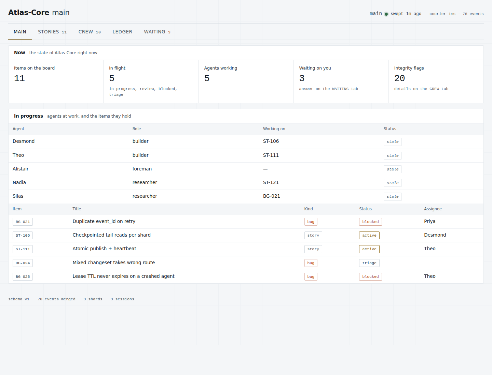

**MAIN** is the landing screen: page sections `Now` (items on the board, in
flight, agents working, waiting on you, integrity flags) and `In progress`
(the working agents with the items they hold, and every in-flight story).

| | |
|---|---|
| 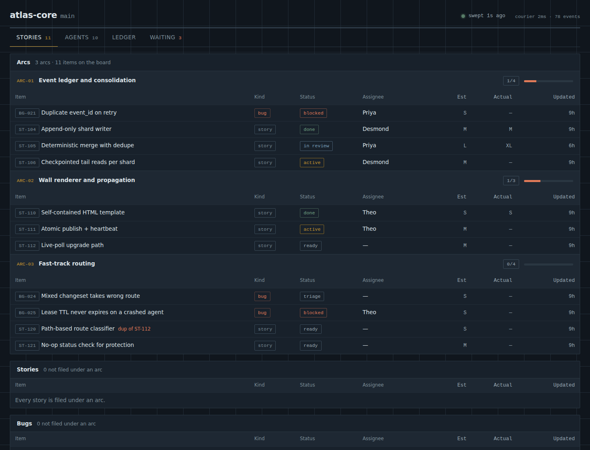 | 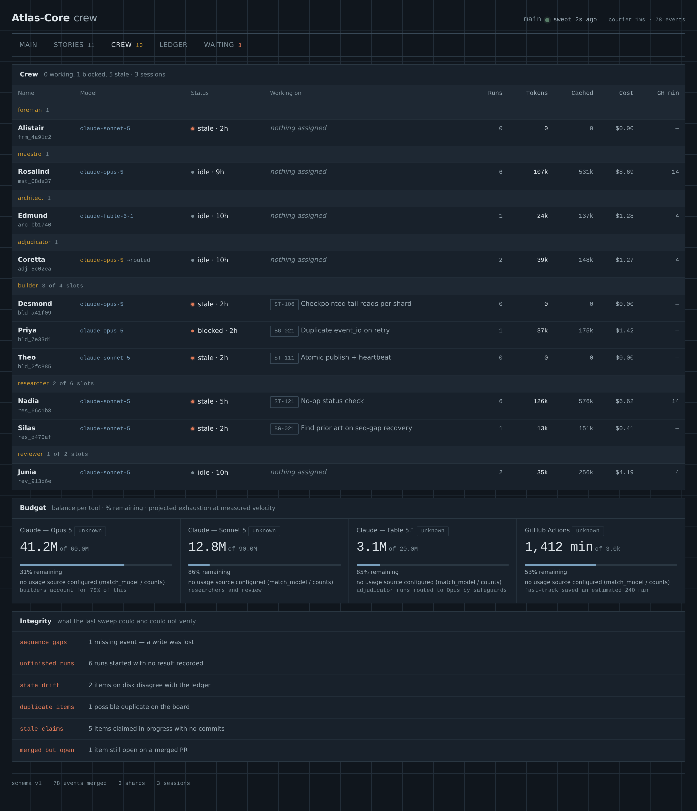 |
| **STORIES** — page sections `Arcs`, `Stories`, `Bugs`: arc bands with story/bug nesting, literal status chips; a **`blocked` chip is a drill-in** — the dialog names the recorded reason and open asks, and (queue-gated) dispatches BUILD A FIX / RESEARCH IT to whatever agent consumes the host queue | **CREW** — page sections `Crew`, `Budget`, `Integrity`: names + keys, models (`requested -> routed`), tokens/cost, budget trajectory, integrity flags |
| 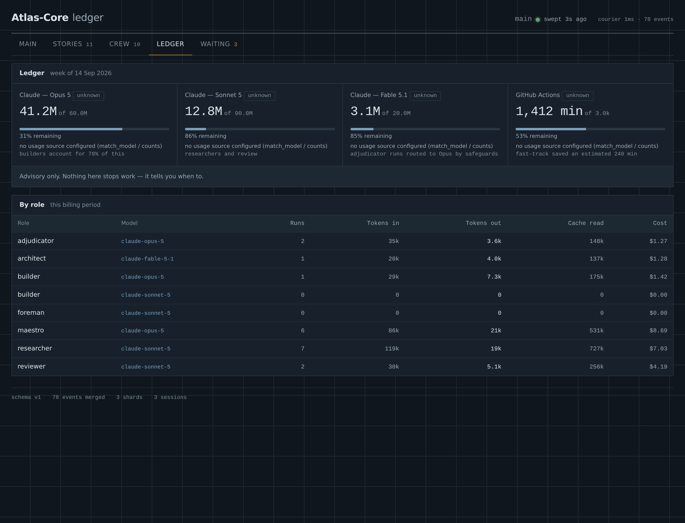 | 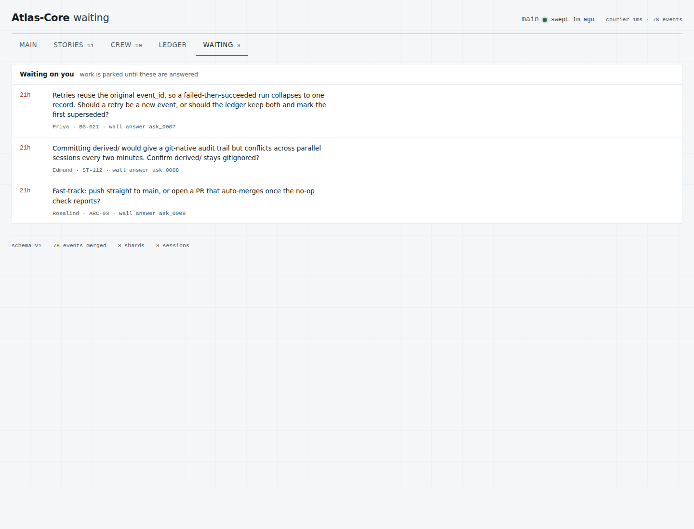 |
| **LEDGER** — see below | **WAITING** — page section `Waiting on you`: every `human_required` ask with its `wall answer` command |

**The LEDGER page** is the money view. Page sections `Ledger` and `By role`:
per-tool budget gauges (used of limit, % remaining, measured velocity, the
projected exhaustion date and the pace chip — `slow` / `on pace` /
`may speed` / `idle` / `unknown` / `exhausted`), the standing advisory line
("budgets are advisory — nothing here stops work, it tells you when to"),
and the per-role rollup for the billing period: runs, tokens in/out, cache
reads and cost per role+model, summed from `run_end` events — counted, never
asserted. It is the page the Patron reads before answering a
capacity-ceiling ask, and the page CAPACITY_REBALANCING's budget-trajectory
signal renders on.

The four oversight tabs (`WALL_DASHBOARDS.md`, DEC-0026/0027/0028):

| | |
|---|---|
| 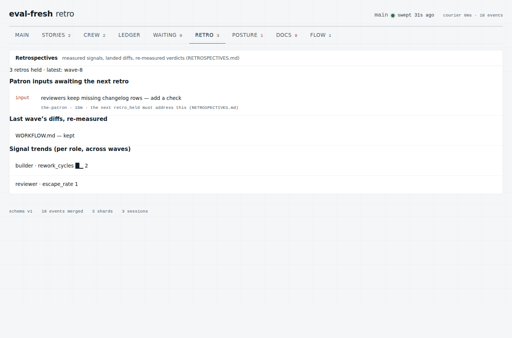 | 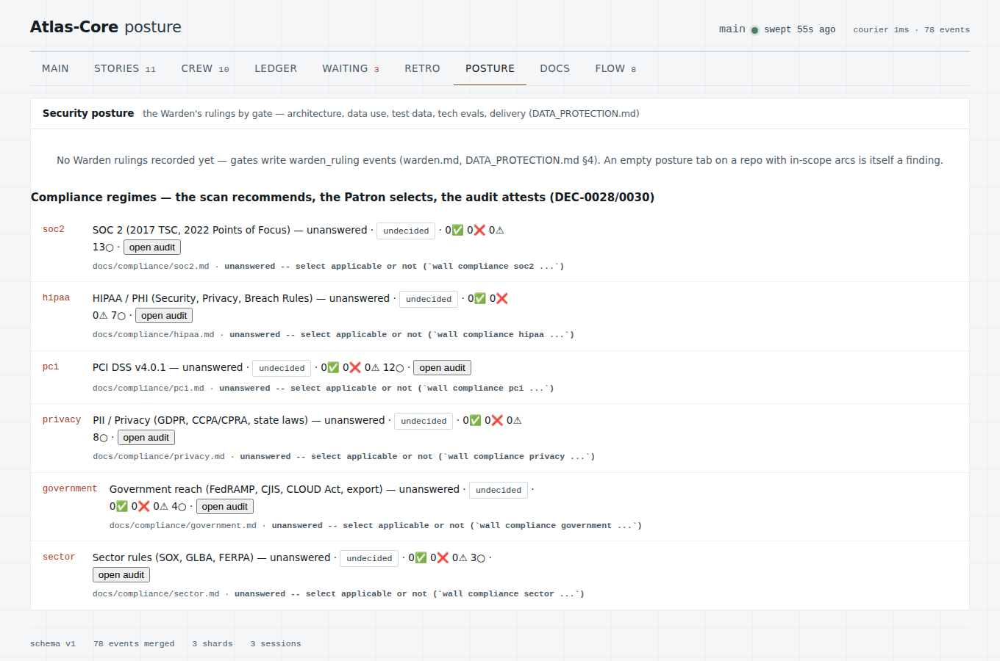 |
| **RETRO** — signal trends across waves, diffs landed + re-measured, and pending `wall retro-note` inputs the next retro must address | **POSTURE** — the Warden's latest ruling per subject; blocked/refused front and center; the **compliance regimes** (SOC 2 · HIPAA/PHI · PCI · PII/privacy · government · sector · NIST · FDA) with the Patron's selections, the Warden scan's recommendations folded into **dispositions** (a regime disabled against the evidence reads `NOT RECOMMENDED FOR DISABLED`, with a WHY popout carrying the evidence), ENABLE / DISABLE / REQUEST AUDIT dispatch through the queue port, both-direction challenges and the selection decision log (DEC-0028/0030/0031) |
| 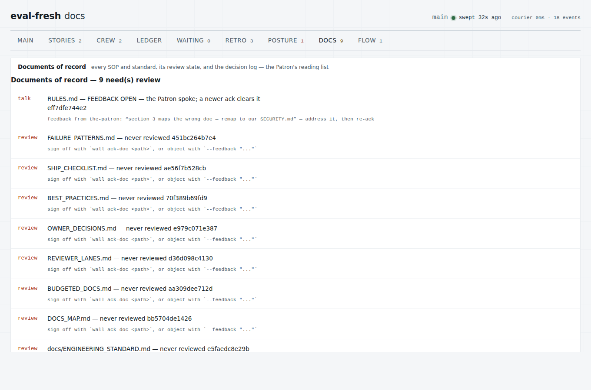 | 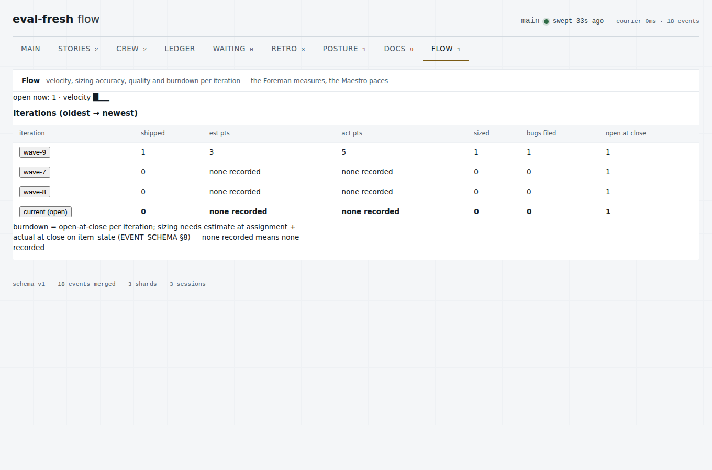 |
| **DOCS** — every SOP/standard at its sha: current / CHANGED / never-reviewed / feedback-open / missing; click any row to **read it in place** and APPROVE / REQUEST CHANGES / DENY through the queue port (DEC-0032), or sign off with `wall ack-doc`, object with `--feedback` | **FLOW** — per-iteration shipped, estimate-vs-actual points, bugs filed, open-at-close burndown; each row opens the drill-in |
| 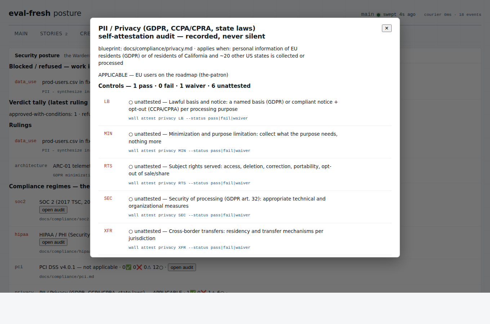 | 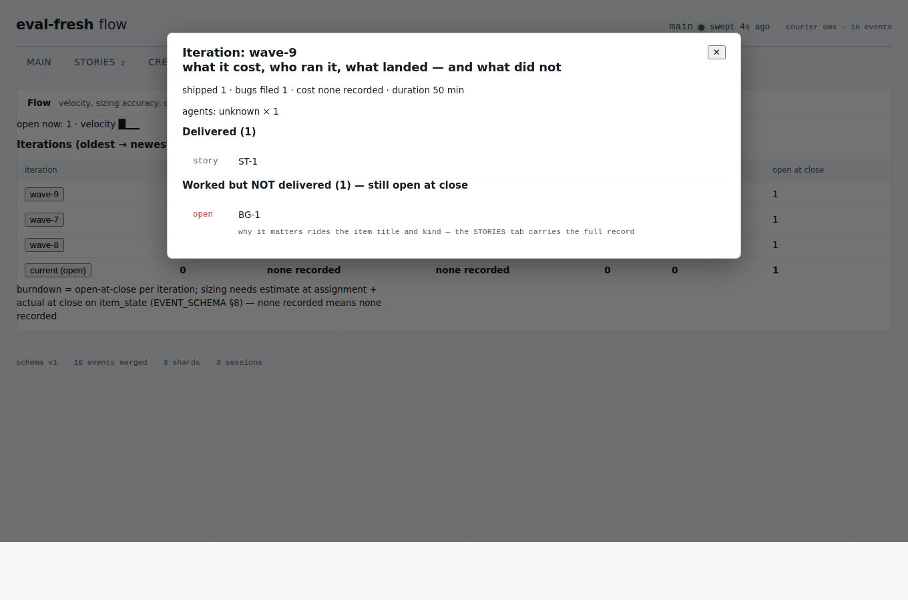 |
| **The audit popout** — per regime: applicability + reason, the challenge if one is open, and every control's pass ✅ / fail ❌ / waiver ⚠ with its note (mandatory on every verdict since DEC-0030 — pass carries its proof, fail and waiver their reason) and the `wall attest` / `wall audit` verbs | **The iteration popout** — what the iteration cost (`cost_usd` summed), agents by role, duration, what was delivered, and what was worked but NOT delivered |

Also in `docs/screenshots/`: the blocked drill-in dialog
(`wall-blocked.png` — the recorded reason and open ask, read-only without a
host queue), the reference deployment's real 1143-item board
through `adapters/board_import.py` (`wall-overlay-reference.png`), the
honest-degrade banner for a malformed snapshot (`wall-degrade.png`), light
mode, and the status-vocabulary fixture.

---

## Try it in 30 seconds

```bash
cd sample
python3 make_sample.py                  # writes fake event shards
python3 ../tools/wall/courier.py --repo .
open .wall/derived/wall.html            # or double-click it
```

The sample deliberately contains four integrity problems, all real conditions
the system has to survive:

- A **sequence gap** - a record was deleted from one shard. A lost write shows
  as a hole rather than vanishing.
- Two **orphaned runs** past deadline. In-flight runs correctly do not count, or
  every working builder would light up the panel.
- **Nadia reads `stale`, not `working`**, though her last event claims a run in
  progress. A blown deadline reclassifies the agent regardless of what it said
  about itself. Evidence over self-report, made mechanical.
- **Coretta shows `claude-opus-5 -> routed`** - she requested one model and
  safeguards sent her to another. The ledger records what ran, so per-model
  costs stay honest.

---

## The five ideas everything else follows from

**1. Agents don't persist; state does.** Claude Code subagents are single-shot.
Nothing polls, nothing watches. So persistence lives on disk and short agent
invocations fire off hooks and a timer. This is why the courier is a script
(DEC-0001), why Maestro is the top-level session rather than a subagent
(DEC-0002), and why the Foreman's singleton is a lock file rather than a
process. The live wave added a corollary: **subagents do not schedule either** -
a check-in registered by a subagent fires into the parent, so the agent that
scheduled it waits forever while its wake-up wakes somebody else.

**2. Bookkeeping is code, not cognition.** Counting tokens, merging shards and
rendering a grid are deterministic. A foreman running as a model every two
minutes outspends the builders while producing no code. Models are invoked for
judgment: contradiction triage, stale-claim narration, anomaly. Measured: a
status stream ran all night as one Python file, zero model calls.

**3. Evidence outranks self-report.** Status comes from the repository, the
tests and the checks, not from agents describing themselves (DEC-0011). A
`run_start` with no terminal event past its deadline reclassifies the agent as
`stale`. Item files are a materialized view of the event log, so `diff-state`
catches anything written out of band. In the live wave a builder's own report of
its checks was superseded twice by reading the check runs directly.

**4. Keys are identity; names are labels.** `bld_a41f09` is permanent and
appears in every event. "Desmond" is a reusable display name, unique among live
agents repo-wide (DEC-0003, DEC-0009). Reuse is safe *because* nothing
downstream depends on the name. The wave extended this to the working tree
itself: repository-level git configuration and unkeyed temp filenames are shared
mutable state, so identity is set per invocation and every temp file is keyed by
agent key.

**5. The ledger must be reproducible.** Merge is idempotent on `event_id` and
totally ordered on `(ts, session_id, seq)`, so a full rebuild from shards yields
a byte-identical ledger to an incremental run. Verified. That property is what
makes the audit trail trustworthy, and it is why the courier is not an agent -
and why shards ship to an isolated branch rather than riding pull requests
(DEC-0004).

---

## The path: quick start to full implementation

Every step is a real command or a written procedure; the right-hand column is
where it is specified. Steps 0-2 take minutes; the rest is the operating
rhythm.

| # | Phase | What happens | Specified in |
|---|---|---|---|
| 0 | **See it work** | Render the sample wall from fake shards, 30 seconds, zero model calls | "Try it in 30 seconds" above |
| 1 | **Deploy into the repo** | Copy `tools/wall/`, `docs/`, `frontend/theme/`, `.claude/`, `.gitignore`; empty repo fills templates, existing repo maps them | The two runbooks below |
| 2 | **Start it** | `wall run-once` (works with nothing installed) -> `wall serve` -> the wall is live at `127.0.0.1:8123` | INSTALL.md |
| 3 | **Close the loop** | `wall install --yes` (consent-gated) puts the one machine-wide timer on; `wall verify` proves it; shards + diagnostics ship off-box | INSTALL.md |
| 4 | **Define the product** | Intake Q&A: effort variables + six product domains, derived from the repo first, asked second | PRODUCT_INTAKE.md |
| 5 | **Author the work** | Architect designs arcs, writes citable stories; board seeded (or imported via `adapters/board_import.py`) | ITEM_AUTHORING.md |
| 6 | **Run waves** | Session start SOP -> dispatch -> parallel build -> serial integration -> merge -> close SOP | SESSION_LIFECYCLE.md, WORKFLOW.md, `.claude/skills/wave/` |
| 7 | **Wire the graders** | External reviewer lanes imported into one shared body of criteria | `.claude/skills/reviewer-integration/` |
| 8 | **Tune on measurements** | Builder/researcher split, PR pacing, CI sharding — one knob per cycle | CAPACITY_REBALANCING.md, TESTING_STANDARDS.md |
| 9 | **Let it learn** | Findings graduate to rules + tests + checklist lines; decisions accrete; the next wave starts smarter | FAILURE_PATTERNS + the `learn` loop |

**Steps 1–5 are a gate, not a suggestion:** guardrails, scaffolding,
metrics, quality and security machinery, requirements and architecture land
first — in a new repo or an existing one — before any product line of code is
built or delivered. The Maestro's dispatch sequence enforces it (a product
story does not dispatch past a missing foundation item), and the bootstrap
carries the same gate at Phase 4.

An LLM session can walk this path end-to-end on its own, asking the engineer
only to run or verify the consent-gated steps: `docs/LLM_BOOTSTRAP.md`.
Containers, VMs and Kubernetes: `docs/DEPLOYMENT_TARGETS.md`. Regulated
industries: `docs/COMPLIANCE_POSTURE.md`.

---

## The empty-repo runbook

Start to first wave. Each step is a real command or a real decision; none of it
assumes anything already exists.

**1. Copy the kit in — one command (DEC-0021).** From a kit checkout:

```bash
python3 tools/wall/bootstrap.py fresh --into ../your-repo --apply \
        --mcp claude-code cursor vscode
```

Dry-run first (drop `--apply`) to see exactly what lands: the bounded
side-repo subtree (`tools/wall/`, `docs/`, `frontend/theme/`,
`templates/`), the `.wall/` skeleton, every MISSING context document
from `templates/` (an existing file is never overwritten), a
`kit_source.json` stamp for later upgrades, and your editors' MCP
configs pointing at the wall server as the engineer's seat. Same
command on a laptop, VM, Docker, cluster node or cloud box —
stdlib-only, nothing to install first. Steps 2-6 below are what the
script deliberately leaves to you.

**2. Copy the context documents to the root and fill them.** From
`templates/`, copy and rename:

| Template | Becomes | What it is |
|---|---|---|
| `templates/AGENTS.md.template` | `AGENTS.md` | Entry point, tool-agnostic: what the project is, current state, doc index, pointer to the rules. `CLAUDE.md` and other tool copies are generated from it (`docs/CONTEXT_FILES.md`). |
| `templates/RULES.md.template` | `RULES.md` | The binding rules. Part 1 is yours to write; Part 2 ships as-is. |
| `templates/FAILURE_PATTERNS.md.template` | `FAILURE_PATTERNS.md` | Append-only registry of bug classes: seventeen seeded general ones, plus a library of inherited classes genericized from three production deployments (a resident desktop app, a network appliance and a research-publishing repo) that await their first occurrence here. |
| `templates/KNOWN_ISSUES.md.template` | `KNOWN_ISSUES.md` | The intake: every finding recorded on arrival, before it is worked, grouped into families by shared mechanism; it leaves only as guarded (a registry class) or declined with a reason. |
| `templates/ENGINEERING_STANDARD.md.template` | `docs/ENGINEERING_STANDARD.md` | The canonical method: root cause to requirement to test to code, the done-definition, and a per-repo Bindings zone that is the only part you edit. |
| `templates/DESIGN_DOC.md.template` | `docs/architecture/<ARC>.md` | The per-arc design an arc's stories cite by section: intent, boundary, slice plan, rollback story. |
| `templates/SHIP_CHECKLIST.md.template` | `SHIP_CHECKLIST.md` | The pre-ship gate, including gates-run-last and the budget check. |
| `templates/BEST_PRACTICES.md.template` | `BEST_PRACTICES.md` | The coding standards the whole roster and any hosted reviewers judge against. |
| `templates/DOCS_MAP.md.template` | `DOCS_MAP.md` | Change kind to doc surfaces: which docs must update in the same pull request. |
| `templates/BUDGETED_DOCS.md.template` | `BUDGETED_DOCS.md` | Which documents feed model prompts, their budgets, and measured headroom. |
| `templates/OWNER_DECISIONS.md.template` | `OWNER_DECISIONS.md` | What is off, deferred or retired on purpose - the third state beside working and broken - with each entry's reason and lifting condition. |
| `templates/REVIEWER_LANES.md.template` | `REVIEWER_LANES.md` | Every review lane this repo has had: state, exact disqualifiers, meter facts, owner actions owed, salvage. |
| `templates/EVAL_RECORD.md.template` | `docs/decisions/EVAL-*.md` | One per technology evaluation: bench, disqualifiers, verdict, re-eval triggers (docs/TECH_EVALUATION.md). |

Replace every `<PLACEHOLDER>` and delete the leading comment block from each.
Each template carries a **question set** — required questions plus the probes
for what nobody thinks to ask — in `docs/TEMPLATE_INTAKE.md`; run them as one
batched round rather than guessing at placeholders.
The only one that needs real thought today is `RULES.md` Part 1 - the hard
rules. Everything else can start thin and grow.

**3. Initialize and make the first commit.** `git init`, then commit the kit and
the filled templates together. This commit is the base every agent rebases onto,
so it should already contain the rules they are supposed to follow.

**4. Claim the roster.** Agents need keys before they have anything to write
into an event.

```bash
python3 tools/wall/wall.py agents claim --role builder --session <sid>
python3 tools/wall/wall.py agents            # see the roster
python3 tools/wall/wall.py agents audit      # duplicate keys, name collisions
```

**Maestro is not claimed.** It is the session you are already talking to, not a
row in the roster (DEC-0002). If you find yourself allocating a key for the
orchestrator, something has gone wrong - most likely an attempt to spawn one,
which the harness will refuse anyway.

**5. Install the timer, with consent.** One scheduled task per machine, not one
per repository (DEC-0010). The session-start hook **detects only**; it never
writes a system task. When something is missing it surfaces the exact command
and waits for you.

```bash
python3 tools/wall/wall.py install       # explicit say-so; prints what it wrote
python3 tools/wall/wall.py register      # adds this repo; no privileges needed
python3 tools/wall/wall.py verify        # task alive? heartbeat fresh?
```

After the first yes on a machine, adding another repository is a plain file
write.

The platform adapters are real: a scheduled task on Windows, a launch agent on
macOS, a user timer on Linux. `install` prints the schedule it is about to
create and waits for you before creating it, and `verify` reports what the
platform says is actually installed rather than what the kit believes.

`run-once` remains the universal entry point - it is what the timer calls, and
it can be driven by hand, from a git hook, or from CI without any timer at all:

```bash
python3 tools/wall/wall.py run-once
```

**6. Open the wall.** Serve it locally and leave it open.

```bash
python3 tools/wall/wall.py doctor        # heartbeat, integrity flags, roster
python3 tools/wall/wall.py summary       # one-screen human digest (--json for machines)
open .wall/derived/wall.html
```

**From an editor instead of a terminal:** `tools/wall/mcp_server.py` is
the same seat over MCP stdio — `wall_status`/`wall_waiting` to stay
current, `wall_answer`/`wall_enqueue` to rule and hand out work — from
VS Code, Cursor, Claude Code or any MCP client. Three-line client
configs and the role gate (engineer vs agent) are in
`docs/MCP_INTEGRATION.md` (DEC-0019).

Two properties are not optional if you serve it yourself: bind `127.0.0.1`
explicitly, and send no-cache headers on the polled JSON. A wall showing a
cached snapshot is worse than no wall, because it is confidently wrong. Check
the `generated_at` stamp before believing anything on the page.

**7. Run the first wave.** With the roster claimed and the wall live, invoke the
`/wave` skill in the session. Maestro surveys the items, vets them, dispatches
against **disjoint file surfaces**, and integrates through one pull-request slot
in a set merge order.

Expect the first wave to teach you something the kit did not know. When it does,
the response is a `FAILURE_PATTERNS.md` entry plus the matching
`SHIP_CHECKLIST.md` item - in the same change. That pairing is the whole
mechanism by which this gets better.

---

## The existing-repo adoption runbook

A project that already has its own context documents does **not** copy the
templates over them. Duplicating a rule is worse than not having it: two copies
drift, and the next agent reads whichever it found first. The job here is to
**map**, and to add only what is genuinely missing.

**Shortcut — let the session run this whole runbook:** `/adopt inventory` parses
the tree and classifies every document by function with evidence; `/adopt map`
writes the pointer stubs; `/adopt consolidate` merges duplicates with the
engineer ruling on conflicts (`.claude/skills/adopt/SKILL.md`).

**1. Inventory what exists - by function, not by filename.** Every mature
repository has grown some of these under names of its own. Find them:

| Function | Common names | What the kit expects it to do |
|---|---|---|
| Entry point | `AGENTS.md`, `CLAUDE.md`, `CONTRIBUTING.md`, the README | Orient a session: what this is, where it stands, where the rules are |
| Standing rules | `RULES.md`, `STANDING_RULES.md`, a "conventions" doc | Bind behaviour; change only by the owner, in writing |
| Failure registry | `KNOWN_FAILURE_PATTERNS.md`, a postmortem folder | Name bug classes already paid for, each with a check |
| Ship checklist | `SHIP_CHECKLIST.md`, a release runbook, a PR template | Gate a change before it ships |
| Coding standards | `BEST_PRACTICES.md`, a style guide, a reviewer config | One shared body of criteria every reviewer judges against |
| Decision log | `docs/decisions/`, ADRs, a decisions page | One record per ruling, superseded rather than rewritten |
| Prompt budgets | usually nothing | Declare and measure what feeds model prompts |
| Docs map | a "docs discipline" note, a PR-template line, usually nothing | Say which doc surfaces move with which change kind, in the same change |

**2. Map, do not duplicate.** For each file in `templates/`, if the project
already has the equivalent, write a **stub at the kit's expected location** that
points at the real document and says what that document must additionally carry:

```markdown
<!-- Pointer, not a document. -->
# RULES.md
This project's standing rules live at `docs/STANDING_RULES.md`.

Kit rules that document must carry, and where they are in it:
- Identity is per-invocation; agents never write repository-level git config. [section N]
- Merge authority is the coordinator's; builders report green and stop. [section N]
- Gates run last, after the final edit. [section N]
```

Three rules are non-negotiable on adoption, because each one exists to stop a
measured corruption rather than to express a preference: **per-invocation
identity** (a shared configuration write lands on a sibling's commit),
**coordinator merge authority** (a green check is not necessarily the gating
check), and **gates last** (a gate run before the final edit proves nothing).
If the host's documents do not carry them, adding them there is the first
change - not a second rulebook.

Only where nothing exists do you copy the template and fill it. A project with
no failure registry should get `FAILURE_PATTERNS.md` on day one; the seeded
classes apply to any agent crew.

**3. Install the machinery alongside.** `.wall/` and `tools/wall/` are new
directories and collide with nothing. The agent roster in `.claude/` is the one
place that can collide: **merge by adding files, never by overwriting**. If a
role name already exists in the host, the project decides which definition wins
and records that as a decision in `docs/decisions/` - both because it is a
ruling somebody will otherwise re-litigate, and because a silently replaced role
sheet changes the behaviour of every future run.

**4. Register and install, consent-gated.** Exactly as the empty-repo path:
`wall register` adds the repository to the machine registry and needs no
privileges; `wall install` runs on explicit say-so and prints what it wrote. If
the host already serves a wall or dashboard of its own, register the kit's files
with that server rather than standing up a second one — with the page and every
polled file no-store on each path that can serve them (INSTALL.md's host-served
rule; a cacheable page is a wall that goes quietly stale).

**5. Shake it down on one small item.** Claim the roster, then run `/wave`
scoped to a **single low-blast-radius item**. The point is not throughput; it is
to find out which of your assumptions the host repository does not share -
interpreter resolution, the name of the gating check, where derived files come
from - while only one unit is exposed to the answer. The findings from that one
item usually belong in the host's rules appendix as environment seams.

**The inventory, as one command (DEC-0021):**

```bash
python3 tools/wall/bootstrap.py adopt --into ../your-repo          # report
python3 tools/wall/bootstrap.py adopt --into ../your-repo --apply  # + vendor the machine
```

It detects what already serves each adoption function (by the names
those things actually go by), vendors only the machine — your
documents stay the documents of record — and names the gaps to fill
from `templates/`. The checklist below is what you then do with the
report.

### Adoption checklist

| Exists? | Action |
|---|---|
| Entry-point doc | Add a "mandatory reading" block pointing at the rules, failure registry and checklist. Do not replace the doc. |
| Standing rules | Verify the three non-negotiables are present; add the missing ones **there**. Stub `RULES.md` as a pointer. |
| Failure registry | Keep it; add any of the seventeen seeded classes that can happen here, in its existing format. |
| Ship checklist | Keep it; ensure gates-run-last and the budget check are items in it. |
| Coding standards | Keep it, and check it against the seeded honesty rules - a standards file that lets a surface report a state it did not establish is missing the class these exist to stop. Add the missing rules **there**; register it in the budget table. |
| Decision log | Keep it; adopt the front-matter contract so the contradiction check can read it. |
| Prompt budgets | Almost certainly missing. Copy `templates/BUDGETED_DOCS.md.template` and register every document a tool loads into a prompt. |
| `.claude/` roster | Merge by adding files. A name collision is a decision, recorded as one. |
| None of the above | Follow the empty-repo runbook from step 2. |

The resident desktop app is the reference adoption: an existing repository
with its own rules, registry and checklist, where the kit's job was mapping and filling gaps rather
than installing a second set of standards.

### Upgrading an adoption

Taking a newer kit into a repo that already adopted one is a routine, not
an event — the discipline the reference adoption runs on every change,
written down (the Architect owns running it; DEC-0020 makes it part of
the drift pass). As one command from the NEWER kit's checkout
(DEC-0021):

```bash
python3 tools/wall/bootstrap.py upgrade --into ../your-repo          # delta + dry run
python3 tools/wall/bootstrap.py upgrade --into ../your-repo --apply  # re-vendor verbatim
```

It shows the upstream commit range since your stamped kit source and
reminds you to read the decision index first. The numbered discipline
it automates:

1. **Read the delta as decisions first, code second.** The decision
   index (`docs/decisions/index.md`) is the changelog of *rulings*; the
   commit log is the changelog of *code*. A new DEC may bind your
   adoption (a new standing constraint, a new tool allowlist) even where
   no file you vendored changed.
2. **Re-vendor verbatim, never fork.** Copy the kit files your adoption
   carries (`tools/wall/` in the reference layout) over your copies,
   whole files. A local patch to a vendored file is drift with a byline:
   if the kit is wrong, fix it **upstream first**, then re-vendor — the
   reference adoption has done this for every fix it ever needed.
3. **Config is additive by contract.** New config keys default to
   absent-means-old-behavior (`queue_api`, `agents_feed`, `role` all
   arrived this way), so an un-updated `wall.json` keeps yesterday's
   wall working. Read `wall.example.json`'s new `_` notes for what a new
   key would give you, and bind it only against a real host rule.
4. **Run your own pins, then the kit's.** Your adoption-side tests (the
   reference repo pins the projection, the serving allowlists, the
   config↔server agreement) are what catch a kit change that breaks
   *your* binding; the kit's own suite ships green or the upgrade
   doesn't start.
5. **One PR per upgrade, citing the kit commit.** The upgrade lands in
   your repo as one reviewable change naming the upstream range it
   vendors, through your normal gates — never as drive-by edits inside
   feature work.

### Dependencies, and uninstalling

**Dependencies are verified, not bundled (DEC-0022).** Every bootstrap
install and upgrade runs a preflight naming what this machine needs and
why: Python 3.11+ (the one hard dependency), git (a warning if absent —
stamps degrade honestly), and nothing else — stdlib only, no pip
installs, ever. Optional surfaces bring their own host (an MCP editor,
a browser, the platform scheduler), and the preflight says which.

**Uninstall is one command, with the audit record protected:**

```bash
python3 tools/wall/bootstrap.py remove --into ../your-repo          # dry run
python3 tools/wall/bootstrap.py remove --into ../your-repo --apply  # do it
```

It un-vendors the machine and strips exactly the wall's entry from each
MCP client config (other servers kept). **The `.wall/` ledger survives
by default** — it is the audit trail; only an explicit `--purge-state`
deletes it. Context documents, `docs/` and your decision log are never
touched: by uninstall time they are your documents. Run
`wall uninstall` (the machine timer) *before* removing `tools/wall`.

### Looking ahead: more than one adopting repository

Nothing below is needed for the first adoption. It is written down now because
the second one is where these get decided badly by default. **The mechanics are
[`docs/FLEET.md`](docs/FLEET.md)** — the exit-code verdict, the spin-off
exchange that ends, the one byte-identical artifact, delivery as a draft pull
request, and how a disposition is recorded. What follows is the short version.

- **Shared rules cross repositories additively.** A rule learned in one adopter
  is offered to the others; consolidating two rule sets never deletes a
  sibling's rule to make the merge tidy. A rule that does not apply is declined
  with a reason, which is a different artifact from a rule that vanished.
- **Every inbound cross-repository item is answered: adopted, reworded, or
  declined-with-reason.** Those are the three answers. **Silence is not one of
  them** — an unanswered item is indistinguishable from an item nobody received,
  so the sender learns nothing and sends it again.
- **A sync verdict is never UNKNOWN.** Comparing a shared block across repos
  produces "same", "differs" or "absent here" — a comparison that cannot decide
  is a broken comparison, and it is fixed rather than reported.
- **A run is not an action.** A cross-repository checker that runs perfectly and
  reports drift correctly has still changed nothing; every non-zero verdict ends
  in a tracked item with an owner, or the check is decoration.
- **A hash pin proves no local edit, not fleet agreement.** Pinning a governed
  shared block locally is worth doing and is honest only with that caveat
  attached: it says nobody changed this copy, not that the copies match.

---

## Status

Capability by design. The kit is built in parallel by several units, so this
table describes what each part is *for*, not what is finished this hour -
**see `tools/wall/` and run `wall doctor` for live status**. Where a command
is not built yet it says so and exits distinctly, printing what it would have
needed; that is a stub by design rather than a bug, and `wall --help` is the
authority on which commands are in that state today.

| Area | Purpose | Notes |
|---|---|---|
| Consolidation | Merge shards, order totally, render the wall, write a heartbeat | Reproducibility is verified by test, not asserted |
| Roster | Key and name allocation, audit, release | Keys permanent; names reusable when released |
| Classification | Route a changeset from its file set alone | Never agent-asserted; deny beats allow |
| Wall and theme | Static page, local server, tokens with light and dark verified to contrast standards | No build step |
| Install adapters | One machine-wide timer per platform - scheduled task, launch agent, user timer | Consent-gated: the schedule is printed before it is created |
| Questions and escalation | Raise, route, answer, record as a decision | Blocking work stops; non-blocking work continues |
| Integration | Rebase, regenerate derived files, prove, gate, open the pull request | The role sheet exists so the procedure stops being re-typed |
| Context templates | The root context documents a new project starts from (thirteen templates) | `templates/`, this repository |
| Decision log | One file per ruling, superseded rather than rewritten | `docs/decisions/` |

---

## Layout

### `docs/` — the process corpus

| File | What it is |
|---|---|
| `RECONCILIATION.md` | **BINDING** — the 16 questions answered, the wave's measured lessons |
| `WALL_STANDARDS.md` | Folder layout, git boundaries, reference-deployment mapping |
| `AGENT_ROSTER_SPEC.md` | The roles, models, caps, authority |
| `SKILLS_LIBRARY.md` | The starting skills every role inherits: the genericized experience of earlier deployments -- diagnosis from the answer back to the question, research, review, CI, live actuation, security, compliance, web, classifiers -- mapped to roles, product-free by test |
| `EVENT_SCHEMA.md` | The ledger contract — read before the first real run |
| `WORKFLOW.md` | Execution model, dispatch, ambiguity, escalation, integration |
| `ITEM_AUTHORING.md` | Arcs, stories, bugs — how the Architect writes them, how research enriches them |
| `SESSION_LIFECYCLE.md` | Session start/close SOPs, startup questions, engineer escalation |
| `PRODUCT_INTAKE.md` | The product-definition Q&A: derive from the repo first, ask second |
| `TEMPLATE_INTAKE.md` | Per-template question sets: required + LLM probes, worked examples |
| `CAPACITY_REBALANCING.md` | The measured knobs: builder/researcher split, PR pacing, CI sharding |
| `DIAGNOSTICS_LOOP.md` | Running system → shipped evidence → automated review → story with design; findings recorded on arrival, liveness proven from execution |
| `TECH_EVALUATION.md` | Measure-before-flip: bench, flag protocol, decision record, re-eval triggers; metered-service economics and live-lane comparison controls |
| `UPGRADE_DISCIPLINE.md` | The routine bump nobody evaluated: semver classes, the transitive native-wheel class, the cold soak, pins that lift |
| `CONTEXT_FILES.md` | Agent context files: one `AGENTS.md` master per directory, generated tool copies (`CLAUDE.md`, ...) with a do-not-edit banner, nested files for directory-specific truths, `context_sync.py sync` / `check` |
| `GIT_HOOKS.md` | The free local gate: hooks as step 0, named escape hatches instead of `--no-verify`, line-ending pinning, baseline ratchets |
| `LLM_BOOTSTRAP.md` | The day-zero procedure an LLM session follows to stand all of this up |
| `DEPLOYMENT_TARGETS.md` | Docker, VMs, Kubernetes — who runs the timer, serves, ships |
| `COMPLIANCE_POSTURE.md` | The mechanisms in auditor language: SoD, change control, traceability |
| `TESTING_STANDARDS.md` | Tiers, mutation protocol, SAST lane, sharding + rebalance, derived and published surfaces |
| `SCAN_LANE.md` | Growing the scan lane: one finding, one prevention -- the support file each scanner reads, the fixture that proves each rule, promotion from report-only to blocking |
| `RETROSPECTIVES.md` | The measured retro at wave close: per-role signals, five-whys on the process, diffs not sentiment |
| `UX_STANDARDS.md` | Usability as a requirement axis: interaction budgets, named trajectories, the four ditch prohibitions, user docs move with code |
| `DATA_PROTECTION.md` | The Warden's data charter: exposure map, regime table, rest/motion/in-use, six lifecycle checkpoints, ways forward over full stops |
| `WALL_DASHBOARDS.md` | The wall's tab charter: the nine tabs, the oversight folds (RETRO / POSTURE / DOCS / FLOW), the sha-carrying review + feedback loop, the DESIGN slice-2 contract |
| `compliance/` (eight blueprints) | SOC 2 · HIPAA/PHI · PCI DSS v4.0.1 · PII/privacy · government reach · sector rules · NIST (CSF 2.0, 800-171, SSDF) · FDA-regulated software (QMSR, 524B, Part 11) — source-cited, self-attestation checklists synced to `tools/wall/compliance.py` by a pin |
| `LOGGING_AND_AUDIT.md` | Three planes, per-run artifacts, trace commands |
| `FAST_TRACK.md` | Doc-only routing (generator sources are code), and the CI meter economics that go with it |
| `MCP_INTEGRATION.md` | The wall as an MCP server: one integration point for every editor and agent, role-gated |
| `CAPABILITY_TRUST.md` | Discovery is never trust: the default-deny adoption gate for tools, servers and skills; fetched content is data; the output-relay gate |
| `FLEET.md` | More than one adopting repository: exit-code verdicts, the spin-off exchange, one byte-identical artifact, dispositions |
| `INSTALL.md` | Machine-wide timer, serving, platform specifics |
| `OPEN_QUESTIONS.md` | Settled decisions, and whatever is open now |
| `ORIGINAL_OUTLINE.md` | The source outline, unedited |
| `decisions/` | `DEC-NNNN.md`, one per ruling, plus `index.md` |
| `diagrams/` | Components, the closed loop, `AGENT_TOPOLOGY` (nodes/edges, parallel vs sequential, concern map), `ORG_MAPPING` (the same system as an engineering org) |
| `handoffs/` | Dispatch brief, finding routing, transplant order, wave report |

### `.claude/` — session, roster and skills

| Path | What it is |
|---|---|
| `MAESTRO.md` | The session manual — the Maestro IS the session |
| `agents/` | One role sheet per subagent role |
| `hooks/` | Terminal-event capture; never blocks, honest orphans |
| `skills/wave/` | How a wave runs, phase by phase |
| `skills/reviewer-integration/` | Add/remove external review lanes; shared-criteria learning loop |
| `skills/adopt/` | Parse an existing repo's docs by function; map + consolidate |

### Everything else at the root

| Path | What it is |
|---|---|
| `templates/` | The root context documents, with placeholders |
| `tools/wall/` | Courier, roster, CLI, service + server + shipper, install adapters, renderer, board-import adapters |
| `frontend/theme/` | Tokens, primitives, preview |
| `sample/make_sample.py` | Fixture generator, zero model calls |
| `tests/` | Scaffolding and integrity tests |

---

## Skills

**Skills and role sheets activate by themselves.** Project skills at
`.claude/skills/*/SKILL.md` and agent definitions at `.claude/agents/*.md` are
discovered by Claude Code the moment the kit lands in the repository — there is
nothing to register, install or declare. `/adopt`, `/wave` and
`/reviewer-integration` work on the next session, and a session that is already
open picks them up when it next starts.

| Skill | What it does | When to use it | First-time setup |
|---|---|---|---|
| `/adopt` | Parses an existing repository's documents **by function**, writes pointer stubs at the kit's expected locations, and consolidates duplicates with the engineer ruling on every conflict | Adoption day zero, and any time the host's docs and the kit's expectations drift apart | None — auto-discovered |
| `/wave` | Runs a full build wave: dispatch against disjoint scopes, mediated questions, cooperative parallel PRs with serialized merges, close-out and wave report | Whenever you are working the backlog rather than making one hand edit | None, but the wall must exist — run `wall run-once` first |
| `/reviewer-integration` | Adds or removes an external review lane, baselines its config into the shared criteria, and runs the findings roll-up | Wiring up a hosted reviewer, or at wave close for the `learn` pass | None — though adding or removing a lane is itself an engineer decision |

**Hooks are NOT automatic, by design.** A hook executes code on session events,
so the platform requires you to opt in explicitly: copy the entries from
`.claude/hooks/hooks.json.example` into `.claude/settings.json` (this project)
or `~/.claude/settings.json` (every project on this machine). Without them
nothing breaks — the ledger degrades honestly: terminal events become
best-effort agent writes and `wall doctor` reports orphan runs rather than
pretending the ledger is complete (`.claude/hooks/README.md`).

Optionally, copying a skill directory into `~/.claude/skills/` makes it
available in every repository — sensible for `/adopt`, which is how you arrive
at a repository, and not for `/wave`, which assumes a wall is already there.

---

## Reference deployment

The kit was reconciled against a resident desktop app, a local-first application that ships
through a single-pull-request pipeline. That deployment is where every measured
number in `docs/RECONCILIATION.md` comes from. The mapping is
`docs/WALL_STANDARDS.md`; in short:

- **`tools/` is shipped**, because the deployment *is* a clone of the
  repository. Anything placed in `tools/wall/` is live on the box one automatic
  pull after merge.
- **Integrity is a generated manifest**, derived from the tracked file list and
  auto-synced per commit - so "does this file belong in the ledger" is not a
  decision anyone makes any more.
- **Work ships as named arcs, not numbered drops.** The kit's shipping event
  carries the merged pull-request number.
- **CI scoping belongs to the host repository.** It already routes by change
  class and by draft state; the kit defers to it rather than adding path filters
  of its own.
- **Event shards never ride a pull request.** They ship to an isolated branch,
  the pattern that deployment was already running in production.

Your repository will differ. The mapping document is the shape of the questions
to answer, not a claim about your tree.
