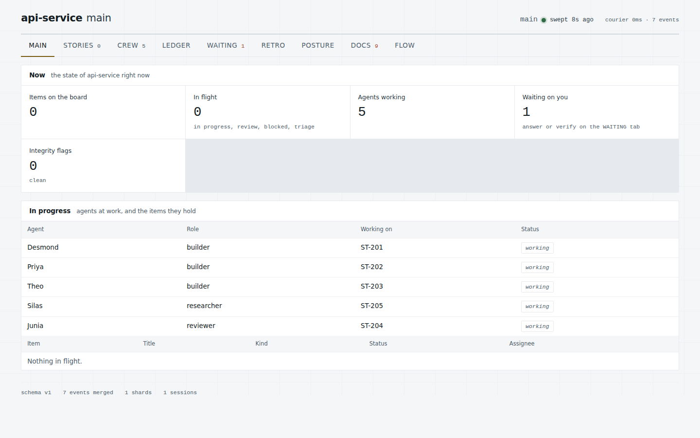
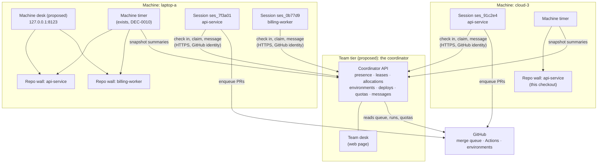
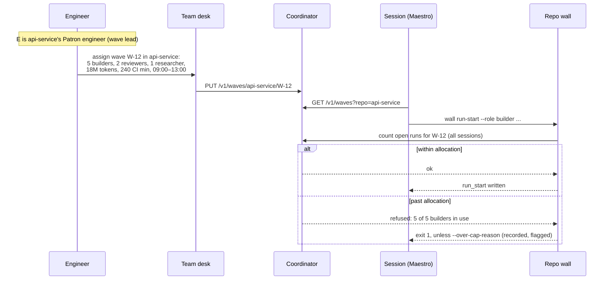
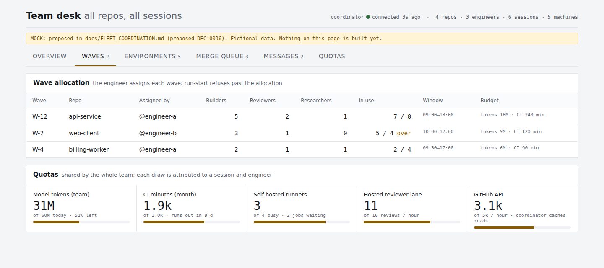
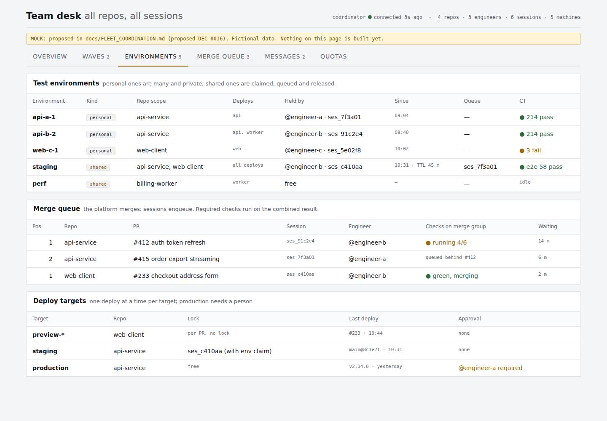
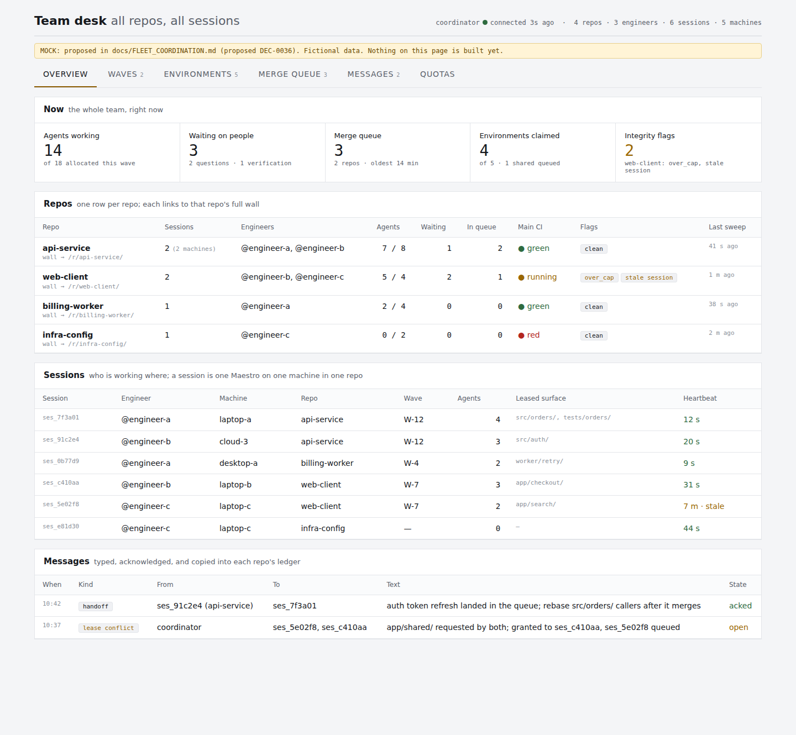
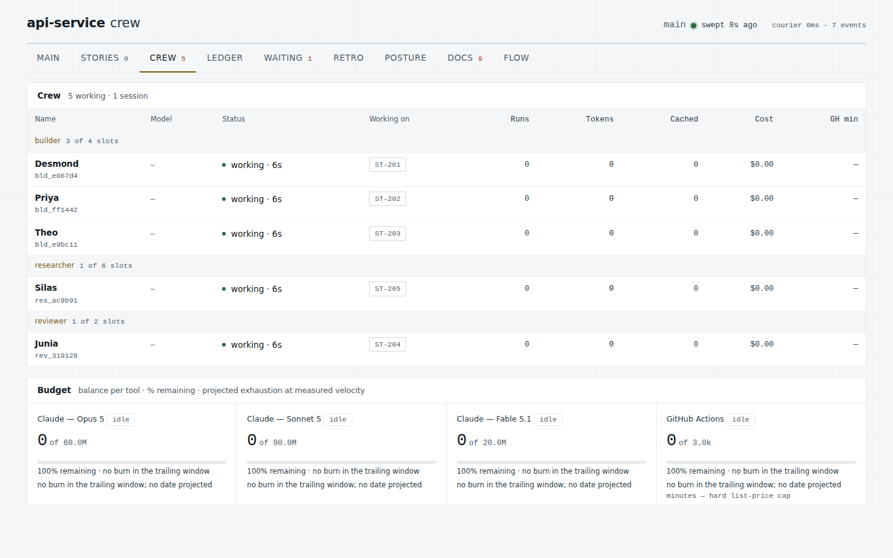
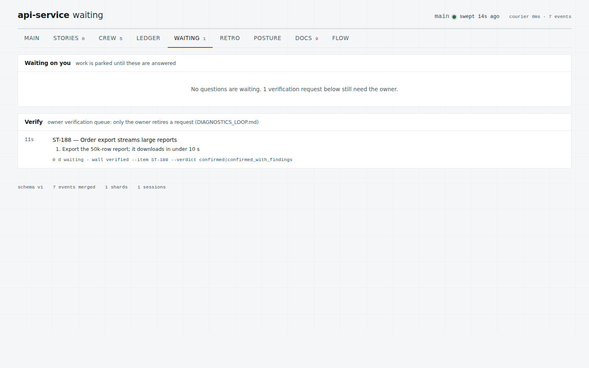

# FLEET_COORDINATION.md

**Status: PROPOSED. Nothing in this document is built.** It is the design for
running the kit with a team of engineers, each with one or many sessions, on
one or many machines, in one or many repositories. The ruling it asks for is
the proposed DEC-0036 in the appendix; the decision log holds only rulings in
force, so it is filed there when the owner accepts it. Every command, file and endpoint named below as *proposed* does not exist
yet; the pieces that exist today are named as such and linked to their code.

Screenshots of the wall are real renders of the current template. Screenshots
of the desk are renders of a static mock (`docs/fleet/desk-mock.html`) with
fictional data.

---

## 1. Why: what breaks today

The kit was built around one repository, one session and one wall. Some of it
already scales to more; some of it breaks at the second session.

| Situation | What works today | What breaks |
|---|---|---|
| One engineer, many repos, one machine | One machine timer sweeps every registered repo (`~/.wall/registry.json`, DEC-0010). Each repo renders its own wall. | `wall serve` binds `127.0.0.1:8123` for one repo; a second repo collides on the port. There is no page that shows all repos. `INSTALL.md` promised a "cross-repo rollup" that was never built. |
| Many sessions, one repo, one machine | Leases in `.wall/registry/leases.json` keep subagents in one session off each other's paths. | Each session is its own Maestro with merge authority (DEC-0002, DEC-0016), so two sessions can race merges. |
| Many sessions, one repo, many machines | Each checkout has a complete wall of its own work. | The roster (`agents.md`), `open_runs.json` and `leases.json` live in each checkout. A session on another machine cannot see them, so two sessions can lease the same path, and role caps are counted per checkout, not per repo. `wall ship` force-overwrites the one `wall-events` branch, so two machines shipping the same repo erase each other's telemetry. |
| Many engineers | Every event carries a `session_id` and an agent key. | Nothing records which person a session acts for. No shared view, no rule for who may merge, no record of who holds a test environment or a deploy target. |
| Shared resources | Per-repo budgets on the CREW tab; per-lane reviewer budgets (`REVIEWER_LANES.md`). | CI minutes, runners, model tokens, reviewer lanes and the GitHub API rate limit are account-level. Per-repo meters cannot see the team's total draw, and nothing arbitrates a shared staging environment or a deploy target. |

The repo wall itself is sound and stays as it is. What is missing is the layer
above it.


*The repo wall today (real render): the MAIN tab of one repository.*

---

## 2. What the owner decided

These answers set the design. They are recorded in the proposed DEC-0036 (appendix).

| Question | Answer |
|---|---|
| Who runs sessions | **A team of engineers**, each with one or many sessions, on one or many machines, in one or many repos. Two sessions in the same repo may be on different machines and belong to different people. |
| Who merges | **The platform merge queue.** No session merges directly. Sessions enqueue; the queue serializes merges and re-runs the required checks on the combined result. |
| How sessions communicate | **A small shared service**, the coordinator. |
| Where it runs | **Both options are laid out, and chosen at setup:** self-hosted or serverless. Same API, same trust model, same tests. Authentication is by GitHub identity in both. |
| How agents are allocated | **The engineer assigns each wave.** No automatic split across repos. |
| Production issue from a customer | **An incident override takes over all work in that repo** until the fix is in production. The fix still goes through the full process and cycle, all the way to production; the override changes priority, never the gates. |
| Shared-environment queue | **A priority can jump the queue.** Otherwise first come, first served. |
| Who leads a shared wave | **The repo's Patron engineer.** When several engineers share a repo's wave, the repo's Patron engineer is the wave lead: they assign its allocation, approve changes to it, and close it. |
| Coordinator history | **Kept indefinitely.** |
| Agent names | **Unique across the whole team.** No two live agents anywhere on the team share a name. |
| Who is in a wave | **The repo decides.** Engineers are in the same wave only when they work in the same repo, however many sessions each of them runs. Engineers in different repos are never in the same wave. |
| Repo dependencies | **Independent repos.** Coordination is about shared people, budget and environments, not code dependencies. |
| Contended CI/CD/CT resources | CI minutes and runners; test environments (**each engineer may have several personal environments; a repo may optionally have one or more shared environments, each covering one, several or all of that repo's deploys**); deploy targets; reviewer and API quotas. |

---

## 3. Vocabulary

| Term | Meaning |
|---|---|
| **Engineer** | A person, identified by their GitHub login. Owns sessions, approves production deploys. |
| **Patron engineer** *(proposed)* | The one engineer who is the Patron for a repo (today's Patron role, now one per repo). Leads that repo's wave: assigns its allocation, approves changes to it, closes it. |
| **Machine** | A workstation, VM, container or cloud sandbox that runs sessions. Has one machine timer (DEC-0010). |
| **Session** | One Maestro (DEC-0002) in one checkout of one repo on one machine, acting for one engineer. Identified by `session_id`, as today. |
| **Repo wall** | Today's wall: one repository's fold of its event ledger. Unchanged. |
| **Machine desk** *(proposed)* | One local page and server per machine showing every repo registered on it, with each repo's wall mounted under it. Needs no coordinator. |
| **Team desk** *(proposed)* | The coordinator's page: every repo, session, machine and engineer on the team. |
| **Coordinator** *(proposed)* | The shared service. Holds presence, cross-machine leases, wave allocations, environment and deploy claims, the quota ledger and messages. Holds no code and no secrets beyond its own. |
| **Wave allocation** *(proposed)* | The engineer's assignment of agent slots and budget to one wave in one repo. |
| **Environment** *(proposed as a kit object)* | A place tests run against: personal (owned by one engineer, many allowed) or shared (claimed, queued, released). |
| **Deploy target** *(proposed as a kit object)* | A place a deploy lands: preview, staging, production. One deploy at a time per target. |

---

## 4. Architecture: three tiers



**Tier 1, the repo wall.** Unchanged. Still the full, authoritative record of
one checkout's work, still foldable from events alone, still usable with no
network.

**Tier 2, the machine desk** *(proposed, no service needed)*. One server per
machine on `127.0.0.1:8123` serves an index of every repo in
`~/.wall/registry.json` and mounts each repo's wall under `/r/<name>/`. This
alone fixes the port collision and makes INSTALL.md's rollup claim true for
one machine. It keeps every existing server property: localhost bind, no-store
on polled files, path-traversal safety, an exact allowlist per repo.

**Tier 3, the team tier** *(proposed)*. The coordinator and the team desk. It
never replaces a repo's own ledger; it holds the things that must be shared
across machines and people, and mirrors a summary of each repo wall.

### What stays local, what becomes shared

| State | Today | Proposed |
|---|---|---|
| Event ledger, items, decisions | Per checkout | **Per checkout, unchanged.** Coordinator events are also written into each affected repo's ledger, so a repo's history stays complete on its own. |
| Roster (`agents.md`) | Per checkout | Per checkout, **with names unique across the whole team**: the coordinator is the name registry. A live agent's name is never live anywhere else on the team, in any repo or session, so a name on the desk means exactly one agent. Keys stay the identity (DEC-0003) and never change. |
| Leases | Per checkout | **Local leases stay; a path lease that could collide with another session is also claimed at the coordinator**, which is the arbiter across machines. |
| Open runs, role caps | Per checkout | Per checkout for the hook; **counted against the wave allocation at the coordinator**. |
| Merge authority | Each Maestro | **The merge queue.** Sessions enqueue only. |
| Telemetry branch | One `wall-events` branch, overwritten | Superseded when a coordinator is configured; without one, **one branch per session** (`wall-events/<session_id>`) so machines stop overwriting each other. |
| Environments, deploy targets, quotas | Not modelled | Coordinator objects. |

**How team-wide names work.** `wall agents claim` *(exists)* picks a name from
the role's pool. With a coordinator configured, it asks the coordinator for a
name that is not live anywhere on the team, and releases it there on `wall
agents release`. The role pools grow to fit a team. If the coordinator is
unreachable, the claim takes a provisional local name, flagged on the wall;
on reconnect a colliding provisional name is renamed, and the key, which every
event references, never changes.

---

## 5. The coordinator

### 5.1 What it holds

Seven resources. Each change is an append-only event with an actor (engineer,
session, machine) and a time; current state is a fold of those events, the
same pattern as the repo ledger.

| Resource | Holds | Lifetime |
|---|---|---|
| `presence` | Every session: engineer, machine, repo, branch, wave, heartbeat, the kit version. | Stale after 5 minutes without a heartbeat; ended by `session_end`. |
| `leases` | Path claims per repo, per session, with a TTL. | Released at run end, session end, or TTL expiry. |
| `allocations` | Wave allocations: repo, role slots, token and CI budget, time window, assigned by. | Closed at wave close. |
| `environments` | Personal and shared environments, their repo scope and deploy set, and claims with a queue. | Claims carry a TTL; personal environments persist. |
| `deploys` | Deploy targets, their lock, their last deploy, approval requirements. | Lock held for the length of one deploy. |
| `quotas` | Model tokens, CI minutes, runner pool, reviewer lanes, GitHub API: limit, draw so far, draw per session and engineer. | Reset per the provider's window (hour, day, month). |
| `messages` | Typed messages between sessions and to people. | Open until acknowledged; kept indefinitely after. |

### 5.2 API sketch

JSON over HTTPS. Every write is idempotent with a client-chosen `op_id`, so a
retried call never double-claims.

| Call | Purpose |
|---|---|
| `POST /v1/sessions` · `POST /v1/sessions/{id}/heartbeat` · `DELETE /v1/sessions/{id}` | Check in, stay alive, check out. The heartbeat carries the repo wall's summary (the same fields `wall summary` prints). |
| `POST /v1/leases` · `DELETE /v1/leases/{id}` | Claim or release paths. A claim that overlaps another session's live lease returns `409` with the holder, and the caller queues or re-scopes. |
| `PUT /v1/waves/{repo}/{wave}` · `GET /v1/waves?repo=` | The engineer's allocation; sessions read it at run start. |
| `POST /v1/environments/{id}/claims` · `DELETE …/claims/{claim}` | Claim a shared environment or join its queue; release it. |
| `POST /v1/deploys/{target}/lock` · `DELETE …/lock` | Take and release a deploy lock. Production locks require an approval record. |
| `POST /v1/quotas/{name}/draws` · `GET /v1/quotas` | Record a draw; read remaining headroom. |
| `POST /v1/messages` · `POST /v1/messages/{id}/ack` · `GET /v1/messages?to=` | Send, acknowledge, poll. |
| `GET /v1/desk` | Everything the team desk renders, in one read. |

### 5.3 Trust model

- **Identity is GitHub identity.** A person signs in to the desk with GitHub.
  A session authenticates with a token that GitHub issues to that engineer
  (a fine-grained personal token, or a short-lived token from a GitHub App the
  team installs). The coordinator checks the token with GitHub and records the
  login on every event.
- **Membership is the access rule.** Access requires membership of a
  configured GitHub organization or team. A session may act on a repo only if
  its engineer has write access to that repo, and the coordinator checks this
  with GitHub, not with its own list.
- **Least data.** The coordinator stores no code, no diffs, no secrets
  belonging to repos, and no prompt text. It stores paths, item ids, counts,
  times and short message text. `DATA_PROTECTION.md` classes apply: message
  text is scanned for secret patterns before it is stored.
- **Authority does not widen.** The coordinator can refuse (a lease, a claim,
  a lock, a run past allocation). It can never grant anything GitHub does not
  already allow: it cannot merge, cannot deploy, cannot approve.
- **Everything is attributed.** Every event names engineer, session and
  machine. The Warden reviews the coordinator like any other data use
  (DEC-0025), and its gate applies before the first team rollout.
- **History is kept indefinitely.** Coordinator events are append-only and
  never expire: the team's record of who held what, when, and why stays
  complete, as each repo's ledger already does. Old events move to cheaper
  archive storage but stay readable. Two things make indefinite retention safe:
  - **People can be forgotten without losing the record.** Events refer to an
    engineer through a stable pseudonymous id; the id-to-login mapping is a
    separate table. Removing a person (for example under a data-protection
    request) deletes their mapping row, and their events remain, attributed to
    an anonymous id. This is the only kind of deletion the coordinator allows.
  - **Nothing sensitive is kept in the first place** (the least-data rule
    above), so indefinite retention never means keeping secrets or customer
    data indefinitely. Incident records carry the ticket id, never the
    customer's details.

### 5.4 When the coordinator is unreachable

A down coordinator must never stop an engineer from working, and must never let
two sessions silently collide.

| Action | Coordinator down |
|---|---|
| Build, test locally, write events, render the repo wall | Proceeds. |
| Run start inside a wave already allocated | Proceeds against the last allocation read; flagged `coordinator_unreachable` on the wall. |
| Lease a path already leased locally | Proceeds. A new cross-session lease on a path last seen held elsewhere is refused. |
| Claim a shared environment, take a deploy lock | **Refused.** These are exactly the collisions the coordinator exists to prevent. |
| Enqueue a PR | Proceeds; the merge queue is GitHub's, not the coordinator's. |
| Messages | Queued locally in `.wall/outbox/` and sent on reconnect. |

### 5.5 Two ways to run it, chosen at setup

| | Self-hosted | Serverless |
|---|---|---|
| What runs | One stdlib Python service plus SQLite, packaged for Docker. The Kubernetes target in `DEPLOYMENT_TARGETS.md` gains a Deployment and a Service for it. | The same handlers as functions behind an API gateway, with a managed key-value or SQL store. |
| Operated by | The team (one box or one cluster). | The cloud provider. |
| Cost at rest | The box. | Near zero. |
| Latency | Lowest on a local network. | Cold starts; fine for minute-scale coordination. |
| Data location | Wherever the team puts the box. | The provider's region. |
| Setup (proposed) | `wall fleet init --mode self-hosted` writes the compose or Kubernetes files and a `fleet` block in `wall.json`. | `wall fleet init --mode serverless --provider <name>` writes the function bundle and infrastructure template. |

Both share one handler library and one test suite; only the storage adapter and
the entry point differ. `wall fleet init --mode none` records that the team
runs without a coordinator, and everything in section 4's "today" column keeps
working.

---

## 6. Agent allocation per repo

### 6.1 The rule

**The repo's Patron engineer assigns each wave.** Before a wave starts, the
repo's Patron engineer, as wave lead, records how many agents of each role it may run, its token and CI budget,
and its time window. Role caps in each repo's `wall.json` stay as hard
ceilings; the allocation is at or below them.



### 6.2 How it is counted

- **Wave membership follows the repo.** A wave belongs to exactly one repo,
  and a repo has at most one open wave at a time. Every session working in
  that repo is in its wave, whichever engineer and machine it belongs to and
  however many sessions each engineer runs; they share its allocation. Two
  engineers in different repos are never in the same wave. The desk shows who
  is using which slots.
- `wall run-start` *(exists)* already refuses past `role_limits`. With a
  coordinator configured it also refuses past the wave's allocation, counting
  open runs across **every** session in the wave. `--over-cap-reason` still
  opens the run, still records the reason, and the courier still flags
  `over_cap`, now at the team level too (the "5 / 4 over" row below).
- Token and CI budgets are soft limits: the desk shows burn against them and
  raises a message to the wave's engineer at 80% and 100%. The hard ceiling
  remains the account's own quota.
- **The Patron engineer leads the shared wave.** Other engineers working in
  the repo ask the wave lead for slots or budget (a `question` message); only
  the wave lead changes the allocation and closes the wave. Every engineer
  still owns their own sessions.
- The wave lead may reassign mid-wave. A reassignment is a `rebalance` event
  *(exists: `wall rebalance`, one knob per cycle)* recorded against the wave.


*Team desk, WAVES tab (mock): each wave's allocation, what is in use, and the
team-wide quotas every draw counts against.*

### 6.3 Worked example

Three engineers, four repos, one morning.

| Engineer | Sessions | Repo | Wave | Allocation | Why |
|---|---|---|---|---|---|
| @engineer-a | laptop-a | api-service | W-12 | 5 builders, 2 reviewers, 1 researcher | Release-week work; highest priority. |
| @engineer-b | cloud-3 | api-service | W-12 (shared) | uses W-12 slots | Joins the same wave on an auth change. |
| @engineer-a | desktop-a | billing-worker | W-4 | 2 builders, 1 reviewer, 1 researcher | Long-running retries work in the background. |
| @engineer-b | laptop-b | web-client | W-7 | 3 builders, 1 reviewer | UI work. |
| @engineer-c | laptop-c | web-client | W-7 (shared) | uses W-7 slots | A search change in the same wave. |
| @engineer-c | laptop-c | infra-config | none | 0 | Reviewing only; no agents. |

@engineer-a is in two waves because they work in two repos. @engineer-a and
@engineer-b are in the same wave (W-12) because both work in api-service, and
@engineer-b and @engineer-c share W-7 for the same reason. @engineer-a and
@engineer-c share no wave: they never work in the same repo.

---

## 7. Communication between sessions

### 7.1 Channels

| Channel | Carries | Latency |
|---|---|---|
| **Presence** | Who is where, on what, since when. | Heartbeat every 60 s. |
| **Leases** | "I am writing these paths." | On claim. |
| **Messages** | Typed: `handoff`, `question`, `notice`, `blocker`, `lease_conflict`, `release_request`. Each has a sender, recipients (sessions, engineers or a repo), an optional item id and a required acknowledgement. | Pushed on the next heartbeat; the Maestro reads its inbox at each wave checkpoint. |
| **The merge queue** | "This change is ready." GitHub's own state. | Immediate. |
| **The repo ledger** | The durable record. Every coordinator event that concerns a repo is also written into that repo's ledger as an event, so the repo's history is complete without the coordinator. | Next sweep. |

### 7.2 Rules

1. **Sessions never talk directly.** Everything goes through the coordinator,
   so it is attributed, ordered and visible on the desk.
2. **A message is not delivered until acknowledged.** An unacknowledged
   `blocker` or `question` past its SLA escalates to the recipient's engineer,
   then to the repo's owner, using the existing escalation ladder
   (`WORKFLOW.md` section 4).
3. **Questions still go decision-log first.** A cross-session question checks
   the repo's decision log before it is sent; the answer, if it is a ruling,
   becomes a DEC-NNNN in the repo it concerns.
4. **Handoffs carry state, not prose.** A `handoff` names the item, the branch,
   the last commit and the leases being released, so the receiving session can
   verify rather than trust (DEC-0011).

### 7.3 The same repo on different machines

```mermaid
sequenceDiagram
  participant A as ses_7f3a01 (laptop-a, @engineer-a)
  participant C as Coordinator
  participant B as ses_91c2e4 (cloud-3, @engineer-b)
  participant Q as Merge queue
  A->>C: lease src/orders/, tests/orders/
  B->>C: lease src/auth/
  C-->>B: ok (disjoint)
  B->>C: lease src/orders/api.py
  C-->>B: 409 held by ses_7f3a01 until 11:10
  B->>C: message release_request to ses_7f3a01
  A->>C: ack; will release after PR #415 enqueues
  B->>Q: enqueue PR #412 (auth)
  A->>Q: enqueue PR #415 (orders)
  Q-->>A: #415 rebased onto #412 in the merge group; checks re-run
  C-->>B: lease src/orders/api.py granted (A released)
```

### 7.4 Different repos

Independent repos share people, budget and environments, not code. The
cross-repo messages that matter are therefore about resources: a shared
environment's queue moving, a quota nearing its limit, an engineer switching
their attention. `FLEET.md` *(exists)* still governs the one thing repos do
exchange on purpose: the hash-pinned shared block, delivered by draft PR.

---

## 8. Merging: the platform merge queue

### 8.1 What changes

Today the Maestro merges, one at a time, in a chosen order (DEC-0016). Under
DEC-0036 the Maestro **enqueues** and the platform merges. Everything else in
DEC-0016 holds: cooperative parallel PRs on disjoint leased surfaces, no push
to a branch whose checks are running, the transplant procedure per PR.

| Step | Before | After |
|---|---|---|
| Unit green, reviewed | Maestro merges when its turn comes. | Maestro enqueues. |
| Ordering | Maestro chooses. | Queue order; the engineer may reprioritise in GitHub. |
| Combined check | The next PR rebases onto the moved main before its turn. | The queue builds a merge group (the PR on top of everything ahead of it) and runs the required checks on it. |
| A merge group fails | n/a | The PR leaves the queue; its session gets a `blocker` message and handles it through the normal CI-red path. |

### 8.2 CI changes the kit must make

- **Workflows run on `merge_group`.** Required checks must trigger on the
  `merge_group` event as well as `pull_request`, or the queue waits forever.
- **DEC-0035's concurrency group gains a third payload.** A merge-group run
  must never share a group with, or cancel, a pull-request run. The recipe and
  `tests/test_ci_group_recipe.py` gain the merge-group case.
- **Branch protection requires the queue.** The kit's setup checks that the
  default branch requires the merge queue and the listed checks, and reports it
  on the POSTURE tab.

---

## 9. CI, CD and continuous testing across sessions

### 9.1 CI minutes and runners

- Every workflow run is attributed to a session and an engineer: the branch
  carries the session id, and the coordinator reads run usage from GitHub.
- The quota ledger holds the account's minutes; the desk shows draw per repo,
  per wave and per engineer, and projects when the month's minutes run out.
- Self-hosted runners are a pool. A session whose wave has used its CI budget
  gets a `notice`; past 100% it gets a `blocker` and its engineer decides.
- Existing rules still hold and matter more with more sessions: collapse
  superseded runs (DEC-0035), never push to a branch whose checks are running,
  scope CI only where escape rates allow (DEC-0014).

### 9.2 Test environments

Each engineer may have **several personal environments**. Each repo may
optionally have **one or more shared environments**, and each shared
environment covers **one, several or all** of that repo's deploys (a shared
environment may also span several repos, as `staging` does below).

| Field | Meaning |
|---|---|
| `id` | Name, e.g. `api-a-1`, `staging`. |
| `kind` | `personal` (one owner, no queue) or `shared` (claimed, queued, released). |
| `repos` | The repos it serves. |
| `deploys` | Which of each repo's deployable units it runs (`all`, or a list). |
| `owner` | For personal: the engineer. For shared: the repo owner. |
| `claim_ttl` | For shared: how long a claim lasts before it must be renewed. |
| `provision` | How it is created and reset (a script, a template, or "managed elsewhere"). |

**Continuous testing (CT)** runs against environments, not branches. A
session's CT suite runs on each deploy into the environment it holds, and its
results post to that session's repo wall and the desk. A shared environment's
claim is taken before the deploy into it and released after the CT run, so a
second session's deploy can never land in the middle of the first session's
test run.

**Queue order: a priority can jump the queue.** A shared environment's queue
is first come, first served, except that a claim marked with a priority moves
ahead of every claim without one (and ahead of lower priorities), keeping
arrival order among equals. Proposed defaults, open to the owner:

| Priority | Who may set it | Effect |
|---|---|---|
| `normal` | Anyone (the default) | Joins the back of the queue. |
| `high` | The claim's engineer, with a reason | Goes ahead of every `normal` claim. |
| `urgent` | The claim's engineer, with a reason; the repo's owner is notified | Goes to the front, ahead of `high`. |

A jump never interrupts the current holder: it takes the next turn, so no test
run is cut off halfway. The one exception is a production incident override
(section 9.5), which may interrupt. Every jump is an attributed event (who, which claim,
why, whom it passed), each passed session gets a `notice`, and the desk shows
how often each engineer jumps so the habit stays visible.

### 9.3 Deploy targets

| Rule | Detail |
|---|---|
| One deploy at a time per target | A deploy lock at the coordinator, taken by the session and released when the deploy finishes. |
| Attribution | Every deploy records engineer, session, commit and environment. |
| Production needs a person | A production lock requires an approval record from an engineer (GitHub environment protection rules are the enforcement; the coordinator only checks and records). |
| Previews need no lock | Per-PR preview targets are independent by construction. |


*Team desk, ENVIRONMENTS tab (mock): personal and shared environments with CT
results, the merge queue across repos, and deploy locks.*

### 9.4 Reviewer lanes and API quotas

- Hosted reviewer lanes (the project's `REVIEWER_LANES.md`, from `templates/REVIEWER_LANES.md.template`) get team-level budgets in the
  quota ledger; a lane near its hourly limit is shown before a session triggers
  another review.
- The coordinator reads GitHub once and serves many sessions (queue state, run
  usage, check results), so sessions stop spending the shared API rate limit on
  the same reads.

---

### 9.5 Production incident override

A production issue reported by a customer overrides **all work in that
repository** until the fix is running in production. The override changes
who goes first, everywhere the repository competes for anything. It never
removes a step: the fix goes through the full process and cycle, all the way
to production.

**Declaring it.** An engineer with write access to the repository declares the
incident *(proposed: `wall incident open --repo <name> --ref <ticket id>
--summary "<what the customer sees>"`)*. The reference is the customer ticket
id, never the customer's personal data (`DATA_PROTECTION.md`). The repository's
owner and every engineer with a session in the repository get a `blocker`
message at once. A repository has at most one open incident; a second report
of the same problem attaches to it.

**What it overrides, in that repository:**

| Resource | During the incident |
|---|---|
| Dispatch | No new run starts for anything except incident work (`wall run-start` refuses other items and names the incident). |
| Running agents | Every non-incident agent stops at its next checkpoint: it commits its work in progress to its own branch, records a `handoff`, and parks. Nothing is killed mid-write and nothing is lost. |
| Leases | The incident session may lease any path. A conflicting lease is released at the holder's checkpoint, with a handoff record. |
| Wave allocation | Incident runs get the slots they need regardless of the wave's allocation; each is recorded with the incident id as its over-cap reason. The paused agents' slots are freed for them. |
| Merge queue | The incident PR goes to the front. Other PRs for the repository are held (taken out of the queue) and put back automatically when the incident closes. |
| Shared test environments | The incident takes every environment that covers the repository, next. **Unlike a priority jump, it may interrupt:** the current holder is stopped after its current CT step, notified, and put back at the front of the queue afterwards. An environment shared with other repositories is interrupted for them too. |
| CI runners, reviewer lanes, API quota | Incident jobs and reviews go first. Budgets are not a reason to wait; the spend is recorded against the incident. |
| Deploy targets | Staging and production locks are reserved for the incident. |

**What it never overrides.** Every gate still runs, in order:

1. Reproduce the issue from the customer's report and record it as a finding
   (`wall finding`, *exists*), with a regression test that fails.
2. The fix is a story with citable acceptance criteria and a brief, built by
   a Builder under a lease, with the failing test now passing.
3. Review by the Reviewer and the hosted lanes; the Warden if the fix touches
   a regulated or security surface.
4. CI green on the PR and on the merge group.
5. Deploy to staging and run CT.
6. Deploy to production with a person's approval (GitHub environment
   protection still enforces it).
7. Owner verification (`wall verify-request`, *exists*) and the customer's
   confirmation through the ticket.

**Other repositories** keep working. They are affected only where they share
something with the incident's repository: a shared environment, runners,
reviewer lanes or quota, and they get a `notice` when that happens.

**Closing it.** After production is verified, the engineer closes the incident
*(proposed: `wall incident close --ref <ticket id>`)*. Parked sessions get a
message to resume, held PRs are put back in the queue (they rebase onto the new
main in the merge group), interrupted environment holders get their turn back,
and the wave's allocation applies again. The incident then feeds the existing
learning loop: a retrospective (`wall retro`, *exists*) and a failure-registry
entry with its recurrence test, in the same change as any preventive fix.

**Audit.** Every effect above is an event carrying the incident id, in the
repository's ledger and on the desk: who declared it, what it paused and
interrupted, every gate it passed, and when it closed.

---

## 10. Workflows

### W1. An engineer starts the day across several repos

1. The machine timer is already running (DEC-0010). The engineer opens the
   machine desk *(proposed)* at `http://127.0.0.1:8123/` and sees every repo
   registered on the machine.
2. On the team desk *(proposed)*, they assign today's waves: repo, roles,
   budget, window.
3. They start one session per repo. Each session checks in (`presence`),
   reads its wave allocation, and runs the existing session-start procedure
   (`SESSION_LIFECYCLE.md`), which gains one step: read the inbox.
4. Each Maestro plans and dispatches as today. `wall run-start` checks both the
   repo's role caps and the wave allocation.

### W2. Two engineers in the same repo on different machines

1. Both sessions check in to the same repo and so join its one open wave;
   the desk shows both, with their leased surfaces.
2. Each lease that could collide is claimed at the coordinator; overlapping
   claims return the holder, and the second session re-scopes or sends a
   `release_request`.
3. Both enqueue PRs; the merge queue orders and tests them together.
4. A failed merge group sends a `blocker` to the session whose PR left the
   queue; the other session is unaffected.

### W3. One engineer in the same repo on two machines

Same as W2, with one difference: both sessions share the engineer's identity,
so a `handoff` between them needs no second person's acknowledgement, only the
receiving session's.

### W4. Assigning and changing a wave

1. The repo's Patron engineer, as wave lead, sets the allocation. Other
   engineers in the repo request changes from them. The desk rejects an allocation above the
   repo's role caps or above the team's remaining quota, and says which.
2. Mid-wave, a change is recorded with `wall rebalance` *(exists)* and applies
   to the next run start; running agents are not stopped.
3. At wave close, `wall retro` *(exists)* compares the allocation with what was
   used, and the next allocation is informed by it.

### W5. From finished unit to merged

1. Unit green and reviewed on its PR, as today (`WORKFLOW.md` sections 5–6).
2. The Maestro enqueues. It does not merge.
3. The queue runs the required checks on the merge group.
4. On merge, the item moves to `done` from the ledger as today; the lease is
   released at the coordinator.

### W6. Using a shared test environment

1. The session claims `staging` (or joins its queue, with a priority and a
   reason if the work cannot wait). The desk shows the claim and the queue.
2. It deploys into `staging` (taking the deploy lock), runs CT, reads results.
3. It releases the claim. The next session in the queue is notified.
4. A claim past its TTL without renewal is released and flagged; the holder's
   engineer gets a `notice`.

### W7. Deploying

1. Staging deploys take the target's lock, deploy, release.
2. Production deploys additionally require an engineer's approval record, which
   GitHub's environment protection enforces.
3. Every deploy is an event in the repo ledger and a row on the desk.

### W8. The coordinator goes down

Section 5.4 applies. The repo walls keep working, the desk shows the
coordinator lamp cold, environment and deploy claims are refused, messages
queue locally, and on reconnect the outbox drains and presence is re-sent.

### W9. A new engineer or machine joins

1. The engineer is added to the configured GitHub team.
2. On their machine: bootstrap the repos as today, `wall install` the machine
   timer as today, then `wall fleet join` *(proposed)*, which writes the
   coordinator URL to `~/.wall/` and checks the engineer's token.
3. Their first session appears on the desk.

### W10. Leaving

`wall fleet leave` *(proposed)* checks out every session on the machine,
releases its leases and claims, and removes the coordinator settings. The team
tier can be removed entirely by setting the `fleet` mode to `none`; nothing in
any repo depends on it.

---

### W11. A customer reports a production issue

1. The engineer declares the incident for the repository with the customer
   ticket id. Everyone working in the repository gets a `blocker`.
2. Non-incident agents park at their next checkpoint; the incident session
   takes the leases, slots, runners and environments it needs.
3. The fix runs the full cycle (section 9.5): reproduce, failing test, story,
   build, review, CI, merge queue (at the front), staging and CT, production
   with approval, owner verification, customer confirmation.
4. The engineer closes the incident. Parked work resumes, held PRs re-enter
   the queue, and the retrospective and failure-registry entry follow.

---

## 11. The machine desk and the team desk

### 11.1 Machine desk *(proposed)*

- `wall serve` on a machine with more than one registered repo serves an index
  page at `/` and each repo's wall at `/r/<name>/`. With one repo it behaves as
  today.
- The index shows, per repo: last sweep, integrity flags, waiting-on-you
  (questions plus verifications), agents working, open PRs.
- It needs no coordinator and no network. It is how one engineer with many
  repos on one machine works, even without a team.

### 11.2 Team desk *(proposed)*

Six tabs: OVERVIEW, WAVES, ENVIRONMENTS, MERGE QUEUE, MESSAGES, QUOTAS. Each
repo row links to that repo's wall. The desk shows only summaries; the repo
wall remains where the detail and the evidence live.


*Team desk, OVERVIEW tab (mock): every repo, every session, and the messages
between them.*

For comparison, the repo wall's CREW and WAITING tabs as they render today:


*Repo wall, CREW tab (real render): agents by role against their slots, and
the budget panel.*


*Repo wall, WAITING tab (real render): open questions and the owner
verification queue.*

---

## 12. Configuration *(proposed)*

A `fleet` block in `.wall/config/wall.json`, and the machine's
`~/.wall/fleet.json` for the coordinator URL and token reference:

```json
{
  "fleet": {
    "mode": "none | self-hosted | serverless",
    "coordinator_url": "https://desk.example.internal",
    "github_org": "your-org",
    "github_team": "your-team",
    "heartbeat_s": 60,
    "lease_ttl_min": 45,
    "message_sla_min": {"blocker": 30, "question": 120},
    "environments": [
      {"id": "staging", "kind": "shared", "repos": ["api-service", "web-client"],
       "deploys": "all", "claim_ttl_min": 45}
    ],
    "deploy_targets": [
      {"id": "production", "repo": "api-service", "approval": "required"}
    ]
  }
}
```

The token itself never goes in either file; `fleet.json` names where it is
read from (an environment variable or the OS keychain).

---

## 13. Rollout, in phases

Each phase ships on its own, with tests, and leaves the kit fully usable if
the next phase never comes.

| Phase | Delivers | Needs a coordinator |
|---|---|---|
| **P0. Machine desk** | Multi-repo `wall serve`, the machine index page, per-session telemetry branches, INSTALL.md's rollup made true. | No |
| **P1. Coordinator core** | Presence, cross-machine leases, messages; self-hosted and serverless adapters; `wall fleet init/join/leave`; the team desk OVERVIEW. | Yes |
| **P2. Allocation and quotas** | Wave allocations, run-start checks against them, the quota ledger, the WAVES and QUOTAS tabs. | Yes |
| **P3. Merge queue** | Enqueue instead of merge in the role sheets and `WORKFLOW.md`; `merge_group` in CI and in DEC-0035's recipe; branch protection checks on POSTURE. | No (GitHub) |
| **P4. Environments and deploys** | Environment and deploy objects, claims, CT reporting, the ENVIRONMENTS tab. | Yes |
| **P5. Incident override** | `wall incident open/close`, the dispatch freeze and checkpoint parking, queue holds, environment interruption, the incident banner on the desk and the repo wall. | Yes (the freeze and parking also work locally in one checkout without it) |

P0 and P3 are useful to a single engineer and can ship first.

---

## 14. Cautions

- **A coordinator is a new trust boundary.** It sees who works on what and
  when across the team. Put it through the Warden's gate (DEC-0025) before the
  first team rollout, and keep it to the least data in section 5.3.
- **Do not let the desk become the source of truth.** The repo ledger is. If
  the desk and a repo wall disagree, the repo wall wins and the desk is flagged.
- **Merge queues change CI costs.** Each merge group is another CI run. The
  saving is fewer red mains and fewer rebases; measure both.
- **Shared environments serialize people.** A long claim blocks the queue.
  Keep TTLs short and CT suites fast, and prefer personal environments.
- **Allocation by hand needs a habit.** If waves are not assigned, run-start
  refuses. The desk shows unassigned sessions so the gap is visible.
- **An override is expensive; keep it for real incidents.** It parks everyone
  in the repository and interrupts shared environments. The desk shows how
  often each repository declares one, and each is reviewed in its retro.
- **Indefinite retention grows.** Plan archive storage from the first
  rollout, and have the Warden confirm the pseudonymous-id design against
  the regimes the team is under before any real data lands.
- **Clock skew across machines.** Order comes from the coordinator's clock,
  never the client's.

---

## 15. Questions still open for the owner

1. **Wave ownership.** Settled: the same repo means the same wave, and the
   repo's Patron engineer leads it (assigns, approves changes, closes).
   Still open: who stands in when the Patron engineer is away?
2. **Priority levels.** Settled: a priority can jump the queue (section 9.2).
   Still open: are the proposed levels and who may set them right, and should
   `urgent` need the repo owner's approval rather than only notifying them?
3. **Message routing to people.** Should `blocker` and `question` messages also
   reach engineers outside the desk (email, chat), and if so which?
4. **Retention.** Settled: indefinitely (section 5.3). Still open: confirm
   pseudonymous ids with a removable mapping as the way to honour a
   person's removal request without breaking the record.
5. **Serverless provider.** Which provider should the serverless reference
   deployment target first?
6. **Agent names across sessions.** Settled: unique across the whole team
   (section 4). Still open: should a released name stay reserved for a
   cool-off period before any other session may reuse it?
7. **Cost attribution.** Should quota draws roll up to engineers only, or also
   to a cost centre per repo?
8. **Who may declare an incident.** Any engineer with write access (proposed),
   or only the repository's owner or an on-call rota?
9. **Running agents during an incident.** Park at their next checkpoint
   (proposed), or stop immediately?
10. **Incident notification.** Beyond the desk, how should an incident reach
    people (ties to question 3)?

---

## Cross-references

`INSTALL.md` (the machine timer and registry) · `DEPLOYMENT_TARGETS.md` ·
`FLEET.md` (the cross-repo exchange) · `WORKFLOW.md` sections 4, 9 ·
`SESSION_LIFECYCLE.md` · `templates/REVIEWER_LANES.md.template` · `DATA_PROTECTION.md` ·
DEC-0002, DEC-0010, DEC-0011, DEC-0014, DEC-0016, DEC-0025, DEC-0035, DEC-0036.

---

## Appendix: the proposed ruling

### DEC-0036 (proposed): A team tier above the repo wall: a coordinator, the platform merge queue, and waves the engineer assigns

The owner's answers are recorded below. On acceptance this text is filed as
`docs/decisions/DEC-0036.md` with `status: active`, citing this design and
the reconciliation record as every kit decision does, and the open
questions in section 15 are answered or deferred by name.

#### Question

The kit assumes one repository, one session and one wall. A team runs many
sessions, on many machines, in many repositories, and two sessions in one
repository can belong to different people on different machines. What is
shared, who merges, how do sessions talk, and who decides how many agents each
repository gets?

#### Decision

The Patron (2026-09-24):

1. **The team is the unit.** Engineers each run one or many sessions, on one
   or many machines, in one or many repositories.
2. **The platform merge queue merges.** No session merges directly. A
   Maestro enqueues; the queue serializes merges and runs the required checks
   on the combined result. This narrows DEC-0016's "the Maestro merges one at
   a time" to "the Maestro enqueues"; DEC-0016's cooperative parallel PRs on
   disjoint leased surfaces stand.
3. **Sessions communicate through a small shared service**, the coordinator:
   presence, cross-machine leases, wave allocations, environment and deploy
   claims, a quota ledger and typed, acknowledged messages. The repo ledger
   stays the source of truth; coordinator events that concern a repository are
   also written into its ledger.
4. **Both hosting options are laid down, chosen at setup:** self-hosted or
   serverless, one API, one trust model, one test suite. Identity is GitHub
   identity; access is membership of a configured organization or team; the
   coordinator can refuse but never grant.
5. **Wave membership follows the repo.** Engineers are in the same wave only
   when they work in the same repository, however many sessions each runs; a
   repository has at most one open wave at a time, and engineers in
   different repositories never share one.
6. **The repository's Patron engineer leads its wave** and assigns it: role
   slots, budget and window, changes to them, and closing it. No automatic split across
   repositories. Role caps in each repository stay as ceilings; `wall
   run-start` also refuses past the wave's allocation, counted across every
   session in the wave, unless an over-cap reason is recorded.
7. **Agent names are unique across the whole team.** The coordinator is
   the name registry; keys remain the identity (DEC-0003).
8. **The coordinator keeps its history indefinitely**, append-only, with
   engineers referenced by pseudonymous ids so a person can be removed
   without deleting the record.
9. **Repositories are independent.** Coordination covers people, budget,
   environments and deploy targets, not code dependencies.
10. **Test environments:** each engineer may hold several personal
   environments; a repository may optionally have one or more shared
   environments, each covering one, several or all of its deploys. Shared
   environments and deploy targets are claimed, queued and released through
   the coordinator; production requires a person's approval. A shared
   environment's queue is first come, first served, except that a claim with
   a priority jumps ahead; a jump never interrupts the current holder and is
   always attributed.
11. **A customer-reported production issue overrides all work in its
   repository** until the fix is in production: dispatch, leases, the wave's
   allocation, the merge queue, shared environments (which it may
   interrupt), runners, reviewer lanes and deploy locks all serve it first.
   It never removes a gate: the fix goes through the full process, all the
   way to production, with a person approving the production deploy.
12. **Contended resources are metered team-wide:** CI minutes and runners,
   deploy targets, reviewer lanes and API quotas, each draw attributed to a
   session and an engineer.

#### Why

Two sessions on one repository today can lease the same path, race a merge,
double-count role caps and overwrite each other's telemetry, and nothing
records which person a session acts for. A second wall does not fix that; a
shared arbiter does. Keeping the repo ledger authoritative keeps every
repository usable on its own, and keeping the coordinator unable to grant
anything keeps GitHub's permissions the only ones that matter.

#### What this rules out

Sessions coordinating peer to peer; a session merging directly once the queue
is configured; the coordinator holding code, diffs, prompt text or repository
secrets; the desk overriding a repo wall; automatic cross-repository agent
allocation.

#### Revisit if

The platform merge queue is unavailable for a host, the team outgrows one
coordinator, or measured wave data shows hand allocation costs more than it
saves.
