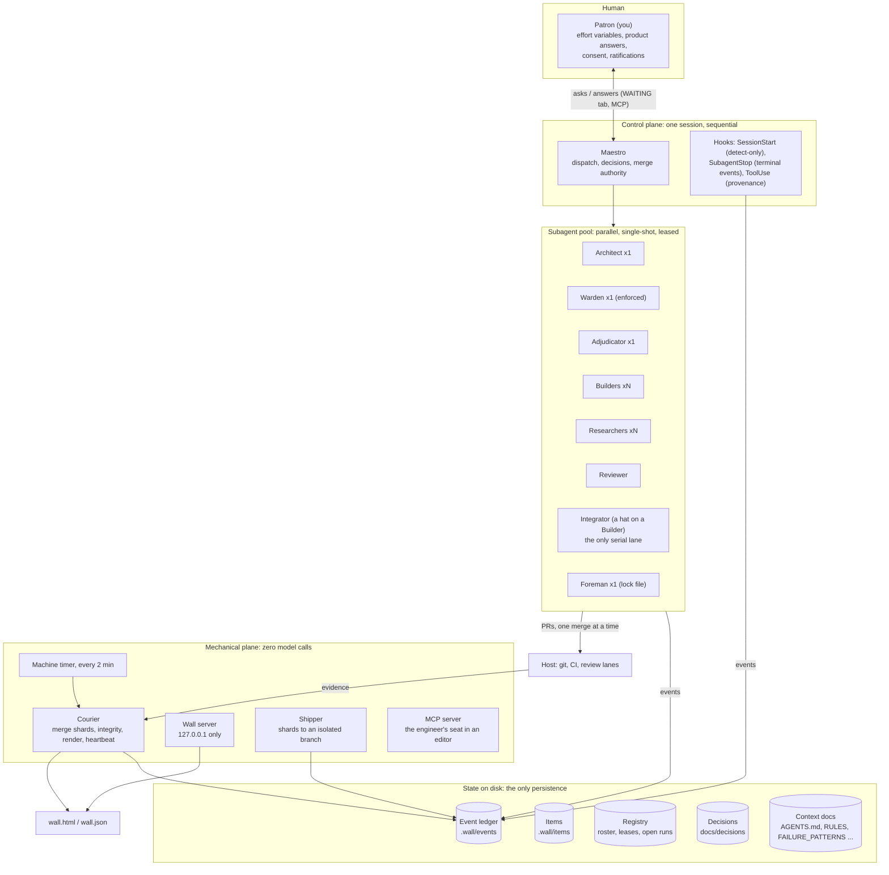
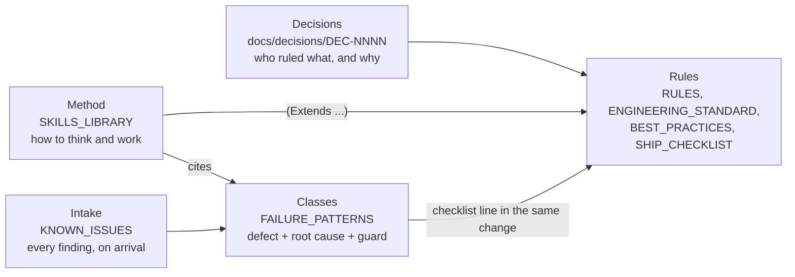
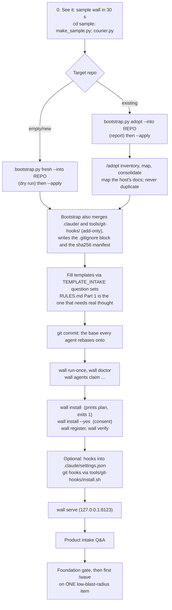
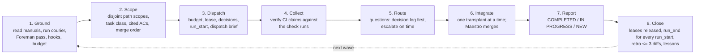
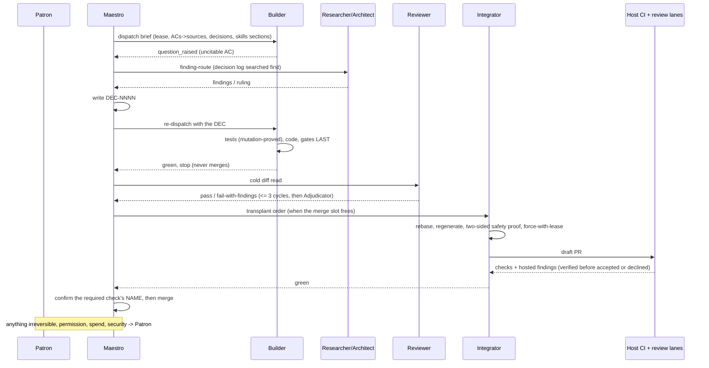
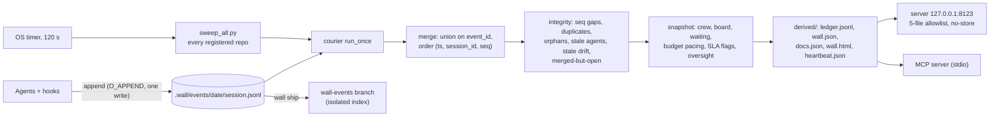
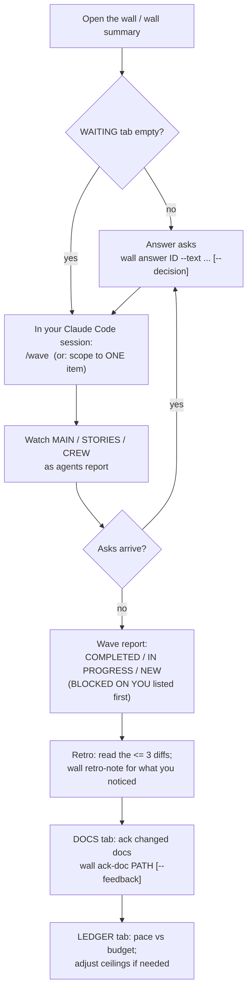
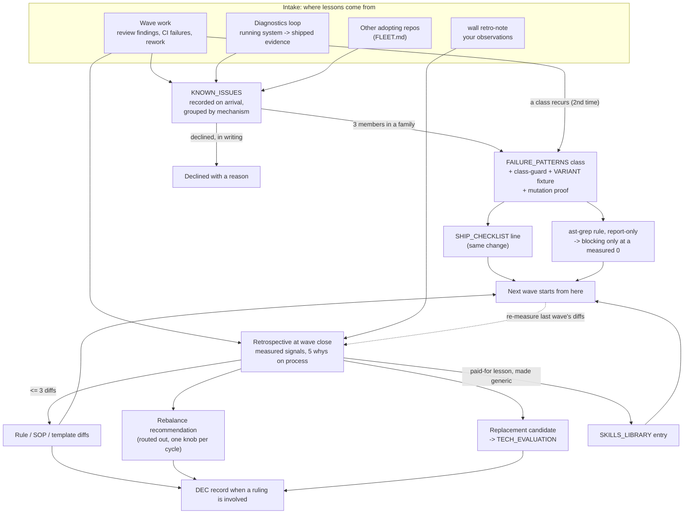
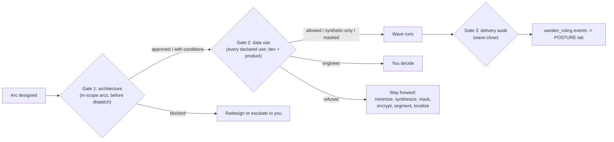
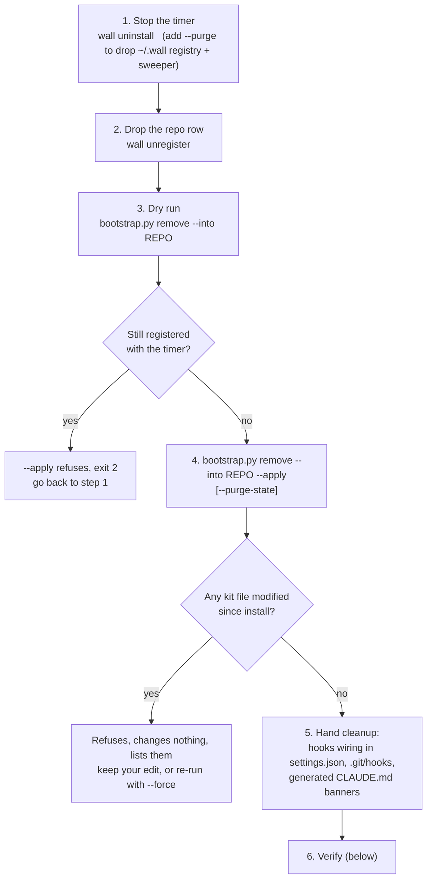

# Wall Kit: Technical Reference, User Guide and White Paper

> **This is the consolidated source of truth for the kit.** It covers what the kit is, how it installs and works, how you work with it, how it learns, how it is removed, what to be careful of, and every change made to it. It is one document, maintained by rule.
>
> **How it stays true.** Any change to the kit's behavior, commands, configuration, roles, decisions, install or removal, or its documentation updates this file **in the same pull request**. `tests/test_guide_current.py` fails CI when this guide falls behind the code: a `wall` command, a bootstrap mode, a config key, an integrity flag, a role, a skill, a decision or a document that exists but is not described here. The Reviewer rejects a behavior change that leaves this guide untouched, and the Maestro's standing rules and the wave's close carry the same rule. The change log (Appendix C) records every change, newest first.
>
> Where this guide and a narrower document disagree, the narrower document is the detailed record for its subject and this guide is corrected to match it in the same change. `docs/RECONCILIATION.md` remains binding over both.

## 1. Abstract

> **Read this first.** The kit is a blueprint for an engineering organization run by AI agents. Its author explicitly does **not** endorse using it to replace human decision makers, builders, architects, designers, managers or engineering leaders. Every gate that routes to "the engineer" is there because a person owns that call, and removing the person removes the safety property. Use it to amplify an accountable team, not to substitute for one.

### The problem

AI-assisted delivery fails in predictable ways. Nobody supports the code after it ships. Quality is a coin flip. The work lives only in one session's memory. It doesn't scale past one agent. Nobody can audit what the AI did or undo it. Security is bolted on afterwards. And none of it will pass a compliance review.

### The thesis

What's missing is an **organization**: written roles with authority limits, a durable record of everything that happened, gates that code enforces, and a loop that turns every failure into a guard so the next round of work starts smarter. Models are used for judgment. Everything that can be bookkeeping is plain code.

### What the kit is

| Term | Meaning |
| --- | --- |
| **Blueprint** | The written design of the organization: roles, authority limits, procedures, decisions, standards. Lives in `docs/`, `.claude/` and `templates/`. |
| **Kit** | The drop-in machinery that runs it: an event ledger, a courier that merges and checks it, a live status wall, a CLI, an MCP server, install adapters, bootstrap and context-sync tools. Lives in `tools/wall/` and `frontend/theme/`. |
| **Wall** | The visible surface: a local web page (MAIN, STORIES, CREW, LEDGER, WAITING, plus RETRO, POSTURE, DOCS and FLOW) showing measured status, cost, integrity and what is waiting on you. |
| **Patron** | You, the driving engineer. You supply the effort variables, product answers and the consent decisions no agent may make. |
| **Maestro** | The top-level AI session that runs the process. It dispatches work, holds merge authority and follows written procedure. |

### Five founding ideas

1. **Agents don't persist; state does.** Subagents are single-shot. Persistence lives on disk and is driven by hooks and one timer, so a new session (human or AI) resumes from the files, not from memory.
2. **Bookkeeping is code, not cognition.** Counting, merging and rendering are deterministic Python with zero model calls. Models are reserved for judgment.
3. **Evidence outranks self-report.** Status comes from git, tests, CI and the ledger. An agent that claims to be working past its deadline is shown as `stale`.
4. **Keys are identity; names are labels.** `bld_a41f09` is permanent. "Desmond" is a display name that can be reused.
5. **The ledger is reproducible.** A merge keyed on `event_id` and ordered by `(ts, session_id, seq)` rebuilds byte-identically, which makes the audit trail trustworthy.

### Honesty about capability

Every capability is graded by how it is actually held up:

- **Structural:** code refuses the violation (singleton roles, the localhost-only bind, the courier's integrity flags).
- **Procedural:** written instructions agents are briefed from, with key phrases pinned by tests.
- **Advisory:** a recommendation you can override.

`tests/test_capability_truth.py` fails if a claimed capability loses its instructions, so claims can't quietly become marketing. This document uses the same grades.

### Footprint

Standard-library Python 3.11+, plain HTML and CSS. No pip installs, no build step, no network calls from the machinery itself. A sample wall renders in 30 seconds; a real deployment takes an afternoon.

## 2. Architecture

### Five planes



| Plane | What it is | Why it's separate |
| --- | --- | --- |
| Human | The Patron: you | Consent, product truth and ratification can't be delegated |
| Control | The Maestro session plus hooks | One place holds dispatch and merge authority, so work never races |
| Agents | Single-shot role subagents | Judgment in parallel, each within a written authority limit |
| Mechanical | Timer, courier, server, shipper, MCP server | Bookkeeping as deterministic code: cheap, reproducible, never tired |
| State | Files on disk and in git | Agents don't persist. The files are the organization's memory |

### Knowledge layers

The knowledge documents are layered, and each layer has a different job and a different way to change:



| Layer | Changes by | Rule |
| --- | --- | --- |
| Decisions | A new DEC that supersedes the old one; never an edit | Append-only; a contradiction check reads the front matter |
| Rules | The owner, in writing | Part 1 of `RULES.md` is yours; Part 2 ships as-is |
| Classes | A finding that recurs, promoted with its guard | Append-only; a retired number is never reused |
| Method | A paid-for lesson, made generic | One copy per rule; product-free by test |
| Intake | Every finding, the moment it arrives | Leaves only as guarded (a class) or declined with a reason |

### State on disk

```
.wall/
  config/wall.json                 budget meters, role caps, thresholds      (tracked)
  registry/agents.md               key -> name roster                        (tracked)
  registry/leases.json             file-scope leases                         (tracked)
  registry/open_runs.json          dispatch state; survives a restart        (tracked)
  items/<item_id>.json             one per arc / story / bug                 (tracked)
  events/<date>/<sid>.jsonl        append-only shards      (ignored; shipped to an isolated branch)
  derived/  wall.html wall.json ledger.jsonl heartbeat.json      (ignored; regenerated)
  logs/     trace, 14-day TTL                                    (ignored)
  runs/<run_id>/  prompts, diffs, tool calls, 7-day TTL          (ignored; may hold sensitive text)
```

The rule of thumb: **`.wall/registry/` identifies things; `.wall/events/` and `.wall/derived/` can be rebuilt or are shipped elsewhere.** Item files are a materialized view of the event log. `wall diff-state` catches any item written outside that path.

## 3. Installation

### Prerequisites

| Need | Hard or soft | Notes |
| --- | --- | --- |
| Python 3.11+ | **Hard** | `--apply` refuses on older Python and exits 2; a dry run still runs |
| git | Soft | Missing git is a warning. The kit stamp reads `unknown`, and `wall ship` and upgrade deltas stop working |
| pip packages | None | Standard library only, never a pip install (DEC-0022) |
| OS | Any of three | Windows (Scheduled Task), macOS (LaunchAgent), Linux (systemd user timer, with a printed cron fallback) |
| Optional hosts | Soft | An MCP-capable editor, a browser for the wall, the platform scheduler for the timer |
| Claude Code | For the agent layer | Skills (`/adopt`, `/wave`, `/reviewer-integration`) and role sheets are discovered automatically once `.claude/` is present |

### The path, end to end



### Step 0: see it work (no install)

```bash
cd sample
python3 make_sample.py                     # fake event shards, zero model calls
python3 ../tools/wall/courier.py --repo .
open .wall/derived/wall.html
```

The sample deliberately includes four integrity problems: a sequence gap, two orphaned runs, an agent whose last event says it's working but who shows as `stale`, and a model reroute. It's a good way to see how the wall tells the truth.

### Step 1: bootstrap (four modes, all dry-run unless `--apply`)

Run from a **kit checkout**. Every mode takes `--into <repo>` (required), `--apply`, `--force` and `--mcp [claude-code cursor vscode]`; `remove` also takes `--purge-state`. All four refuse, exiting 2, if `--into` points at the kit itself. A refusal to touch a locally modified file exits 1 and changes nothing.

```bash
python3 tools/wall/bootstrap.py fresh   --into ../your-repo --apply --mcp claude-code cursor vscode
python3 tools/wall/bootstrap.py adopt   --into ../your-repo [--apply]
python3 tools/wall/bootstrap.py upgrade --into ../your-repo [--apply] [--force]
python3 tools/wall/bootstrap.py remove  --into ../your-repo [--apply] [--force] [--mcp ...] [--purge-state]
```

| Mode | What it does |
| --- | --- |
| **fresh** | Copies `tools/wall`, `docs`, `frontend/theme` and `templates`, file by file, skipping byte-identical files and `__pycache__`. Merges `.claude/` and `tools/git-hooks/` **by adding only**: a missing file is added, an identical one left alone, a differing host file reported as `COLLISION` and never overwritten (even with `--force`); `.claude/settings*.json` is never copied. Appends the kit's `.gitignore` lines in one marked block. Records the sha256 of every file it owns in the stamp. Writes the 11 root context documents from templates **only if missing**. Writes `.wall/config/wall.json` (from `wall.example.json`) and `.wall/registry/agents.md` if missing. Generates `CLAUDE.md` from `AGENTS.md`. Stamps `.wall/config/kit_source.json`. Writes MCP configs if `--mcp` is given. If a hand-written `CLAUDE.md` exists without an `AGENTS.md`, it skips `AGENTS.md` and tells you to run `context_sync.py sync --adopt`. |
| **adopt** | Detects what already serves each of 9 adoption functions (entry point, rules, failure registry, checklist, standards, decision log, budgets, docs map ...) and reports each as **MAPPED** or **GAP**. With `--apply` it copies the machinery: `tools/wall`, `docs` (excluding `docs/decisions`, so your decision log stays yours) and `frontend/theme`, merges `.claude/` and `tools/git-hooks/` by adding only (collisions reported, never overwritten), writes the `.gitignore` block and the manifest. It **never** writes templates or context docs. Gaps are listed for you to fill. |
| **upgrade** | Prints `git log old..new` since the stamped kit commit and tells you to read `docs/decisions/index.md` first. Re-copies the vendored trees, and **deletes** files that disappeared from the kit, but only under `tools/wall`, `frontend/theme` and the `.claude/` / `tools/git-hooks/` files bootstrap itself added. `docs/` and `templates/` are only added to. **Before changing anything it checks every file in the plan against the manifest:** a file whose bytes match neither its recorded hash nor the current kit copy is `MODIFIED` (or `UNVERIFIED` if unrecorded); the whole upgrade refuses, names them and exits 1 unless `--force`. Refreshes the `.gitignore` block, regenerates context copies, rewrites the stamp and never touches host config. |
| **remove** | See section 11. |

**MCP configs.** `--mcp` writes a `wall` server entry into `.mcp.json` (Claude Code), `.cursor/mcp.json` and `.vscode/mcp.json` (as a stdio server): `python tools/wall/mcp_server.py --repo . --role engineer`. It keeps an existing `wall` entry, merges into a file that has other servers, and skips a file that isn't valid JSON.

### Step 2: what bootstrap leaves to you

Bootstrap lays down the machinery, the roster (`.claude/`), the git hooks' files and the `.gitignore` block. It deliberately does **not** wire anything that runs code on your behalf: session hooks in `.claude/settings.json` and git hooks in `.git/hooks` stay opt-in (Step 4). Any `COLLISION` it reported is a decision for you: keep your file, or take the kit's, and record which as a DEC.

1. **Fill the templates.** Replace every `<PLACEHOLDER>` and delete the leading comment block. Run the question sets in `docs/TEMPLATE_INTAKE.md` as one batched round rather than guessing. Only `RULES.md` Part 1, your hard rules, needs real thought on day one.
2. **Commit a base.** The first commit should already contain the rules agents must follow, because every agent rebases onto it.
3. **Existing repo:** run `/adopt inventory`, then `/adopt map` (writes pointer stubs where your docs already serve a function), then `/adopt consolidate` (merges duplicates; every conflict is your call, recorded as a DEC). Three rules are non-negotiable on adoption: **per-invocation git identity**, **coordinator-only merge authority** and **gates run last**. Bootstrap merges `.claude/` by *adding* files; a role-name collision is a decision you record.

### Step 3: start the machinery

```bash
python3 tools/wall/wall.py run-once                        # merge shards, render the wall; works with nothing installed
python3 tools/wall/wall.py doctor                          # heartbeat, integrity flags, roster, plumbing
python3 tools/wall/wall.py agents claim --role builder --session <sid>
python3 tools/wall/wall.py install                         # PRINTS the plan and exits 1; creates nothing
python3 tools/wall/wall.py install --yes                   # consent: creates ONE timer per machine
python3 tools/wall/wall.py register                        # add this repo; no privileges needed
python3 tools/wall/wall.py verify                          # what the platform says is installed, heartbeat age
python3 tools/wall/wall.py serve                           # http://127.0.0.1:8123, localhost only
```

The Maestro is **never** claimed in the roster. It's the session you're talking to (DEC-0002).

**The machine timer** is one task per machine, not per repo (DEC-0010), with state in `~/.wall/` (or `%USERPROFILE%\.wall\`; override with `WALL_HOME`): `registry.json`, `sweep_all.py`, `heartbeat.json`, `courier.log`. It runs every 120 s by default, and the heartbeat is considered stale after 300 s.

| OS | Creates | Removes |
| --- | --- | --- |
| Linux | `wall-courier.service` + `.timer` in `~/.config/systemd/user` (`Persistent=true`), `systemctl --user enable --now` | `disable --now` |
| macOS | `~/Library/LaunchAgents/com.wallkit.courier.plist`, `launchctl bootstrap gui/<uid>` | `bootout` |
| Windows | `schtasks /Create /TN WallCourier /SC MINUTE /MO 2 /F` using `pythonw.exe` (no console window flashes) | `schtasks /Delete` |

`install --yes` is idempotent. Each adapter replaces its task in place. If the scheduler step fails, the registry and sweeper survive and the command exits 1. After the first yes on a machine, adding another repo is just `wall register`.

### Step 4: optional hooks

- **Session hooks** (`.claude/hooks/`) are **opt-in by design**, because hooks run code. Merge the `hooks` block from `hooks.json.example` into `.claude/settings.json` (this project) or `~/.claude/settings.json` (every project). `tool_use.py` records tool calls (secrets scrubbed, 256 KB cap). `subagent_stop.py` writes `run_end` / `run_error` events. Both always exit 0 and never block. Without them the ledger **degrades honestly**: `wall doctor` reports orphan runs instead of pretending the ledger is complete. No SessionStart hook ships. Two patterns are documented instead.
- **Git hooks** (`bash tools/git-hooks/install.sh`; bootstrap copies the files, installing them is your step): pre-commit regenerates scan rules and never blocks; pre-push refuses pushes to the default branch and runs the scan lane. Bypass with `SKIP_RULES_REGEN` / `SKIP_PUSH_GATE`, never with `--no-verify`.

### Letting an AI session do all of it

`docs/LLM_BOOTSTRAP.md` is the day-zero procedure an AI session can follow end to end: 0 orient (no writes), 1 lay files down, 2 start the machinery, 3 product intake, 4 first wave behind the foundation gate, 5 operating state. The session asks you only to run or verify the consent-gated steps (`install --yes`), and keeps an ask/verify ledger table.

### Containers, VMs, Kubernetes

`docs/DEPLOYMENT_TARGETS.md` covers who runs the timer, who serves the wall and who ships shards when there's no desktop session. `run-once` is the universal entry point, so a CI job, a cron sidecar or a git hook can drive the courier with no platform timer at all.

## 4. What gets installed, and who owns it

### Ownership model

Ownership decides what upgrade may overwrite and what remove may delete. Get it wrong and you either lose edits or leave debris.

| Class | Paths | Upgrade | Remove |
| --- | --- | --- | --- |
| **Kit-owned tree** | `tools/wall/`, `frontend/theme/` | Overwritten verbatim; files dropped upstream are **deleted**; a locally modified file blocks the upgrade unless `--force` | Deleted, except a locally modified file blocks the remove unless `--force` |
| **Kit-owned by filename** | `templates/<kit template names>` | Added and updated | Each unmodified kit-named file deleted (modified ones need `--force`); the folder stays if host files remain (a `templates/` folder is common in Flask and Django apps) |
| **Merged, add-only** | `.claude/` (MAESTRO, 8 role sheets, 3 skills, hooks; never `settings*.json`), `tools/git-hooks/` | Missing files added; files bootstrap added are refreshed or pruned if unmodified; host files never touched | Files bootstrap added and you did not modify are deleted; host-authored files never |
| **Marked block** | The kit's lines in `.gitignore` between `# >>> wall kit` and `# <<< wall kit` | Refreshed in place | Stripped back to your exact bytes (the file is deleted if the kit created it) |
| **Shared, add-only** | `docs/` (kit process docs beside your decision log) | Added and updated, never pruned | **Kept** |
| **Host-owned once seeded** | `AGENTS.md`, `RULES.md`, `FAILURE_PATTERNS.md`, `KNOWN_ISSUES.md`, `SHIP_CHECKLIST.md`, `BEST_PRACTICES.md`, `DOCS_MAP.md`, `BUDGETED_DOCS.md`, `OWNER_DECISIONS.md`, `REVIEWER_LANES.md`, `docs/ENGINEERING_STANDARD.md`, `docs/decisions/` | Never touched | Never touched |
| **Host state** | `.wall/config/wall.json`, `.wall/registry/*`, `.wall/items/*` | Never touched | Kept unless `--purge-state` |
| **Audit record** | `.wall/events/**` (and the `wall-events` branch) | Never touched | Kept unless `--purge-state`; the branch is never touched |
| **Generated** | `CLAUDE.md`, `GEMINI.md`, Copilot/Cursor copies (from `AGENTS.md`) | Regenerated if not hand-edited | Kept, with a warning that their banner names a tool that's gone |
| **Editor configs** | `.mcp.json`, `.cursor/mcp.json`, `.vscode/mcp.json` | Existing `wall` entry kept | Only the `wall` entry stripped (only the clients named with `--mcp`, or all three); other servers kept |
| **Machine** | `~/.wall/` and the OS timer | `wall install --yes` (idempotent) | `wall uninstall [--purge]` |

### The stamp

`.wall/config/kit_source.json` holds `{"kit_commit": "<sha or unknown>", "vendored": [...], "merged": [...], "files": {"<path>": "<sha256>", ...}}`. `upgrade` reads `kit_commit` to show the delta; `files` is the **manifest** that lets upgrade and remove tell your edits from the kit's bytes.

| A file on disk that... | is treated as | upgrade / remove |
| --- | --- | --- |
| matches its recorded sha256, or the current kit copy | unmodified | proceeds |
| is recorded but matches neither | `MODIFIED` | refuses (all or nothing, exit 1) unless `--force` |
| is not recorded (older stamp, stray file) | `UNVERIFIED` unless it matches the kit copy or the kit's git blob at the stamped commit | refuses unless `--force` |

Old records are carried forward unchanged, so a local edit nothing touched never becomes the new baseline. Context documents, `.wall/config` and MCP configs are deliberately not on the manifest: they are yours from the moment they are written, and no step overwrites or deletes them.

> **Still: treat `tools/wall/` and `frontend/theme/` as read-only.** The manifest protects an edit from being lost; it does not make a local patch a good idea. If the kit is wrong, fix it upstream and re-vendor ("Re-vendor verbatim, never fork").

### Inventory

| Area | Contents |
| --- | --- |
| `tools/wall/` | `wall.py` CLI (+ `wall.bat`), `bootstrap.py`, `courier.py`, `agents.py`, `service.py`, `server.py`, `shipper.py`, `mcp_server.py`, `summary.py`, `items.py`, `questions.py`, `decisions.py`, `contracts.py`, `quality.py`, `compliance.py`, `oversight.py`, `testkit.py`, `context_sync.py`, `install/` (OS adapters), `adapters/` (board import), `render/`, `config/wall.example.json` |
| `frontend/theme/` | Design tokens (light and dark, contrast-verified), primitives, preview. No build step |
| `docs/` | About 35 process documents including this guide, 8 compliance blueprints, diagrams, handoff templates, the decision log, the skills library |
| `templates/` | 13 context-document templates |
| `.claude/` | `MAESTRO.md`, 8 role sheets, skills `wave`, `adopt`, `reviewer-integration`, hooks |
| `.wall/` | Config, registry, items, events, derived, logs, runs (section 2) |

## 5. How it works

### The Maestro is the session

The orchestrator is **the top-level session you talk to, not a subagent**. Subagents can't spawn subagents. In the first live wave, an orchestrator run as a subagent found its `Agent` tool disabled and couldn't dispatch anyone. So there's no `maestro.md` role sheet, only `.claude/MAESTRO.md`, the manual the session reads. If a session has no `Agent` tool, it degrades to handing back a **dispatch plan** and says plainly that it could not spawn. A plan is never reported as a dispatch.

**The Maestro owns:** dispatch, caps, leases, task class, question routing, writing DEC records, merge and ready-flip authority, the wave report and the retrospective. **It never** edits ledgers or product source.

**Standing rules** (from measured failures):

- **G1:** never write `git config`; set identity per invocation (`git -c user.name=...`).
- **G2:** key every temp file by agent key.
- **G3:** only the Maestro schedules. A check-in a subagent schedules wakes the parent, not the subagent.
- **G4:** worktrees have no venv; pass the interpreter in.
- **G6:** gates run last, after the final edit.
- **G10:** budget-counted docs are re-measured.
- **G12:** merge authority is the session's.
- Evidence over self-report.

### Roles and authority

| Role | Tier / model | Count | Job | Can't |
| --- | --- | --- | --- | --- |
| **Builder** | Opus (judgment) or Sonnet (mechanical) | N (default cap 4) | One item end to end. Maps every acceptance criterion to a source (an uncitable one becomes a question). Owes tests by tier, a mutation table, SAST triage | Merge, flip ready, fix outside its scope, author requirements |
| **Integrator** | Opus | a hat on a Builder | Rebase, regenerate derived files, safety proof, `--force-with-lease`, gates last, draft PR, drive review threads | Merge |
| **Reviewer** | Sonnet | cap 2 | Reads the diff **cold**, without the builder's reasoning; pass or fail-with-findings; verifies hosted-lane findings | Edit (read-only tools); reply on threads |
| **Researcher** | Sonnet | cap 6 | One question; searches the decision log first; states its network mode | Write production code; answer the Builder directly |
| **Architect** | Fable / Opus | 1 (enforced) | Requirements, design, arcs and stories, rulings, docs; drift pass; signs playbooks and evals | Judge code correctness (that's the Reviewer) |
| **Warden** | Fable / Opus | 1 (enforced) | Security, compliance, data governance; three gates | **Grant** anything; it can only block |
| **Adjudicator** | Fable / Opus | 1 (enforced) | Tie-breaks after evidence runs out; DEC contradictions; third rework cycle | Change ceilings (yours) |
| **Foreman** | Sonnet | 1 (lock + heartbeat + TTL) | Reconciles claimed status against git, CI and the ledger; cost rollups; rebalance recommendations with numbers | Assign work; rewrite the ledger; run on a timer |
| **Courier** | none (script) | per machine timer | Merges shards, integrity, render, heartbeat | Anything that needs judgment |

**Identity:** keys look like `<role3>_<6hex>` (e.g. `bld_a41f09`) and are permanent. Display names come from per-role pools and are unique among *live* agents. Confusable names are refused. `wall agents whois --name X --at <ts>` resolves who held a recycled name at a given time.

### The wave lifecycle



A wave ends when the backlog drains, the budget runs out, or you stop it.

**Dispatch sequence:**

0. Foundation gate: a product story doesn't dispatch past a missing foundation item. The Architect's drift pass is confirmed.
1. Advisory budget check.
2. Lease disjointness: overlapping scopes are queued, never run in parallel.
3. Task class: `mechanical` goes to Sonnet, `judgment` to Opus. All-Opus builders measured 400-720K tokens per unit.
4. Attach the relevant decisions.
5. `wall run-start --key K --role R --item ID --deadline-min N --scope ...` writes `run_start` and registers the run in `open_runs.json` (which survives a restart), under a lock. **It refuses when the role is at its `role_limits` cap** unless an `--over-cap-reason` is recorded on the event; the courier flags `over_cap` for any run written around the command.
6. Send the filled `dispatch-brief.md`.

### A unit of work, end to end



### Questions and escalation

Every question is **mediated**: Builder → Maestro → decision log → Researcher → Architect → the Maestro writes the DEC → the Builder is re-dispatched. Because only one writer produces rulings, no answer can silently contradict another.

| Clock | Default | Then |
| --- | --- | --- |
| Question assigned | 5 min | `unassigned_past_sla` flag |
| Researcher first run | 10 min | `assigned_no_run` flag |
| Escalate to Architect | 30 min |  |
| Escalate to human | 60 min | Lands on your **WAITING** tab |

**The tie-break ladder:** 1 failing test or CI → 2 decision log → 3 expert of record → 4 Adjudicator → 5 you. A ruling states the tier it was settled at and what would overturn it.

**Six things skip the ladder and go straight to you:** irreversible or outward-facing actions, permission and credential boundaries, spend beyond budget, conflicts between live decisions, scope changes, and security findings. "Never manufacture consent."

### Pull requests and merging

- **DEC-0016:** concurrent PRs on disjoint leased surfaces are allowed. **Merges are serialized** by the Maestro, and the next PR rebases first. A single-slot mode exists for hosts that mandate one designated branch.
- Only the Integrator force-pushes, and only after a **two-sided path-filtered proof**: inside the unit's scope the diff shows only its work, outside it is empty. The push uses `--force-with-lease=<recorded sha>`.
- Before merging, the Maestro confirms the green check's **name** is the one branch protection requires. A green check isn't necessarily the gating check.
- Never push to a branch whose checks are running. One PR measured 11 cancelled runs and 77 wasted minutes.
- After a merge: a bounded sweep of living docs driven by `DOCS_MAP.md`.

### Review lanes

Hosted reviewers (CodeRabbit, Copilot, and others) are **lanes** that share one body of criteria (`BEST_PRACTICES`). `/reviewer-integration add` baselines a lane, imports its rules into the shared body, probes it with deliberate violations and records it in `REVIEWER_LANES.md`. Hosted findings are **verified before being accepted or declined**: a truncated-diff finding is refuted with a parse proof, and a "better fix" needs a counterfactual test. A green lane proves the lane ran, not that it read the diff. Lanes never get merge authority. A `learn` roll-up every 10 merged PRs turns recurring categories into structural fixes.

### The mechanical plane



- The courier reads only the unread tail of each shard (checkpointed). A partial trailing line waits for the next run, and corrupt lines are counted. Output is written atomically. The heartbeat reads `ok` only when there are zero corrupt lines.
- **Items are a derived view.** `wall rebuild` regenerates `.wall/items/` from events, and `wall diff-state` flags any file written outside that path.
- **The summary is one function** (`summary.py`) feeding both the CLI and MCP, so the human view and the agent view can't disagree.
- **The shipper** is the only code that touches the network, and only when you run `wall ship`. It pushes shards to the `wall-events` branch through an isolated git index, never the working tree, so telemetry never rides a PR.

## 6. User guide: working with it day to day

### Your job as the Patron

You supply four things, and the organization runs everything else on written procedure:

1. **Effort variables:** how much, how fast, and the budget ceilings.
2. **Product answers:** requirements, data security, hosting, technology, architecture and UX. These are derived from the repo first and asked second.
3. **Consent:** anything irreversible, outward-facing, permission-widening, spend beyond budget, or security-related.
4. **Ratification and verification:** signing off documents, suppressions, evaluations and compliance selections.

### Product intake (once, then as amendments)

`docs/PRODUCT_INTAKE.md` covers two input classes: **effort variables** and **six product domains** (requirements, data security, hosting, technology, architecture, UX). The session derives what it can from an existing repo and asks only what it can't, in one batched round. Answers land in a DEC, `PRODUCT_BRIEF.md` and the design brief. Changing your mind mid-flight is an **amendment**, and it reaches in-flight work by re-dispatch. "No answer" is not an answer: an unanswered question stays on your WAITING tab.

### A typical day



### Starting a session

The session-start procedure (`SESSION_LIFECYCLE.md`) has nine steps: read the context docs, set identity, confirm a clean tree, run the drift pass, `wall run-once` + `doctor`, reconcile orphan runs, check the waiting tab and the PR slot, and vet the last handoff. The session may ask up to six **startup questions** (Q1-Q6): scope for this session, stop conditions, and so on. Answer them once and the wave runs.

### How to ask for work

| You want | Say or run |
| --- | --- |
| Work the backlog | `/wave` |
| Shake down a new adoption safely | `/wave` scoped to **one low-blast-radius item** |
| A new feature | Describe the outcome. The Architect writes the arc and stories, and asks you what it can't cite |
| A bug fixed | Give the reproduction. A bug item requires one |
| A doc-only change | Just make it. `wall classify` routes it fast-track if every file matches `fast_track.allow` and none matches `deny` |
| A new hosted reviewer | `/reviewer-integration add` (adding a lane is your decision) |
| Adopt an existing repo | `/adopt inventory` → `/adopt map` → `/adopt consolidate` |
| Stop | Tell the session. A wave also stops on backlog drain or budget exhaustion |

**Write outcomes, not mechanisms.** Story criteria come in three kinds: *always*, *never*, and *survives refutation*. An acceptance criterion the Builder can't trace to a source becomes a question, not a guess.

### How to answer

```bash
python3 tools/wall/wall.py summary                       # one screen; --json for machines
python3 tools/wall/wall.py answer Q-123 --text "Use UTC everywhere"
python3 tools/wall/wall.py answer Q-124 --text "..." --decision   # also writes a DEC skeleton
python3 tools/wall/wall.py why ST-42                     # decisions in effect for an item, and which runs saw them
python3 tools/wall/wall.py trace ST-42                   # causal timeline
```

From an editor, the MCP server gives you the same seat: `wall_status`, `wall_waiting`, `wall_answer`, `wall_enqueue`, `wall_trace` and more. It runs in `engineer` mode for you. Agents get the read-only `agent` mode, so an agent can't forge your answer.

### How to review

- **PRs** arrive as drafts, already reviewed cold by the Reviewer and, where configured, by hosted lanes. The Maestro flips a PR to ready and merges only after the required check passes. You can require your own approval through branch protection. The kit recommends it.
- **Documents:** the DOCS tab shows every document of record at its sha: current / CHANGED / never-reviewed / feedback-open / missing. Read a document in place, then `wall ack-doc PATH` or `--feedback "..."`. With `queue_api` set, APPROVE / REQUEST CHANGES / DENY buttons enqueue the action.
- **Security and compliance:** the POSTURE tab shows the Warden's latest ruling per subject, with blocked items first. Choose regimes with `wall compliance <regime> --applicable/--not-applicable --reason`. Self-attest controls with `wall attest <regime> <control> --status pass|fail|waiver --note`. A note is mandatory on every verdict.

### The loop commands (normally run by the Maestro, available to you)

```bash
python3 tools/wall/wall.py run-start --key bld_a41f09 --role builder --item ST-42 --deadline-min 90 --scope src/billing/
python3 tools/wall/wall.py run-end --run <run_id> --outcome pass      # only when session hooks are not installed
python3 tools/wall/wall.py retro --wave 7 --file retro.json           # validated retrospective (<= 3 diffs, every retro-note addressed)
python3 tools/wall/wall.py rebalance --knob builders --from 4 --to 3 --signal rework_rate=0.31 --expect "rework under 0.2" --horizon "2 waves"
python3 tools/wall/wall.py finding --signature "..." --class unclassified --route story_filed --snapshot-ref <ref>
python3 tools/wall/wall.py story-filed --finding <event_id> --item BG-9
python3 tools/wall/wall.py verify-request --item ST-42 --what "export button" --steps "open report" --steps "click export"
python3 tools/wall/wall.py verified --item ST-42 --verdict confirmed    # your answer, recorded in the human session
```

### How to decide

A ruling becomes a `DEC-NNNN.md` with Question, Decision, Why, What it rules out, and Revisit if. You never edit an old DEC. You supersede it with a new one, and the old one gets exactly two fields changed (`status`, `superseded_by`). To switch something **off on purpose** (a suppressed finding, a pinned version, a deferred feature), add an entry to `OWNER_DECISIONS.md` with a reason and an **observable** `lifts-when` condition. Only you may write these.

### Reading the wall

| Tab | Read it for |
| --- | --- |
| **MAIN** | Now: items, in flight, agents working, waiting on you, integrity flags |
| **STORIES** | Arcs with nested stories and bugs. A `blocked` chip drills into the reason and open asks (BUILD A FIX / RESEARCH IT if `queue_api` is set) |
| **CREW** | Agents by key and name, model `requested -> routed`, tokens, cost, budget, integrity |
| **LEDGER** | Budget gauges with pace chips (`slow` / `on pace` / `may speed` / `idle` / `unknown` / `exhausted`), per-role cost rollup. Read before raising a ceiling |
| **WAITING** | Every `human_required` ask, with its `wall answer` command; and a **Verify** panel of open verification requests, each with its `wall verified` command, overdue ones marked |
| **RETRO** | Signal trends across waves, landed diffs re-measured, pending retro notes, and every rebalance (knob, from → to, signals, expected effect, horizon) |
| **POSTURE** | Warden rulings by gate; compliance regimes, dispositions, challenges, audits |
| **DOCS** | Documents of record at their sha, review state, decision log |
| **FLOW** | Per-iteration shipped, estimate vs actual, bugs, burndown; each row drills into cost, agents and delivered vs not delivered |

**Always check `generated_at`** before believing the page. A stale wall is confidently wrong. If the heartbeat is old, run `wall verify`.

### Habits that keep it healthy

- Answer WAITING items promptly. The SLA ladder escalates to you after 60 minutes, and blocked builders hold slots.
- Use `wall retro-note` whenever you notice something. The next retro must adopt, queue or decline it.
- Keep `RULES.md` Part 1 short and real. Add a rule when a change got it wrong, not in anticipation.
- Upgrade the kit as one PR per upgrade, reading the decision index first.

## 7. Capabilities in depth

Each capability carries its enforcement grade: **S** structural (code refuses the violation), **P** procedural (written instruction; key phrases pinned by tests), **A** advisory (a recommendation you can override).

### 7.1 Event ledger and audit trail (S)

- **Three planes:** the ledger (`.wall/events`, kept forever, shipped to an isolated branch), the trace (`.wall/logs`, 14 days) and artifacts (`.wall/runs/<run_id>/`, 7 days: `meta.json`, `prompt.md`, `response.md`, `tools.jsonl`, `diff.patch`, `tests.txt`). They're linked by `trace_id`, `run_id` and `parent_run_id`.
- **Envelope:** `schema_version`, `event_id` (UUID4), per-session `seq`, `ts`, `session_id`, `event`, `agent_key`. Records reference keys, never names.
- **Families:** run lifecycle (`run_start` by the Maestro; `run_end` / `run_error` by the hook), items (`item_created`, `item_state`, `item_shipped` with the PR number), questions, decisions, oversight (`warden_ruling`, `retro_held`, `doc_review`), compliance, diagnostics.
- **Closed vocabularies:** outcome `pass | partial | blocked | timeout | error | human_required`, plus an `error_class` list. Tokens are four numbers (in, out, cache read, cache write).
- **Writes are safe:** one `os.write` with `O_APPEND` per record, and atomic batches. Writing a delta to an envelope field is refused (`protected_field_write`).
- **Audit:** `wall rebuild` + `wall diff-state` + sequence checks. `wall trace` and `wall why` answer "what happened to this item and under which decisions".
- **Reproducible:** a full rebuild equals an incremental run, byte for byte.

### 7.2 Integrity detection (S)

The courier flags, on every sweep (the `FLAG_KEYS` set that `wall doctor` counts: `seq_gaps`, `seq_duplicates`, `orphan_runs`, `duplicates`, `state_drift_detail`, `merged_but_open`, `escalations`, `stale_claims`, `fold_problems`, `over_cap`, `dropped_findings`, `verify_overdue`): **sequence gaps** (a deleted record leaves a visible hole), **duplicates**, **orphan runs** (a `run_start` with no terminal event past `stale_after_min`), **stale agents** (an agent that claims to be `working` past its deadline is shown as `stale`), **state drift** (an item file that disagrees with the ledger), **merged-but-open** items, **model reroutes** (`requested -> routed`) and **corrupt lines**.

### 7.3 The wall and its server (S)

A single static HTML file renders nine tabs from one `wall.json`. Served over HTTP it polls every 10 s, skipping hidden tabs. From `file://` it reloads every 30 s. The server binds **127.0.0.1 as a hard-coded constant** (there's no `--host` flag), serves an exact **5-file allowlist**, sends `no-store` on JSON, is traversal-safe, and answers GET/HEAD only. Its honesty rule: an absent signal is shown as absent, with the mechanism that would emit it named. EXECUTE controls appear only after a same-origin queue health probe answers.

### 7.4 Roster and identity (S)

`agents.py` keeps the roster in `.wall/registry/agents.md` under the same OS advisory lock. **Architect, Adjudicator and Warden are singletons, refused in code at claim time.** The Foreman singleton is a lock file with a heartbeat and a TTL. Names that are confusable with a live agent's name are refused.

### 7.5 Leases and parallelism (S/P)

`.wall/registry/leases.json` holds file-scope leases, and dispatch checks that scopes are disjoint (overlap is queued). One story is one dispatch, one path scope and one lease. Parallel builders never touch the same file. Integration is serial.

### 7.6 Questions, SLAs and escalation (S for flags, P for routing)

`questions.py` folds each question through raised → assigned → answered / escalated → human_required → human_answered, and raises five flag kinds: `blocked_without_question`, `unassigned_past_sla`, `assigned_no_run`, `capacity_wasted`, `escalate`. Human answers go to a dedicated `s_human` shard.

### 7.7 Decision log (S for checks, P for authorship)

`decisions.py` parses the front matter without YAML (a parse failure is a named problem) and detects missing or unapplied supersession, cycles and overlapping active scopes. An overlap is reported as "a candidate, not a verdict". 35 decisions ship with the kit; all are active.

### 7.8 Quality machinery (S/P)

- **Definition of done:** 17 items in config, shared by every grader.
- **Tests:** tier pyramid with required tiers per change class; **"tests must be able to fail"**, backed by an 11-step mutation protocol; a new-symbol coverage gate that reports "could not decide" rather than zero; gates run last.
- **Scan lane:** ast-grep, gitleaks, SkillSpector (YARA), actionlint and zizmor via `tools/quality/scan.sh`. Rules generated from failure classes start **report-only**. Promotion to blocking is refused in code without a date, a reason and a measured standing count of 0. **Secrets block from day one.** Every suppression needs a dated reason.
- **Test sharding:** `testkit.py` balances greedily, longest first. Imbalance (slowest shard > 1.5x the median) triggers a rebalance at integration.

### 7.9 Fast track (S)

`wall classify` routes a changeset **from its file list alone**, never from what an agent asserts. **Deny beats allow**, and mixed changesets are split. `AGENTS.md` / `CLAUDE.md`, workflows, `tools/**` and generator sources are always denied. Doc-only changes skip the heavy CI but never skip the ledger event, the lease or the decision log, and still land through a PR (DEC-0005). `wall fast-track` can commit locally. It never pushes.

### 7.10 Budgets and cost (A, with one strict nuance)

Actuals come from the harness (`subagent_tokens`, `tool_uses`, `duration_ms` → `run_end`), never estimated. The LEDGER tab shows usage against limit, velocity (up to a 7-day trailing window), projected exhaustion and a pace chip. **Budgets are advisory: nothing stops work** (DEC-0008). A meter marked `strict: true` (GitHub Actions minutes in the example config) produces a mandatory `slow` verdict and "hard cap reached -- stop the spend line". Even then, stopping is procedural: the Maestro pauses dispatches.

### 7.11 Model tiering (P)

| Tier | Model | Roles |
| --- | --- | --- |
| Authority | Fable, or Opus, never lighter | Architect, Adjudicator, Warden |
| Execution | Opus | Maestro, judgment Builders, Integrator |
| Verification | Sonnet | Foreman, Reviewer, Researcher, mechanical Builders |

The ledger records `model_requested` and `model_used` separately, because safeguards may reroute a request. The claimed 3-5x saving is **stated, not yet measured**.

### 7.12 Security and compliance (S for the Warden singleton and the bind; P for gates)

See section 9. There are eight compliance blueprints (SOC 2, HIPAA/PHI, PCI DSS 4.0.1, privacy/PII, government, sector: SOX/GLBA/FERPA, NIST CSF 2.0 / 800-171 / SSDF, FDA QMSR / 524B / Part 11), each with self-attestation checklists kept in sync with `compliance.py` by a pin test. `wall compliance-scan` suggests which regimes apply from repo evidence, using word-boundary keyword matching with at most 5 pieces of evidence per regime.

### 7.13 MCP integration (S for the role gate)

`mcp_server.py` speaks stdio JSON-RPC (protocol `2024-11-05`) and exposes six tools. **Engineer** mode gets all six. **Agent** mode gets reads only. `wall_enqueue` POSTs to your `queue_api`, or refuses honestly if that isn't configured. There's no remote (claude.ai) connector: that would cross the localhost line and needs its own DEC (DEC-0019).

### 7.14 Board import (S)

`adapters/board_import.py` imports an existing tracker as `item_created` / `item_state` events. It is additive and idempotent, and driven by a declarative profile (`PROFILE_GENERIC`, `PROFILE_SLUG_KEYED`). The reference deployment's 1,143-item board renders through it.

### 7.15 Context files (S)

`AGENTS.md` is the master, and `context_sync.py` generates `CLAUDE.md`, `GEMINI.md`, Copilot and Cursor copies. Each copy carries a banner with the master's sha256, and a check fails on drift. See the change write-up for the full status table.

### 7.16 Diagnostics loop (S for the events and flags, P for triage judgment)

The loop runs: running system → redacted snapshots shipped unconditionally → freshness (undated counts as stale) → deterministic triage under an act-and-audit grant → a story with evidence, hypotheses, root cause, design and prevention. The events are written by commands: `wall finding` (signature normalized; an `unclassified` finding may not be routed `auto_repaired`), `wall story-filed`, `wall verify-request` and `wall verified` (the owner's answer, in the human session). The courier flags `dropped_findings` (a finding routed `story_filed` with no story past `sla_minutes.story_filed`, default 60) and `verify_overdue` (a verify request older than `verify_horizon_days`, default 7); open requests show on the WAITING tab with the `wall verified` command. A hand-run diagnostic is allowed only while no closed telemetry loop exists (DEC-0034). The snapshot shipper and the classifier that reads your system's logs are yours to build for your product; the kit supplies the events, the checks and the procedure.

### 7.17 Fleet (P)

For more than one adopting repo (`FLEET.md`): verdicts are exit codes (0 in sync, 1 diverged and acted on, 2 UNKNOWN, which is never a pass). One hash-pinned, byte-identical shared block. Delivery by draft PR. Every inbound item is adopted, reworded or declined with a reason.

**Proposed, not built: fleet coordination** (`FLEET_COORDINATION.md`, proposed DEC-0036). One machine already sweeps many repos (DEC-0010), but each repo serves its own wall on one port, and a team breaks the one-session assumptions: two sessions in one repo on different machines cannot see each other's leases, open runs or roster, can race merges, and overwrite each other's `wall-events` telemetry. The proposal adds two tiers above the unchanged repo wall. A **machine desk** serves every registered repo from one local server and needs no service. A **team tier** adds a shared coordinator (self-hosted or serverless, chosen at setup, GitHub identity) holding presence, cross-machine leases, wave allocations the engineer assigns (engineers share a wave only when they work in the same repo, however many sessions each runs, and the repo's Patron engineer leads it), shared test environments (first come, first served unless a priority jumps the queue) and deploy locks, a team-wide quota ledger, and typed, acknowledged messages between sessions. Merges move to the platform merge queue: a Maestro enqueues and never merges. A customer-reported production issue overrides all work in its repo until the fix is in production, without skipping any gate. It ships in five phases (P0 machine desk to P4 environments and deploys); the design lists the questions still open for the owner.

### 7.18 Deployment targets (P)

Docker, VMs and Kubernetes (`DEPLOYMENT_TARGETS.md`). The invariants: one sweeper per checkout; the unauthenticated server is never exposed; one writer for the telemetry branch; applying a manifest counts as consent.

### 7.19 Skills library (P, pinned by tests)

This is the method layer: 18 sections, 211 entries, mapped to roles, product-free by test. It covers diagnosis from the answer back to the question, research, design, building, testing, review, CI and release, systems you don't own, live systems, security, detection, compliance, operations, web and UX, platforms, heuristics and state.

### 7.20 Run starts and role caps (S)

`wall run-start` is the one way a dispatch opens a run: it writes `run_start` with the agent key, role, item, deadline, scopes and decisions in context, and registers the run in `.wall/registry/open_runs.json` in the shape the SubagentStop hook resolves, under an exclusive lock so two dispatches cannot both pass the cap. It refuses past `role_limits[role]`, counting runs with no terminal event that are not past their deadline, unless `--over-cap-reason` is given (recorded on the event). The lock is `.wall/registry/open_runs.lock` (10 s timeout), an OS advisory lock held on an open file (flock on POSIX, `msvcrt.locking` on Windows), not the file's existence: the kernel frees it the moment a holder exits or crashes, so no waiter ever guesses a holder is dead or breaks a lock, a holder releases only its own descriptor, and the lock file is left in place (unheld, it blocks nothing); a live holder at the timeout makes the command exit 1 and name the lock. `wall run-end` writes the terminal record for setups without hooks and leaves a marker (`.wall/runs/<run_id>/ended.json`); if the SubagentStop hook later fires for that run it consumes the marker and writes nothing, so there is exactly one terminal record. Markers older than 6 hours are ignored, so a leftover never swallows a later real stop.

### 7.21 Retrospective and rebalance records (S for validation, P for content)

`wall retro --wave W --file retro.json` refuses a retrospective that breaks RETROSPECTIVES.md: no measured signal (each needs a `source` of ledger, wall, checks or ci), more than 3 diffs, a diff kind outside the closed list (rule, sop, template, failure_class, rebalance, design_candidate, no_change), a diff with no horizon, why or owner, or any `retro_input` since the last retro left unaddressed (adopted with a diff in this record, queued with an item, or declined with a reason). `wall rebalance` writes `rebalance_applied` with the signals, knob, from, to, expected effect, horizon and a one-step revert; it refuses a second rebalance in the same cycle without `--reason`, and refuses a second reversal of the same knob, routing it to the Adjudicator as an escalated question (`q_rebalance_<knob>_ep<N>`, one per oscillation episode, so a knob that oscillates again after a ruling asks the Adjudicator again). Rebalances show on the RETRO tab and in `wall summary`.

### 7.22 Context-document budget headroom (S)

`wall doctor` measures every document registered in `BUDGETED_DOCS.md` (or the path in `budgeted_docs`) in its declared unit (characters, bytes, lines, or tokens approximated at 4 characters) and reports ok, warn (under 10% headroom) or fail (over budget) per document. Unfilled placeholders and unrecognised units read "not measured", never "fine"; no register at all reads "not measured".

## 8. How it learns and matures as it's used

### The honest answer first

**No code in the kit rewrites its own rules, changes its own caps or picks its own models.** Every piece of learning is a **text diff**, written by an agent or a person, that goes through the same PR, review and merge gates as any other change. This is on purpose:

- A crew that can write its own suppressions has no findings (`OWNER_DECISIONS` template).
- A crew that can widen its own permissions has no permissions (`SESSION_LIFECYCLE`).

So the kit "learns on its own" in this sense: the **agents** are given written procedures that make them notice, record, promote and guard every lesson as part of normal work. The **code** measures, flags and regenerates. The **human** ratifies anything that widens authority or suppresses a finding.

| Automatic (code) | Authored (agent or human, through PRs) |
| --- | --- |
| Budget pace verdicts (`courier.py`) | Rules, SOPs, templates |
| SLA escalation flags on every sweep | Failure classes and their guards |
| Integrity flags: gaps, orphans, stale agents, reroutes, over-cap runs, dropped findings, overdue verifications | Skills-library entries |
| `run_end` / tool traces from hooks | Decisions (DEC) |
| Scan rules regenerated from registry blocks (`quality.py`); `rules --check` fails on drift | Owner suppressions (`OWNER_DECISIONS`) |
| Test-shard imbalance detection (`testkit.py`, slowest shard > 1.5x the median) | Capacity and model-tier changes |
| Weekly scanner-version canary opens a draft PR (`scanner-bump.yml`) | Promotion of a scan rule to blocking |
| **Validation of the learning records:** `wall retro` refuses an unmeasured or oversized retro and any unaddressed retro-note; `wall rebalance` enforces one knob per cycle and routes oscillation to the Adjudicator; `wall run-start` refuses past a role cap | The content of those records |
| Context-doc budget headroom measured by `wall doctor` | |

### The maturity engine



### The loops, one by one

| Loop | Trigger | Output | Brake |
| --- | --- | --- | --- |
| **Intake** (`KNOWN_ISSUES`) | Any finding, the moment it arrives | An entry in a mechanism family | Leaves only as **guarded** or **declined in writing**; there is no third state |
| **Failure classes** (`FAILURE_PATTERNS`) | A class recurs (**the 2nd time, whatever it cost**) or a family reaches 3 | Class + `class-guard` assertion + a `VARIANT` fixture for the form not yet seen + a mutation proving the guard can fail + a checklist line | Append-only; adding a guard is the only amendment; "an entry with no check is a story, not a defence" |
| **Scan rules** (`SCAN_LANE`, `quality.py`) | A class with a pattern block | A generated ast-grep rule, report-only | Promotion to blocking is refused in code unless there's a date, a reason and a measured `standing_count` of exactly 0 |
| **Retrospective** (`RETROSPECTIVES`, DEC-0023) | Every wave close | Up to **3** diffs from a closed list: rule, SOP, template, class + test, rebalance, replacement candidate, or "no change, watching" with a horizon | Signals are measured, never self-reported; last wave's diffs are re-measured; a quality gate is a floor ("a wave that got faster by relaxing a gate did not get faster") |
| **Retro notes** (`wall retro-note`) | You | A note the next retro **must** adopt, queue or decline | Silence isn't an allowed answer |
| **Capacity** (`CAPACITY_REBALANCING`) | A measured signal (queue depth, CI minutes, cost per merged unit) | A recommendation, then a Maestro decision within caps | One knob per cycle; "drain before you widen"; from, to, expected effect and horizon are recorded; a knob reversed twice goes to the Adjudicator |
| **Diagnostics** (`DIAGNOSTICS_LOOP`) | Evidence shipped from the running system | A story with evidence, hypotheses, root cause, design and prevention | Undated evidence counts as stale; playbooks need Architect and Warden sign-off before they're armed; live-session spend is gated **off by default** |
| **Tech evaluation** (`TECH_EVALUATION`) | A replacement candidate | An EVAL record | Bench first; adopt only if the target improves **and** the guard metric holds; the incumbent wins ties; the Architect writes it, the Warden signs, you ratify |
| **Decisions** (`docs/decisions`) | Any ruling | A DEC with a "Revisit if" section | Never rewritten, only superseded; `decisions.py` flags cycles, broken supersession and overlapping active scopes |
| **Skills library** (section 19) | A paid-for lesson | A generic entry mapped to roles | Product-free by test; one copy per rule; "retire, do not accumulate" |
| **Fleet** (`FLEET.md`) | A rule learned in another adopter | Adopted, reworded or declined with a reason | Additive only; silence is never an answer |

### Guards against learning the wrong thing

A system that learns can also learn to fool itself. The kit carries explicit brakes:

- **Evidence over self-report** (DEC-0011). Retro and rebalance signals come from the ledger, the wall and CI, never from an agent describing itself.
- **F-LOOP-001:** *a learning loop that counts its own actions as evidence* (for example, a recommender trained on clicks from its own ranked list). The checks: deduplicate by item identity, store evidence for every item judged and not only the ones acted on, and compare the realised rate with the target every cycle.
- **Library 3.1 and 3.2:** build the evaluator before the loop. Learn only from findings judged against outcomes. Without a real negative class, the learner is *UNLEARNED*.
- **Library 3.3 and 3.7:** a negative observation expires and carries a scope and an as-of time. False claims are retracted in place and purged from reviewer memory.
- **Attribution brakes:** one knob per cycle and at most three retro diffs, so each effect can be traced to its cause.
- **Pareto exemption:** the checks that guard the optimiser itself are never traded away for speed.
- **F-REVIEW-007:** a promoted review rule must state its scope and include an example that must *not* fire.
- **Owner-only suppression:** only you can switch a finding off (`OWNER_DECISIONS`), and the entry needs a reason plus an observable `lifts-when` condition, not a date.

### What runs in code, and what stays yours

Every learning record now has a command that writes it and refuses it when it breaks the procedure: `wall retro` (retro_held), `wall rebalance` (rebalance_applied), `wall finding` / `story-filed` / `verify-request` / `verified` (the diagnostics loop), `wall run-start` (caps). The courier flags what slips past the commands. Two things remain the adopter's by nature, not by omission:

- **Reading your system's logs.** The snapshot shipper and the deterministic classifier for your product's errors are product-specific; the kit supplies the event contract, the commands, the flags and the procedure (`docs/DIAGNOSTICS_LOOP.md`).
- **Model tiering per dispatch.** This depends on the Maestro tagging each task (`mechanical` or `judgment`) in the dispatch brief; the builder sheet defaults to `opus`. `run-start --model` records what was requested; the ledger records what was used.

### What maturity looks like over time

| Stage | Signs |
| --- | --- |
| Day 0 | Templates are thin; \~17 seeded classes plus the inherited library; the skills library is inherited; every scan rule is report-only |
| First waves | KNOWN_ISSUES fills up; the first local occurrences promote inherited classes; retros land 1-3 diffs each; `RULES.md` Part 1 grows from real mistakes |
| Established | Recurring classes carry guards with mutation proofs; scan rules have reached zero standing findings and become blocking; the retro's re-measurement shows diffs holding; DECs start being superseded |
| Mature | Most new findings match an existing class and are caught before review; retros often end in "no change, watching"; lessons flow out to the skills library and to other adopting repos |

## 9. Security, governance and trust

### Principles

1. **Block, never grant.** The Warden can stop anything on its own. No agent can widen any privilege; that stays with you. "A crew that can widen its own permissions has no permissions."
2. **Segregation of duties.** Builders build, Reviewers read cold and can't edit, only the Integrator force-pushes, and only the Maestro merges. Hosted lanes never merge.
3. **Discovery is not trust.** A tool, MCP server or skill that an agent *finds* is parked by default until a person signs to allow it.
4. **Fetched content is data.** Nothing that comes back from a web page, a tool or an issue is an instruction.
5. **Assume breach anyway.** Every gate is designed so that one failure doesn't unlock the next.

### The Warden's three gates



- Routine arcs get **act-and-audit** rather than a pre-dispatch sign-off.
- The Warden also signs diagnostic playbooks, technology evaluations and the compliance register.
- Every verdict is a `warden_ruling` event. Only you can overrule it, in writing.
- A control the Warden can't evaluate is recorded as **fail**, never skipped.
- **Enforcement:** the Warden singleton is structural (refused in code). The gates themselves are procedural.

### Data protection (`DATA_PROTECTION.md`)

- **Exposure ladder:** walled, containers, **in the LLM** (a hosted prompt is an egress), network, public.
- **Regime classes:** the strictest obligation wins, and residency is named for each class.
- **Three states:** data at rest, in motion and in use.
- **Six lifecycle checkpoints.** A ruling always names a way forward rather than a flat stop.

### Capability trust (`CAPABILITY_TRUST.md`)

- **One default-deny gate** with four verdicts: allow, sandbox, park, deny. **Park** is where everything lands by default.
- **Allowing requires a human signature,** recorded as a TECH_EVALUATION entry plus a DEC plus a wall item.
- **Output-relay gate:** zero runnable instructions may pass from a non-allowed capability to an agent.
- **Hard tells mean denial.** Examples: a brand-lookalike name from an unknown publisher, an opaque binary with no reproducible build, run/allowlist/credential imperatives embedded in docs or tool descriptions, or access beyond what the declared function needs.

### Agent trust boundaries in the machinery

| Boundary | Mechanism | Grade |
| --- | --- | --- |
| Human answers can't be forged by agents | MCP `agent` role is read-only; answers go to the `s_human` shard | S |
| The wall isn't reachable off-box | Hard-coded `127.0.0.1` bind, 5-file allowlist | S |
| Researchers don't browse by default | `research.network: none` (DEC-0006) | S (config) / P |
| Identity can't bleed between agents | Per-invocation `git -c`, temp files keyed by agent | P |
| Force-push can't clobber others' work | Two-sided path-filtered proof + `--force-with-lease=<sha>` | P |
| Status can't be self-asserted | Courier derives status; the stale reclassification | S |
| A role can't exceed its cap silently | `wall run-start` refuses past `role_limits`; the courier flags `over_cap` | S |
| Install and removal can't destroy local edits | sha256 manifest; upgrade and remove refuse modified files without `--force` | S |
| Hooks can't block or crash a session | Always exit 0, never write stdout | S |
| Secrets | gitleaks blocks from day one; rotate first (history keeps the secret); every suppression dated | S / P |
| A session prompt can inject third-party text | F-SEC-011 class + library section 11 | P |

### Compliance posture

The kit maps its mechanisms onto the control families auditors ask about: segregation of duties, change control, traceability, audit trail, SSDF and design control (19 mapped rows in `COMPLIANCE_POSTURE.md`). It is honest about the limit: **this is an evidence trail, not a certification.** Eight regime blueprints carry self-attestation checklists. `wall compliance-scan` suggests which regimes apply, and the POSTURE tab challenges your selections in both directions ("NOT RECOMMENDED FOR DISABLED", with the evidence). It never flips a selection on its own.

### Governance ladder

| Question | Settled by |
| --- | --- |
| Is it correct? | 1. A failing test or CI |
| Was it already decided? | 2. The decision log |
| Who knows? | 3. The expert of record |
| Still contested? | 4. The Adjudicator (states the tier reached and what would overturn it) |
| Ceilings, consent, policy | 5. You |

## 10. Configuration reference

**File:** `.wall/config/wall.json` (tracked; seeded from `tools/wall/config/wall.example.json`). If it's missing, config is `{}` and every key takes its default. Keys that start with `_` are comments. **Config is additive by contract:** a missing key always means the previous behavior, so an old `wall.json` keeps working after an upgrade.

| Key | Default | Controls |
| --- | --- | --- |
| `repo_name` | `""` (the directory name) | The wall header, case-preserved |
| `app_path` | `""` | Deployed copy checked by `wall verify --app` against `MANIFEST.sha256` |
| `role_limits` | builder 4, reviewer 2, researcher 6 | Concurrency caps per role, **refused at `wall run-start`** and flagged `over_cap` by the courier |
| `stale_after_min` | 30 | Minutes past which an open run with no terminal event shows as `stale` |
| `sla_minutes` | question_assigned 5, researcher_first_run 10, escalate_to_architect 30, escalate_to_human 60, question_open_escalate 60 | The question escalation ladder |
| `sla_minutes.story_filed` | 60 | Minutes before a finding routed `story_filed` with no story is flagged `dropped_findings` |
| `verify_horizon_days` | 7 | Age at which an unanswered verify request is flagged `verify_overdue` |
| `budgeted_docs` | `BUDGETED_DOCS.md` | Where `wall doctor` finds the context-document budget register |
| `max_rework_cycles` | 3 | Review rework cycles before the Adjudicator is called |
| `ci_checkin_minutes` | 10 | How often an integrating agent re-checks CI |
| `decisions_dir` | `docs/decisions` | Where DEC files live |
| `fast_track.allow` / `deny` / `significant` | globs | Doc-only routing; **deny beats allow** |
| `fast_track.identity` | `{name:"", email:""}` | Commit identity for fast-track; falls back to `GIT_AUTHOR_*`, otherwise refuses to commit |
| `definition_of_done` | 17 items | The done checklist every grader shares |
| `queue_api` | `null` | `{health, queue, add}` endpoints of a host work queue. Enables the wall's EXECUTE / BUILD A FIX / APPROVE buttons; without it they are read-only |
| `agents_feed` | `null` | An external agent feed for the CREW tab |
| `context.targets` | `["CLAUDE.md"]` | Tool copies generated from `AGENTS.md` (`GEMINI.md`, `.github/copilot-instructions.md`, `.cursor/rules/agents.mdc`) |
| `research.network` | `"none"` | Researcher network access: `none`, `allowlist` (+ `allowlist: [...]`) or `session-default` |
| `budget` | month-to-date; Opus 60M, Sonnet 90M, Fable 20M tokens; GitHub Actions 3000 min (`strict: true`) | LEDGER gauges. Advisory: they tell you when to stop, they don't stop work |
| `documents_of_record` | `[]` (the kit default set) | What the DOCS tab tracks for review and sign-off |

### Environment variables

| Variable | Used for |
| --- | --- |
| `WALL_HOME` | Overrides the machine directory (`~/.wall`) |
| `XDG_CONFIG_HOME` | Where the Linux systemd units go |
| `GIT_AUTHOR_NAME` / `GIT_AUTHOR_EMAIL` | Fast-track identity fallback |
| `WALL_ROOT`, `WALL_RUN_ID`, `WALL_SESSION_ID`, `CLAUDE_HOOK_EVENT` | Read by the session hooks |
| `SKIP_RULES_REGEN`, `SKIP_PUSH_GATE` | Named bypasses for the git hooks (use these, never `--no-verify`) |
| `GCM_INTERACTIVE=never`, `GIT_TERMINAL_PROMPT=0` | Recommended for unattended timer ticks, so git never hangs on a prompt (the kit doesn't read these itself) |
| `WALL_REAL_BOARD` | Test-only: path to a real board for the board-import test |

### Machine files

`~/.wall/registry.json` (registered repos), `sweep_all.py` (what the timer runs), `heartbeat.json`, `courier.log`. Interval 120 s; heartbeat stale after 300 s.

## 11. Removal

Removal happens in a set order, because the timer uninstaller lives in code that `remove` deletes.



### What `remove --apply` does

| Deleted (only if unmodified, or with `--force`) | Kept |
| --- | --- |
| `tools/wall/` and `frontend/theme/` (whole trees, every file checked first) | `docs/`, including the decision log |
| Kit-named files in `templates/` (the folder too, if empty) | Every root context doc (`AGENTS.md`, `RULES.md` ...) |
| `.claude/` and `tools/git-hooks/` files that bootstrap added | Every `.claude/` or `tools/git-hooks/` file you authored, even with `--force` |
| The kit's `.gitignore` block (your lines restored byte for byte) | `.wall/`: **the ledger is the audit record** (unless `--purge-state`) |
| The `wall` entry in `.mcp.json`, `.cursor/mcp.json`, `.vscode/mcp.json`, or only those named with `--mcp` (the file itself if nothing else is left) | Other MCP servers in those files |
| `.wall/` only with `--purge-state` | Generated `CLAUDE.md` copies (with a warning) |
| | `.git/hooks` (hooks you installed are yours to delete) and the `wall-events` branch on your remote |

If any candidate is modified or unverifiable, **nothing** is changed: no deletion, no MCP edit, no `.gitignore` edit. The command lists the files and exits 1. Preflight runs and reports, but never blocks a remove.

### Cautions

- **`--force` deletes your edits to kit files.** Commit first, so git can bring anything back.
- **`--purge-state` destroys the audit trail.** Only use it if the event shards have already shipped to the `wall-events` branch (or you truly don't need them), and compliance obligations allow it.

### Hand cleanup checklist

1. Anything under `.claude/` or `tools/git-hooks/` that remove kept because you edited or authored it: keep it, or delete it by hand.
2. Remove the `hooks` block from `.claude/settings.json` / `~/.claude/settings.json`. Otherwise every tool call will try to run a script that no longer exists. The hooks exit 0, so this is noise rather than breakage.
3. Remove the git hooks from `.git/hooks/` if you installed them.
4. For each generated `CLAUDE.md`: either delete its banner line and keep it as a hand-written file, or delete it and keep `AGENTS.md` (which many tools read natively).
5. Optionally delete the `wall-events` branch on the remote. It's the shipped audit record, so check retention obligations first.

### Verify

```bash
git status                                   # the only changes are the deletions you expect
ls tools/wall frontend/theme 2>/dev/null     # nothing
grep -l '"wall"' .mcp.json .cursor/mcp.json .vscode/mcp.json 2>/dev/null   # nothing
# Linux:   systemctl --user list-timers | grep wall-courier     -> nothing
# macOS:   launchctl list | grep com.wallkit.courier            -> nothing
# Windows: schtasks /Query /TN WallCourier                      -> not found
```

## 12. Cautions and warnings

### Human and organizational

> **Don't remove the human.** Every gate that routes to "the engineer" is a safety property. The kit is designed to amplify an accountable team. Running it with nobody at the consent points isn't a lighter configuration; it's an unsafe one.

- **You are load-bearing.** Unanswered asks stall work, and blocked builders hold capacity. If you're away, stop the wave. Don't let it run on defaults.
- **Quality depends on the specification.** Vague outcomes produce well-tested wrong software. Invest in the intake and in `RULES.md` Part 1.
- **This is experimental.** It's been reconciled against one reference adoption and one 7-hour live wave. Treat measured numbers as one data point.

### Cost

- **Budgets are advisory.** Nothing in code stops spend. A `strict` meter tells the Maestro to stop, and the Maestro does so by procedure. Watch the LEDGER tab and set provider-side hard limits (your API console, GitHub Actions spending limit) as the real backstop.
- **CI is the classic blowout.** Keep `push` scoped to the default branch unless you've adopted DEC-0035's collapsing group. Every job needs `timeout-minutes`. Cancelled runs still bill. Jobs round up to the minute.
- **Metered review lanes run dry mid-PR.** Both hosted lanes did, during the kit's own development. A green lane proves the lane ran, not that it read the diff. Draft-PR auto-review is off by default for metered lanes (DEC-0013).
- **All-Opus builders are expensive:** 400-720K tokens per unit was measured. Tag mechanical work for Sonnet.

### Data and privacy

- **A hosted prompt is an egress.** Anything an agent reads may be sent to a model provider. The Warden's data-use gate exists for this. Don't point agents at production data without a ruling.
- **`.wall/runs/` can contain sensitive prompt text** even after scrubbing. It's gitignored with a 7-day TTL. Keep it out of backups you share.
- **The `wall-events` branch is the audit record and is pushed to your remote.** Check what's in the events before using a public remote. Anyone who can read the repo can read the branch.

### Security

- **The wall server is unauthenticated by design.** It binds localhost only. **Never** proxy, port-forward or expose it (including in Kubernetes). Use SSH tunnels for remote viewing.
- **Builder and Integrator have `tools: "*"`** (flagged as excessive agency by the scan lane; `KNOWN_ISSUES` entry b). Run sessions in a sandboxed container with scoped credentials, and keep permission prompts on for destructive commands.
- **Hooks run code on every tool call.** Review `.claude/hooks/*.py` before enabling them, like any code you execute.
- **A leaked secret must be rotated first.** Deleting it from the diff leaves it in history.
- **Never `--no-verify`.** Use the named escape variables so bypasses are visible.
- **Grant the kit's GitHub credentials the minimum:** read-write on the repo, no admin, and branch protection on the default branch with a required check whose **name** you've confirmed.

### Install and removal

- **Hooks are copied, not installed.** Session hooks and git hooks run code, so wiring them stays your explicit step (section 3, Step 4).
- **`--force` overrides the edit protection.** Upgrade and remove refuse to touch a modified kit file; `--force` overwrites or deletes it. Don't patch vendored files; fix upstream and re-vendor.
- **Upgrade deletes files** that disappeared upstream from `tools/wall/`, `frontend/theme/` and the roster files bootstrap added (unmodified ones only, unless `--force`).
- **Order matters on removal:** `wall uninstall` before `bootstrap.py remove`.
- **`--purge-state` destroys the local audit trail.**
- **One timer serves every registered repo on a machine.** Uninstalling it stops the wall for all of them.

### Reliability

- **Check `generated_at`.** A wall served from cache is confidently wrong.
- **Without hooks, the ledger is incomplete.** `doctor` will say so (orphan runs). Enable hooks for a trustworthy record, or close runs with `wall run-end`.
- **Unattended git can hang on a credential prompt.** Set `GCM_INTERACTIVE=never` and `GIT_TERMINAL_PROMPT=0` for the timer's environment.
- **The product-specific half of diagnostics is yours** (section 8): the kit writes and checks the loop's events, but reading your system's logs and classifying its errors is code you build for your product.

### Compliance

- **An evidence trail is not a certification.** Self-attestation isn't an audit. Don't represent a regime as met because the POSTURE tab is green.
- **A compliance mapping claims only what a check has verified** (library 13.6). Mark architectural intent as intent.

## 13. Limitations, open items and things you may have missed

### Stated limits (from the kit's own white paper)

- Experimental: one reference adoption, one 7-hour wave.
- Anything that isn't structurally enforced is procedural. Agents follow it because they're briefed, not because code refuses the alternative. The capability grades (structural / procedural / advisory) say which is which, and `tests/test_capability_truth.py` keeps the grades honest.
- The human is load-bearing.
- Integration is serialized, which caps throughput at the merge rate.
- No real certification audit has been run.
- Quality depends on the specification.
- 24/7 operations, on-call incident response and support engineering are **future work**.

### Gaps found in the first edition of this guide, and how each was closed

The first edition of this guide listed fourteen places where the docs and the code disagreed, or where a promised behavior existed only on paper. Each is now closed, with a test that fails if it reopens.

| # | Gap | Now | Guarded by |
| --- | --- | --- | --- |
| 1 | Bootstrap did not copy `.claude/`, `.gitignore` or git hooks | Merged by adding (collisions reported, settings never copied); `.gitignore` block written and stripped; hooks copied, installing stays opt-in | `tests/test_bootstrap_manifest.py` |
| 2 | No manifest; upgrade/remove could destroy local edits | sha256 manifest; upgrade and remove refuse modified or unverifiable files, all or nothing, unless `--force` | `tests/test_bootstrap_manifest.py` |
| 3 | INSTALL.md CLI table out of date | Table lists every subcommand; a test compares it with the parser | `tests/test_cli_table.py` |
| 4 | `remove --mcp` and `unregister --name` ignored | Both honored | `tests/test_bootstrap_manifest.py`, `tests/test_service.py` |
| 5 | Docs still said "one PR slot" after DEC-0016 | Wave skill, session lifecycle, integrator sheet, roster spec and transplant order state DEC-0016 | `tests/test_doc_drift_pr_slot.py` |
| 6 | Roster spec named the wrong singleton roles | Matches `agents.SINGLETON_ROLES` (architect, adjudicator, warden) | `tests/test_doc_drift_singletons.py` |
| 7 | LOGGING_AND_AUDIT listed commands that don't exist | Real commands only; unbuilt ones in one labelled "planned" list | `tests/test_doc_drift_logging_commands.py` |
| 8 | WALL_STANDARDS layout and decision range stale | Every derived file listed; range has no upper bound | `tests/test_doc_drift_derived_files.py` |
| 9 | `role_limits` displayed, not enforced | `wall run-start` refuses past the cap, under a lock; courier flags `over_cap` | `tests/test_run_caps.py` |
| 10 | `budget_headroom()` was a stub | Measured from `BUDGETED_DOCS.md`; ok / warn / fail per document | `tests/test_budget_headroom.py` |
| 11 | Retro, rebalance and diagnostics records were hand-written | `wall retro`, `wall rebalance`, `wall finding`, `story-filed`, `verify-request`, `verified`, each validating; courier flags `dropped_findings`, `verify_overdue`; the wall shows them | `tests/test_retro_rebalance.py`, `tests/test_diagnostics_events.py`, `tests/test_wall_template_sections.py` |
| 12 | DESIGN tab planned, not built | Unchanged: still planned, and labelled so on the wall (DEC-0026) | |
| 13 | Demo source not in the repo | `demo/README.md` now says plainly the demo cannot be regenerated yet | |
| 14 | Five open `KNOWN_ISSUES` entries | Still open and tracked there as work items (below) | |

### Still open

- **`KNOWN_ISSUES.md`** carries five open entries: standing lint security findings that block promoting a security rule to blocking; builder and integrator sheets granting all tools (flagged as excessive agency); CI action pins on a deprecated runtime; the scanner-bump path unverified until it runs from the default branch; and hosted review lanes that ran out of meter mid-PR. Each is an item, not a hidden defect.
- **First install over same-named files.** `fresh` and `adopt` still overwrite a differing host file under `docs/` or `tools/wall/` on the *first* install (a re-run is protected by the manifest). Blocking there would make `adopt` refuse on any host with a same-named doc; it deserves its own decision.
- **The demo** cannot be regenerated until its source is committed.
- **The DESIGN tab** waits for its data contract (DEC-0026).
- **More than one session, machine or engineer.** Today each repo serves its own wall (a second `wall serve` needs its own `--port`), and sessions in the same repo on different machines cannot see each other's leases, runs or roster. The fix is proposed in `FLEET_COORDINATION.md` (proposed DEC-0036) and is not built.

### Things you may not have considered

- **Backups and retention.** The ledger lives in `.wall/events` and on the `wall-events` branch. Decide a retention period, especially under HIPAA, PCI or FDA, and who may purge.
- **Access control for the repo itself.** The kit's segregation of duties is only as strong as GitHub permissions and branch protection. Require your review on the default branch, and restrict who can push to `wall-events`.
- **Provider-side spend caps.** Budgets are advisory, so set hard limits at the model provider and in GitHub billing.
- **Session sandboxing.** Run agent sessions in a container or VM with scoped tokens. Don't run them on a machine holding production credentials.
- **Multiple humans.** The kit models one Patron. With a team, decide who answers WAITING items, who can `ack-doc`, who can `verified`, and who can write `OWNER_DECISIONS`. Record that as a DEC. The team model, with GitHub identity per session and one Patron engineer per repo leading its wave, is proposed in `FLEET_COORDINATION.md` (proposed DEC-0036).
- **Continuity.** If the one machine with the timer dies, the wall stops but no work is lost (state is in git). Document how to re-register on a new machine.
- **Model changes.** Model names are pinned in role frontmatter. When models change, update the tiering DEC and re-measure token-per-unit costs, rather than silently swapping.
- **Licensing and data residency** of the model provider, for regulated data.
- **Incident response.** There's no on-call runbook. If the product is live, pair the kit with your own paging and incident process.
- **Onboarding people.** New humans read this guide first, then `README.md`, `.claude/MAESTRO.md` and the decision index. The wall's DOCS tab tracks what they've acknowledged.

### Recommendations, in priority order

1. Turn on session hooks, branch protection and provider spend caps before the first real wave.
2. Shake down on one low-blast-radius item.
3. Work the five `KNOWN_ISSUES` entries, starting with the all-tools grant on the builder and integrator sheets.
4. Build your product's snapshot shipper and error classifier so the diagnostics loop runs from evidence, not from hand-run asks (DEC-0034).
5. Keep this guide current in every PR; the test will remind you when you don't.

## 14. Troubleshooting and FAQ

### Troubleshooting

| Symptom | Likely cause | Do |
| --- | --- | --- |
| The wall shows an old time | Timer not running, or a cached page | `wall verify`; check `generated_at`; `wall run-once` by hand |
| `wall install` did nothing | No `--yes`: it prints the plan and exits 1 by design | `wall install --yes` |
| Heartbeat `fail` / corrupt lines | A partially written or hand-edited shard | `wall doctor --json`; inspect the named shard; never edit events, append corrections |
| An agent shows `stale` | A run passed `stale_after_min` with no `run_end` | Hooks not enabled, or the agent died. Enable hooks; the Foreman narrates; re-dispatch |
| Orphan runs in `doctor` | SubagentStop hook not installed | Merge `hooks.json.example` into `.claude/settings.json`, or close runs with `wall run-end` |
| `diff-state` reports drift | An item file was written outside the ledger | `wall rebuild` (add `--prune` for items no event created) |
| `/wave` is unknown | `.claude/` is missing (an install older than the manifest bootstrap), or a `COLLISION` kept your own file | Re-run `bootstrap.py upgrade`; resolve collisions; restart the session |
| `bootstrap upgrade/remove` exits 1 naming `MODIFIED` / `UNVERIFIED` files | You edited a kit file, or the stamp predates the manifest | Move the fix upstream; or re-run with `--force` knowing the edit is overwritten |
| `wall run-start` refuses | The role is at its `role_limits` cap, or the open-runs lock is held | Wait for a run to end, raise the cap in `wall.json` (your decision), or pass `--over-cap-reason`; a lock left by a crashed command is broken after 120 s |
| `wall retro` refuses | Unmeasured signal, over 3 diffs, a kind outside the list, a missing horizon, or an unaddressed retro-note | Fix the file; address every retro-note (adopted / queued / declined) |
| `wall rebalance` refuses | A second knob this cycle, or a second reversal of the same knob | Wait for the retro; give `--reason`; or take the oscillation to the Adjudicator |
| The Maestro returns a "dispatch plan" | The session has no `Agent` tool (e.g. it's running as a subagent) | Run from the top-level Claude Code session |
| `agents claim` refuses | A singleton role is already live, or the name is confusable | `wall agents`; `wall agents release --key ...` if it's truly gone |
| `context check` fails | A generated `CLAUDE.md` is stale or was hand-edited | Move the edit into `AGENTS.md`, delete the copy, run `wall context sync` |
| `bootstrap --apply` refuses | Python < 3.11, `--into` is the kit itself, or (remove) the timer is still registered | Upgrade Python; fix the path; `wall uninstall` first |
| EXECUTE buttons are missing | No `queue_api`, or its health probe failed | Configure `queue_api`; buttons are read-only by design without it |
| `wall ship` does nothing | No git, no remote, or it failed honestly | Check git and the remote; shipping is an explicit command |
| A command exits 2 with "not built" | A stub by design | `wall --help` is the authority on what's built |
| Timer runs but git hangs | A credential prompt in an unattended context | Set `GCM_INTERACTIVE=never`, `GIT_TERMINAL_PROMPT=0` |

### FAQ

**Does it need the internet?** The machinery doesn't: it makes zero network calls except `wall ship` / `fetch-events`, when you run them. The agents do, to reach the model provider. Researchers browse only if `research.network` allows it.

**Does it work without Claude Code?** The wall, ledger, CLI, MCP server and context sync work with any tool. The role sheets and skills are written for Claude Code subagents. `AGENTS.md` makes the context portable to Gemini, Copilot and Cursor, but the orchestration (dispatching subagents) needs a harness that can spawn them.

**Can it run fully autonomously?** Technically, most steps can. By design and by the author's explicit caution, consent, permission, spend, security and scope decisions stay with a human.

**Will it merge to main on its own?** Only the Maestro merges, after the required check passes and the reviews are clean. Add required human review in branch protection if you want every merge to wait for you. The kit recommends it.

**Does it learn by itself?** It learns *through its procedures*. Agents record, promote and guard lessons as part of each wave, and the code measures and flags. It never rewrites its own rules outside a reviewable PR (section 8).

**What does it cost?** It depends on unit size and model mix. The measured reference point: all-Opus builders used 400-720K tokens per unit. Watch the LEDGER tab. The kit's own CI budget example is 3,000 Actions minutes per month.

**Can I use it on a monorepo?** Yes. Leases are path scopes, nested `AGENTS.md` files carry per-directory truths, and the fast-track and DOCS_MAP globs scope by path.

**Can two repos share one machine?** Yes. One timer, many registered repos (`wall register`).

**How do I switch a rule off?** You don't delete it. Add an `OWNER_DECISIONS.md` entry with a reason and an observable lifting condition, or supersede the DEC.

**What if I disagree with an agent's ruling?** You're tier 5. Answer with `wall answer --decision` and it becomes a DEC that supersedes.

## 15. Glossary and command appendix

### Glossary

| Term | Meaning |
| --- | --- |
| **Act-and-audit** | Proceed under a standing grant, and record it for later review, rather than asking first |
| **Arc / Story / Bug** | Design unit (ARC), one-dispatch unit of work (ST), reproduced defect (BG) |
| **Class-guard** | A machine-checkable assertion attached to a failure class, proven able to fail by a mutation |
| **Courier** | The deterministic script that merges shards, checks integrity and renders the wall |
| **DEC** | A decision record, `docs/decisions/DEC-NNNN.md`; superseded, never rewritten |
| **Drift pass** | The Architect's check that docs and code still agree, done before dispatch |
| **Fast track** | Doc-only routing that skips heavy CI, decided from the file list alone |
| **Foundation gate** | No product story dispatches until guardrails, scaffolding, metrics, quality, security, requirements and architecture exist |
| **Gates last** | Run the checks after the final edit; a gate run earlier proves nothing |
| **Integrator** | A Builder wearing the transplant hat: rebase, prove, push, open the PR |
| **Lease** | An exclusive claim on a file scope |
| **Ledger** | The append-only, reproducible event log |
| **Maestro** | The top-level session: the orchestrator |
| **Manifest** | The sha256 of every file bootstrap owns, in `kit_source.json`; what lets upgrade and remove tell your edits from the kit's bytes |
| **Mutation protocol** | Plant the defect, watch the test fail, restore |
| **Patron** | The driving human engineer |
| **Shard** | One session's daily event file |
| **Structural / Procedural / Advisory** | Enforcement grades: code refuses / written instruction / recommendation |
| **Transplant** | Moving a finished unit onto the moved main |
| **VARIANT fixture** | A test form of a failure class that has never occurred, so the guard covers the family |
| **Wave** | One round of dispatch, build, integrate, report and close |
| **Warden** | The singleton security and compliance authority: blocks, never grants |

### Bootstrap (run from a kit checkout)

```bash
python3 tools/wall/bootstrap.py fresh|adopt|upgrade|remove --into REPO [--apply] [--force] [--mcp claude-code cursor vscode] [--purge-state]
```

Dry run unless `--apply`. `--force` overrides the manifest's edit protection (never a `.claude/` collision). `--purge-state` is `remove` only.

### `wall` CLI (`python3 tools/wall/wall.py [--repo PATH] <command>`)

`--repo` is global and goes before the command. `docs/INSTALL.md` carries the flag-level table, pinned to the parser by `tests/test_cli_table.py`.

| Command | Main flags | Does |
| --- | --- | --- |
| `wall run-once` | `--rebuild` | Merge shards, check integrity, render the wall |
| `wall summary` | `--json` | One-screen digest, including the latest rebalance and open verify requests |
| `wall doctor` | `--json` | Heartbeat, integrity flags, roster, plumbing, budget headroom |
| `wall classify` | `--staged` | Fast-track or full route, from the file list |
| `wall agents` | `roster\|claim\|release\|whois\|audit`, `--role`, `--session`, `--key`, `--name`, `--at` | Roster |
| `wall rebuild` | `--prune` | Regenerate items from events |
| `wall diff-state` | | Ledger vs item files |
| `wall trace ID` | | Causal timeline |
| `wall why ID` | | Decisions in effect, and which runs saw them |
| `wall answer ID` | `--text`, `--decision` | Answer a human-queue ask |
| `wall ack-doc PATH` | `--by`, `--feedback` | Sign off or object to a document at its sha |
| `wall compliance REGIME` | `--applicable`/`--not-applicable`, `--reason` | Select regimes |
| `wall attest REGIME CONTROL` | `--status pass\|fail\|waiver`, `--note` | Self-attest a control |
| `wall compliance-scan` | | Suggest regimes from evidence |
| `wall audit REGIME` | `--file JSON` | Record a full audit |
| `wall retro-note` | `--text` | A note the next retro must address |
| `wall retro` | `--wave`, `--file` | Write a validated retrospective |
| `wall rebalance` | `--knob`, `--from`, `--to`, `--signal`, `--expect`, `--horizon`, `--reason`, `--adjudication` | Record a capacity change with its revert; one knob per cycle |
| `wall run-start` | `--key`, `--role`, `--item`, `--deadline-min`, `--scope`, `--model`, `--over-cap-reason` | Open a run; refused past the role cap |
| `wall run-end` | `--run`, `--outcome`, `--error-class` | Close a run when hooks are not installed |
| `wall finding` | `--signature`, `--class`, `--route`, `--snapshot-ref` | Record a diagnostic finding |
| `wall story-filed` | `--finding`, `--item` | Join a finding to its story |
| `wall verify-request` | `--item`, `--what`, `--steps` | Ask the owner to verify a shipped change |
| `wall verified` | `--item`, `--verdict`, `--note` | The owner's verification answer |
| `wall fast-track` | `--staged`, `--file`, `--stage`, `--commit`, `-m`, `--item` | Classify, gate, commit locally (never pushes) |
| `wall context` | `sync\|check`, `--adopt`, `--symlink`, `--dry-run` | AGENTS.md → tool copies |
| `wall install` | `--yes`, `--interval`, `--system` | Machine timer (consent-gated) |
| `wall register` | `--name` | Add this repo to the machine registry |
| `wall unregister` | `--name` | Drop this repo, or the row with that name (a name matching two rows is refused), from the registry |
| `wall verify` | `--app`, `--stale-after-s` | Timer, heartbeat, registry, app manifest |
| `wall uninstall` | `--purge`, `--system` | Remove the timer |
| `wall serve` | `--port` (8123), `--check` | Serve the wall on 127.0.0.1 |
| `wall ship` | `--branch` (`wall-events`) | Push shards to the telemetry branch |
| `wall fetch-events` | `--branch` | Pull the telemetry branch, with a freshness guard |

Exit codes: **0** clean, **1** finding or refusal, **2** usage error or unbuilt command.

### Skills (Claude Code)

`/wave` · `/adopt inventory|map|consolidate` · `/reviewer-integration add|remove|baseline|learn`

### Key documents

Appendix B maps every document. Start with: this guide; `README.md`; `.claude/MAESTRO.md`; `docs/RECONCILIATION.md` (binding); `docs/decisions/index.md`.

## Appendix A. Decision index

Every ruling in `docs/decisions/`, as of this edition. A new decision, or a supersession, updates this table in the same change (`tests/test_guide_current.py`).

| ID | Status | Decision | Scope | Decided |
| --- | --- | --- | --- | --- |
| DEC-0001 | active | Courier is a script, not an agent | `tools/wall/` | 2026-09-19 |
| DEC-0002 | active | Maestro is the session, not a subagent | crew | 2026-09-19 |
| DEC-0003 | active | Keys are identity; names are labels | `.wall/registry/` | 2026-09-19 |
| DEC-0004 | active | Event shards ship on an isolated branch | `.wall/events/` | 2026-09-19 |
| DEC-0005 | active | Fast-track ends in a pull request | routing | 2026-09-19 |
| DEC-0006 | active | Researcher network access defaults to none | `research.*` | 2026-09-19 |
| DEC-0007 | active | Builders are tiered by task class | cost | 2026-09-19 |
| DEC-0008 | active | Budget actuals come from harness usage | `.wall/events/` | 2026-09-19 |
| DEC-0009 | active | Names bind to the instance, not the role slot | `.wall/registry/` | 2026-09-19 |
| DEC-0010 | active | One machine-wide timer, not one per repository | install | 2026-09-19 |
| DEC-0011 | active | Evidence outranks self-report | crew | 2026-09-19 |
| DEC-0012 | active | The Integrator is a first-class role | crew | 2026-09-19 |
| DEC-0013 | active | Draft-PR auto-review: per-lane pin, default OFF for metered lanes | review lanes | 2026-09-19 |
| DEC-0014 | active | Scoped CI only where escape-rate-validated; the pyramid gates the merge | CI | 2026-09-19 |
| DEC-0015 | active | Leases are the invariant; worktrees recommended for git-writing builders | isolation | 2026-09-19 |
| DEC-0016 | active | Cooperative parallel PRs; merges + per-PR pushes stay serialized | integration | 2026-09-19 |
| DEC-0017 | active | Portability is a standing requirement, mechanically ratcheted | portability | 2026-09-20 |
| DEC-0018 | active | One source of truth, derived presentations, reporting rides existing actions | reporting | 2026-09-20 |
| DEC-0019 | active | The wall speaks MCP: six tools exactly, stdio only, role-gated, schemas from contracts | integration | 2026-09-20 |
| DEC-0020 | active | Drift-first: the docs pass precedes dispatch, for the Architect and every role | process | 2026-09-20 |
| DEC-0021 | active | One-command bootstrap; the kit lives as a bounded subtree beside the product | deployment | 2026-09-20 |
| DEC-0022 | active | Dependencies verified and named at install; uninstall is a first-class mode | deployment | 2026-09-20 |
| DEC-0023 | active | Retrospectives are measured, land as diffs, and are re-measured — the roles must learn | process | 2026-09-21 |
| DEC-0024 | active | Two test lineages, five families, and usability as a gated requirement axis | quality | 2026-09-21 |
| DEC-0025 | active | The Warden's data charter: exposure, regimes, states — continuous, and forward | security | 2026-09-21 |
| DEC-0026 | active | Three oversight dashboards on the wall; the DESIGN tab waits for its data contract | observability | 2026-09-21 |
| DEC-0027 | active | Assimilation authors the context, the Patron's review governs it, and FLOW measures the work | adoption | 2026-09-21 |
| DEC-0028 | active | The compliance register: blueprints, Patron selection, challenged both ways, attested control by control | compliance | 2026-09-21 |
| DEC-0029 | active | The sibling fold-in: the reference deployment's and the sibling shapes' methods graduate into the kit, agnostically | process | 2026-09-22 |
| DEC-0030 | active | Regime lifecycle: scan recommends, Patron decides, Warden audits — on the ledger | compliance | 2026-09-22 |
| DEC-0031 | active | Two regimes join the register: NIST, and FDA-regulated software | compliance | 2026-09-22 |
| DEC-0032 | active | The DOCS tab reads the document and takes the verdict | wall / oversight / queue | 2026-09-22 |
| DEC-0033 | active | The kit ships its failure library and a known-issues intake | templates / registry | 2026-09-22 |
| DEC-0034 | active | The owner runs a diagnostic by hand only while no closed loop exists | diagnostics / owner asks | 2026-09-23 |
| DEC-0035 | active | A second CI trigger path is a project's choice, paired with one collapsing group | ci / triggers | 2026-09-23 |

## Appendix B. Document map

Every document the kit ships, and what it is for. A new document is added here in the same change.

### Process documents (`docs/`)

| Document | What it is |
| --- | --- |
| `docs/WALL_KIT_GUIDE.md` | **This guide**: the consolidated source of truth |
| `docs/AGENT_ROSTER_SPEC.md` | The roles, models, caps, authority |
| `docs/ARTICLE.md` | The white paper: the case for the kit, its enforcement grades, limits and future work |
| `docs/CAPABILITY_TRUST.md` | Discovery is never trust: the default-deny adoption gate for tools, servers and skills; fetched content is data; the output-relay gate |
| `docs/CAPACITY_REBALANCING.md` | The measured knobs: builder/researcher split, PR pacing, CI sharding |
| `docs/COMPLIANCE_POSTURE.md` | The mechanisms in auditor language: SoD, change control, traceability |
| `docs/CONTEXT_FILES.md` | Agent context files: one `AGENTS.md` master per directory, generated tool copies (`CLAUDE.md`, ...) with a do-not-edit banner, nested files for directory-specific truths, `context_sync.py sync` / `check` |
| `docs/DATA_PROTECTION.md` | The Warden's data charter: exposure map, regime table, rest/motion/in-use, six lifecycle checkpoints, ways forward over full stops |
| `docs/DEPLOYMENT_TARGETS.md` | Docker, VMs, Kubernetes — who runs the timer, serves, ships |
| `docs/DIAGNOSTICS_LOOP.md` | Running system → shipped evidence → automated review → story with design; findings recorded on arrival, liveness proven from execution |
| `docs/EVENT_SCHEMA.md` | The ledger contract — read before the first real run |
| `docs/FAST_TRACK.md` | Doc-only routing (generator sources are code), and the CI meter economics that go with it |
| `docs/FLEET.md` | More than one adopting repository: exit-code verdicts, the spin-off exchange, one byte-identical artifact, dispositions |
| `docs/FLEET_COORDINATION.md` | **Proposed, not built.** A team of engineers with many sessions, machines and repos: the machine desk, the coordinator, wave allocation, cross-session messages, the platform merge queue, test environments, deploy locks, team quotas, workflows and screenshots (proposed DEC-0036). Its mock desk is `docs/fleet/desk-mock.html`; screenshots in `docs/images/fleet/` |
| `docs/GIT_HOOKS.md` | The free local gate: hooks as step 0, named escape hatches instead of `--no-verify`, line-ending pinning, baseline ratchets |
| `docs/INSTALL.md` | Machine-wide timer, serving, platform specifics, the full CLI table (`tests/test_cli_table.py`) |
| `docs/ITEM_AUTHORING.md` | Arcs, stories, bugs — how the Architect writes them, how research enriches them |
| `docs/LLM_BOOTSTRAP.md` | The day-zero procedure an LLM session follows to stand all of this up |
| `docs/LOGGING_AND_AUDIT.md` | Three planes, per-run artifacts, trace commands |
| `docs/MCP_INTEGRATION.md` | The wall as an MCP server: one integration point for every editor and agent, role-gated |
| `docs/OPEN_QUESTIONS.md` | Settled decisions, and whatever is open now |
| `docs/ORIGINAL_OUTLINE.md` | The source outline, unedited |
| `docs/PRODUCT_INTAKE.md` | The product-definition Q&A: derive from the repo first, ask second |
| `docs/RECONCILIATION.md` | **BINDING** — the 16 questions answered, the wave's measured lessons |
| `docs/RETROSPECTIVES.md` | The measured retro at wave close: per-role signals, five-whys on the process, diffs not sentiment |
| `docs/SCAN_LANE.md` | Growing the scan lane: one finding, one prevention -- the support file each scanner reads, the fixture that proves each rule, promotion from report-only to blocking |
| `docs/SESSION_LIFECYCLE.md` | Session start/close SOPs, startup questions, engineer escalation |
| `docs/SKILLS_LIBRARY.md` | The starting skills every role inherits: the genericized experience of earlier deployments, mapped to roles, product-free by test |
| `docs/TECH_EVALUATION.md` | Measure-before-flip: bench, flag protocol, decision record, re-eval triggers; metered-service economics and live-lane comparison controls |
| `docs/TEMPLATE_INTAKE.md` | Per-template question sets: required + LLM probes, worked examples |
| `docs/TESTING_STANDARDS.md` | Tiers, mutation protocol, SAST lane, sharding + rebalance, derived and published surfaces |
| `docs/UPGRADE_DISCIPLINE.md` | The routine bump nobody evaluated: semver classes, the transitive native-wheel class, the cold soak, pins that lift |
| `docs/UX_STANDARDS.md` | Usability as a requirement axis: interaction budgets, named trajectories, the four ditch prohibitions, user docs move with code |
| `docs/WALL_DASHBOARDS.md` | The wall's tab charter: the nine tabs, the oversight folds (RETRO / POSTURE / DOCS / FLOW), the sha-carrying review + feedback loop, the DESIGN slice-2 contract |
| `docs/WALL_STANDARDS.md` | Folder layout, git boundaries, reference-deployment mapping |
| `docs/WORKFLOW.md` | Execution model, dispatch, ambiguity, escalation, integration |

### Compliance blueprints (`docs/compliance/`)

Source-cited self-attestation checklists, kept in sync with `tools/wall/compliance.py` by a pin test: `fda.md`, `government.md`, `hipaa.md`, `nist.md`, `pci.md`, `privacy.md`, `sector.md`, `soc2.md`.

### Handoff templates (`docs/handoffs/`)

| Template | Used for |
| --- | --- |
| `dispatch-brief.md` | Maestro to Builder: identity, AC-to-source table, lease, decisions, gates last, skills-library sections |
| `finding-route.md` | Routing a question: decision log first, SLA timetable, network mode, disposition |
| `transplant-order.md` | Integrator: rebase, regeneration, two-sided safety proof, gates, draft PR |
| `review-thread-takeover.md` | Handing a review thread between owners without crossed replies |
| `wave-report.md` | COMPLETED / IN PROGRESS / NEW, vetted items, export, retrospective |

### Diagrams (`docs/diagrams/`)

Component, closed-loop, agent-topology and org-mapping diagrams; the mermaid sources are authoritative.

### Templates (`templates/`)

The root context documents a project starts from: `AGENTS.md.template`, `BEST_PRACTICES.md.template`, `BUDGETED_DOCS.md.template`, `DESIGN_DOC.md.template`, `DOCS_MAP.md.template`, `ENGINEERING_STANDARD.md.template`, `EVAL_RECORD.md.template`, `FAILURE_PATTERNS.md.template`, `KNOWN_ISSUES.md.template`, `OWNER_DECISIONS.md.template`, `REVIEWER_LANES.md.template`, `RULES.md.template`, `SHIP_CHECKLIST.md.template`.

### Roles and skills (`.claude/`)

`.claude/MAESTRO.md` is the session manual. Role sheets: `adjudicator`, `architect`, `builder`, `foreman`, `integrator`, `researcher`, `reviewer`, `warden`. Skills: `/wave`, `/adopt`, `/reviewer-integration`. Hooks: `.claude/hooks/` (opt-in).

## Appendix C. Change log

Newest first. Every change to the kit adds an entry here in the same pull request.

### 2026-09-24: fleet coordination proposed

- **Proposed, not built:** `docs/FLEET_COORDINATION.md` and its proposed DEC-0036 design the team tier: a machine desk serving every registered repo from one server, a shared coordinator (self-hosted or serverless, GitHub identity), waves the engineer assigns, cross-machine leases, typed acknowledged messages between sessions, the platform merge queue in place of the Maestro's merge, personal and shared test environments, deploy locks and team-wide quotas. Includes workflows, diagrams, real screenshots of the wall and a mock of the desk.
- **Owner ruling folded into the proposal:** wave membership follows the repo. Engineers are in the same wave only when they work in the same repo, however many sessions each runs; a repo has one open wave at a time.
- **Owner ruling folded into the proposal:** the repo's Patron engineer leads its shared wave: assigns the allocation, approves changes, closes it.
- **Owner ruling folded into the proposal:** agent names are unique across the whole team; the coordinator is the name registry and keys stay the identity.
- **Owner ruling folded into the proposal:** a priority can jump a shared test environment's queue (otherwise first come, first served). A jump never interrupts the current holder, and every jump is attributed and shown on the desk.
- **Owner ruling folded into the proposal:** a production issue reported by a customer overrides all work in its repo (dispatch, leases, allocation, merge queue, shared environments, runners, reviewer lanes, deploy locks) until the fix is in production, and the fix still goes through the full process with a person approving the production deploy. `FLEET_COORDINATION.md` section 9.5 and workflow W11.
- **`INSTALL.md` no longer claims a cross-repo rollup exists.** It said the rollup "comes free"; it was never built. It now says so and points to the proposal.

### 2026-09-24: operational gaps closed; this guide made canonical

- **Install and removal are safe.** Bootstrap merges `.claude/` and `tools/git-hooks/` by adding only, writes and strips a marked `.gitignore` block, and records a sha256 manifest; upgrade and remove refuse to overwrite or delete a modified file without `--force`; `remove --mcp` and preflight on remove work.
- **The loops and caps run in code.** `wall run-start` / `run-end` (role caps refused), `wall retro` (validated), `wall rebalance` (one knob per cycle, oscillation to the Adjudicator), `wall finding` / `story-filed` / `verify-request` / `verified`; courier flags `over_cap`, `dropped_findings`, `verify_overdue`; budget headroom measured.
- **Doc drift fixed and pinned:** DEC-0016 PR concurrency, the singleton roles, real commands only in LOGGING_AND_AUDIT, the derived-file layout, the demo's source.
- **The MAIN tab's "Waiting on you" tile counts pending owner verifications** as well as open questions, so it agrees with the WAITING tab (it read 0 while a verification was waiting).
- **Review fixes (hosted review, fourth pass):** the shared lock is now an OS advisory lock on an open descriptor (flock / `msvcrt.locking`) instead of a lock file's existence; the kernel frees it when a holder dies, which removes the stale age, the stale-break race and the release race together. The third-pass token and rename scheme below is superseded.
- **Review fixes (hosted review, third pass):** the shared lock is token-owned (a holder never releases someone else's lock), a stale lock is broken by exactly one waiter, and the stale age is 120 s so a slow holder is never mistaken for a dead one; the diagrams state that `--reason` and `--over-cap-reason` are the recorded overrides; the README refreshes the generated context copies before the first commit.
- **Review fixes (hosted review, second pass):** the open-runs registry is locked across run-start and run-end; the hook no longer double-records a run `wall run-end` closed; a repeat oscillation after a ruling files a new Adjudicator question; an empty budget register no longer reads a later table; `.gitignore` edits keep the host's line endings byte for byte; DEC-0035 states that the `Main` exception applies to push runs only; `unregister --name` works.
- **The wall** shows the new integrity flags (`over_cap`, `dropped_findings`, `verify_overdue`), a Verify panel on WAITING and rebalances on RETRO; a flag the snapshot does not carry reads "not measured", never "clean".
- **This guide** moved into the repo as `docs/WALL_KIT_GUIDE.md`, the single consolidated source of truth, kept current by `tests/test_guide_current.py`, the Reviewer's reject table and the Maestro's standing rules.

### 2026-09-23: skills library, product-free kit, AGENTS.md, two owner rulings

- **Skills library** (`docs/SKILLS_LIBRARY.md`): 211 generic entries in 18 sections, wired into every role sheet, the Maestro, the wave skill and the dispatch brief; section 1 is the diagnosis method, from the answer back to the question.
- **Fifteen inherited failure classes** added to the failure library.
- **No product names** anywhere in the kit, guarded by `tests/test_no_product_names.py`; the board-import profile renamed `slug-keyed`.
- **AGENTS.md** is the one tool-agnostic context master; `context_sync.py` generates the tool copies with a self-verifying banner.
- **DEC-0034**: a hand-run diagnostic only while no closed telemetry loop exists. **DEC-0035**: a second CI trigger path is a project's choice, with one collapsing concurrency group (case-insensitive matching recorded).

