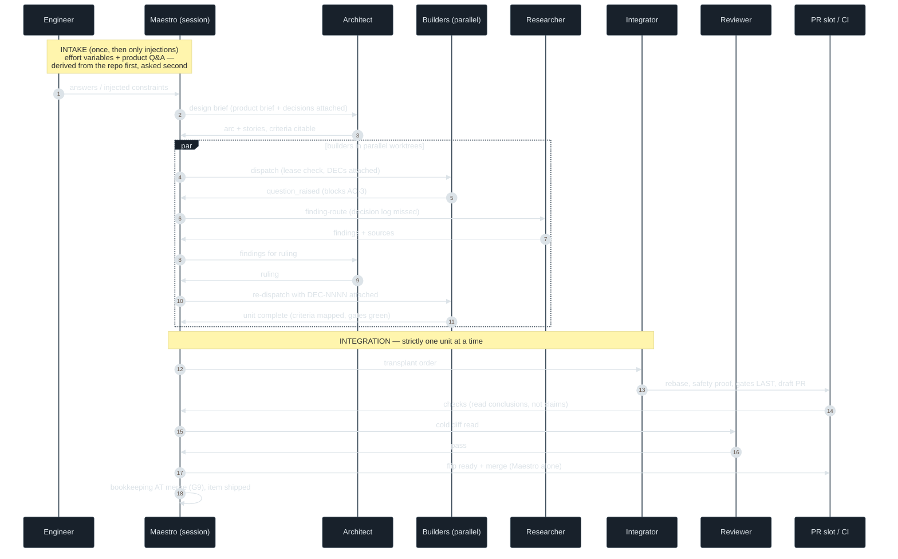

# AGENT_TOPOLOGY.md

The full node-and-edge map of the workforce: every prescribed hook, agent,
session, mechanical process and state store, with **what runs in parallel and
what is forced sequential** made explicit. `ARCHITECTURE.md` in this directory
shows the component structure; this document shows the *actors* and their
edges, and closes with the concern-to-mechanism map — which node or edge is
responsible for security, quality, backlog generation, grooming, design,
logging, auditing, reversibility, checks and balances, and extensible quality.

The intent the shape serves: **ongoing autonomous product development and
deliverables**, with the driving engineer supplying only the initial effort
variables and the clarification/specificity of the product design — through
question and answer, injectable at the start or mid-flight
(`docs/PRODUCT_INTAKE.md`), with everything derivable from an existing repo
derived rather than asked.

---

## 1. Nodes and edges

The rendered, blueprint-themed vector of this diagram (crisp at any zoom):
[`assets/agent-topology.svg`](assets/agent-topology.svg).

```mermaid
%%{init: {"theme":"base","themeVariables":{
  "background":"#10161d","fontFamily":"Segoe UI, Helvetica, Arial, sans-serif","fontSize":"18px",
  "primaryColor":"#18212b","primaryTextColor":"#dce3e8","primaryBorderColor":"#3a4a58",
  "secondaryColor":"#1e2833","tertiaryColor":"#0b1016",
  "lineColor":"#9aa9b3","textColor":"#dce3e8",
  "clusterBkg":"#0b1016","clusterBorder":"#c9962f",
  "edgeLabelBackground":"#18212b","titleColor":"#c9962f",
  "nodeTextColor":"#dce3e8"
}}}%%
flowchart TB
    subgraph HUMAN["Driving engineer (human)"]
        ENG["Engineer<br/><i>effort variables + product Q&amp;A answers;<br/>everything else is autonomous</i>"]
    end

    subgraph SESSION["The session — Maestro (sequential control plane)"]
        MAESTRO["Maestro<br/><i>dispatch, decisions, merge/ready flip.<br/>The top-level session itself, never a subagent</i>"]
        HOOK_SS["SessionStart hook<br/><i>detect-only: registry, heartbeat age,<br/>marker version. Never installs</i>"]
        HOOK_ST["SubagentStop hook<br/><i>terminal run events; never blocks;<br/>honest orphans (agent_key null)</i>"]
        HOOK_TU["ToolUse hook<br/><i>provenance on records</i>"]
    end

    subgraph POOL["Subagent pool (parallel, single-shot, leased)"]
        ARCH["Architect (1)<br/><i>requirements, design, rulings</i>"]
        ADJ["Adjudicator (1)<br/><i>tie-breaks, decision conflicts</i>"]
        WARD["Warden (exactly 1, singleton-enforced)<br/><i>security/compliance sign-off,<br/>data-use verdicts; blocks, never grants</i>"]
        BLD["Builders (N, parallel)<br/><i>disjoint path scopes via leases</i>"]
        RES["Researchers (N, parallel)<br/><i>one question each, network-gated</i>"]
        REV["Reviewer<br/><i>cold diff read, read-only tools</i>"]
        ITG["Integrator (hat on a Builder)<br/><i>the ONLY sequential lane:<br/>one transplant at a time</i>"]
        FORE["Foreman<br/><i>judgment over anomalies only;<br/>bookkeeping is code, not cognition</i>"]
    end

    subgraph MECH["Mechanical plane (parallel to everything, zero model calls)"]
        TIMER["Machine timer<br/><i>one per machine, every 2 min</i>"]
        COURIER["Courier (script)<br/><i>merge shards, integrity checks,<br/>render wall, heartbeat</i>"]
        SERVER["Wall server<br/><i>127.0.0.1 only, 4-file allowlist</i>"]
        SHIPPER["Shipper (script)<br/><i>shards to isolated branch,<br/>isolated index, never the working tree</i>"]
    end

    subgraph STATE["State on disk (the persistence; agents do not persist)"]
        LEDGER[("Event ledger<br/>.wall/events/ — append-only")]
        ITEMS[("Items<br/>.wall/items/ — materialized view")]
        REG[("Registry<br/>leases, roster, open runs")]
        DECS[("Decision log<br/>docs/decisions/DEC-NNNN")]
        ARCHD[("Design docs<br/>docs/architecture/")]
        WALL["The wall<br/>wall.html / wall.json"]
    end

    subgraph HOST["Host platform (sequential by rule)"]
        PR["ONE PR slot<br/><i>one branch, one open PR,<br/>one set of checks running</i>"]
        CI["CI pyramid + review lanes"]
    end

    ENG -->|"intake Q&amp;A answers, injections"| MAESTRO
    MAESTRO -->|"human_required asks<br/>(waiting tab)"| ENG

    HOOK_SS -.->|"stale/missing surfaced"| MAESTRO
    HOOK_ST -.->|"run_end / orphan events"| LEDGER
    HOOK_TU -.->|"provenance"| LEDGER

    MAESTRO -->|"dispatch briefs<br/>(lease check first)"| BLD
    MAESTRO -->|"finding-route"| RES
    MAESTRO -->|"findings for ruling"| ARCH
    MAESTRO -->|"decision conflicts"| ADJ
    MAESTRO -->|"in-scope designs +<br/>data uses"| WARD
    WARD -->|"sign-off / block<br/>(grants go to the engineer)"| MAESTRO
    MAESTRO -->|"transplant order"| ITG
    MAESTRO -->|"cold diff"| REV
    MAESTRO -->|"anomaly triage"| FORE

    BLD -->|"question_raised / findings<br/>(never to a sibling)"| MAESTRO
    RES -->|"findings + sources"| MAESTRO
    ARCH -->|"rulings; doc_impact broadcast"| MAESTRO
    ADJ -->|"tie-break"| MAESTRO
    REV -->|"pass / findings"| MAESTRO
    ITG -->|"draft PR + safety proof"| PR
    ARCH -->|"designs"| ARCHD
    MAESTRO -->|"writes DEC-NNNN<br/>(one writer)"| DECS
    MAESTRO -->|"admits items, leases"| REG

    BLD -.->|"events"| LEDGER
    RES -.->|"events"| LEDGER
    ITG -.->|"events"| LEDGER

    TIMER --> COURIER
    COURIER -->|"reads"| LEDGER
    COURIER -->|"folds"| ITEMS
    COURIER -->|"renders + flags"| WALL
    SERVER -->|"serves"| WALL
    SHIPPER -->|"ships shards off-box"| LEDGER
    FORE -.->|"reads flags"| WALL

    PR --> CI
    CI -->|"green, full pyramid"| MAESTRO
    MAESTRO -->|"merge + flip ready<br/>(G12: Maestro alone)"| PR
```

Dotted edges are **observations and event writes** (nobody waits on them);
solid edges are **work handoffs** (somebody does).

## 2. What is parallel, what is sequential — and why

| Lane | Mode | Forced by |
|---|---|---|
| Builders | **Parallel** (N at once) | Leases: disjoint declared path scopes, TTL'd; a second builder whose scope overlaps is not dispatched |
| Researchers | **Parallel** (N, cap tracks builders + 2) | Each holds one question; answers serialize later through the decision writer |
| Courier / timer / server / shipper | **Parallel to everything** | Zero model calls, read-mostly; the observability plane never takes the control plane's locks |
| Hooks | **Parallel** (fire per event) | Never block; a hook that can block a run becomes a second control plane |
| Warden sign-off | **Sequential gate** per in-scope arc | An in-scope design cannot dispatch stories past an unrecorded sign-off; routine arcs get act-and-audit instead |
| Question answering | **Sequential** through Maestro | One writer for decisions is what makes "no answer contradicts another" enforceable |
| Decision writes (`DEC-NNNN`) | **Sequential** (Maestro only) | Same single-writer rule |
| Integration / transplant | **Sequential** (one unit at a time) | One branch, one PR slot; pushing over running checks cancels them (measured: 11 cancelled runs / 77 min) |
| Merge + ready flip | **Sequential** (Maestro alone, G12) | Caught two would-have-been-early merges on draft-scoped greens |
| Review threads | **Sequential per thread** (one writer, G8) | Two writers under one identity read as one writer contradicting itself |
| Wall/ledger writes per session | **Sequential per shard** (`seq` within `session_id`) | Total order `(ts, session_id, seq)` is what makes the ledger reproducible |

The shape in one sentence: **build in parallel, decide and integrate in
series, observe continuously.**

## 3. One item's journey (sequence view)

## 4. Concern → mechanism map

Every stated goal of the system, and the node or edge that carries it — a goal
with no mechanism is a wish:

| Concern | Mechanism (node/edge) |
|---|---|
| **Security** | SAST + secrets lane in the DoD (per-rule promotion, rotation not deletion); wall server 127.0.0.1-only with a 4-name allowlist; researcher network gated by config mode, stated in every finding; installer consent-gated, detect-only hooks; security findings escalate straight to the engineer |
| **Quality** | Reviewer's cold read (no access to builder reasoning); TESTING_STANDARDS tiers + tests-must-be-able-to-fail rules + 11-step mutation protocol; DoD as config, one definition |
| **Backlog generation** | Intake Q&A seeds the first arcs (PRODUCT_INTAKE.md); findings route to "filed as item"; researcher evidence becomes the material stories are designed from; curiosity of the crew is captured, never lost (silence is not a disposition) |
| **Grooming** | Status verified against evidence every sweep (stale reclassification, merged-but-open flag); amendment rules (ITEM_AUTHORING §5); duplicate/orphan integrity flags; SLA-driven escalation so nothing rots unassigned |
| **Architectural design** | Architect role (one per repo, authority tier); designs land in docs/architecture/; doc_impact broadcast on change; rulings written in DEC-consumable shape |
| **Logging** | Append-only event ledger, sharded per session, byte-reproducible merge; three-plane logging (LOGGING_AND_AUDIT.md); run records with prompts/diffs/tool calls |
| **Auditing** | `wall trace` (causal timeline per trace_id), `wall why` (decisions in effect and who saw them), `decisions_in_context` on every run record, `model_requested` vs `model_used` recorded separately |
| **Reversibility** | Append-only ledger (nothing rewritten); decisions superseded, never edited; transplant step 0 records rollback anchors; force-push only behind the safety proof with `--force-with-lease`; consent print before any system mutation |
| **Checks and balances** | The authority matrix: Foreman never assigns, Maestro never edits ledgers, Architect never reads code for correctness, Reviewer is the only one who does, Integrator alone force-pushes, Maestro alone merges; evidence outranks rhetoric in the tiebreak order; rework capped at 3 cycles then up the ladder |
| **Extensible quality** | Failure registry graduation path (bug class → FAILURE_PATTERNS + SHIP_CHECKLIST in the same change); budgeted-docs ratchet; testkit measure/rebalance loop; every real review finding leaves a prevention behind |
| **Autonomy with minimal input** | Startup questions answered config-first (a question with an on-disk answer is not asked); the human queue reserved for the six classes no agent may answer; intake derives from the repo before asking; injections mid-flight ride the amendment path without stopping the wave |

## 5. Cross-references

- `docs/PRODUCT_INTAKE.md` — the Q&A that feeds this machine its product definition
- `docs/WORKFLOW.md` — the procedures behind every edge above
- `docs/SESSION_LIFECYCLE.md` — how the session enters and leaves this graph
- `docs/ITEM_AUTHORING.md` — what travels along the dispatch edges
- `docs/AGENT_ROSTER_SPEC.md` — the nodes' full role sheets
- `ARCHITECTURE.md` (this directory) — component/file view of the same system
- `ORG_MAPPING.md` (this directory) — the same system mapped to classic org
  functions (PM, PMO/metrics, analysts, QA, security, release, DDD alignment)
