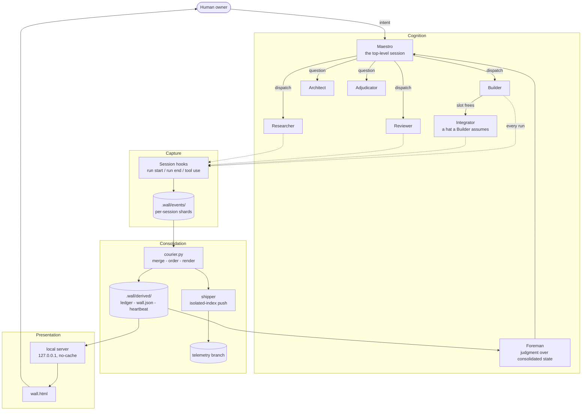
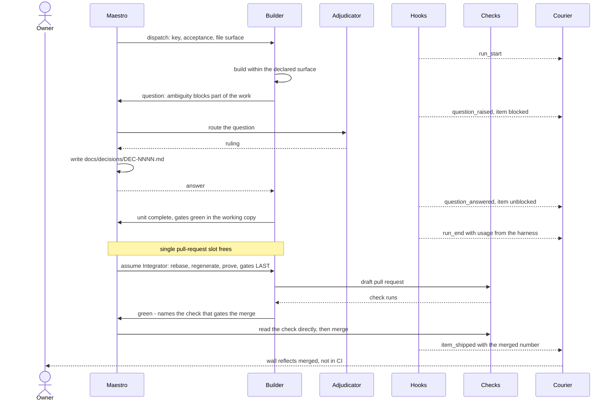
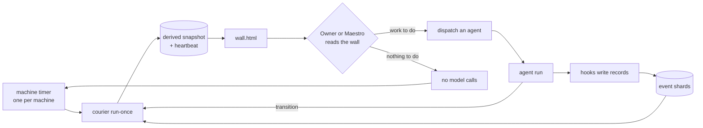

# ARCHITECTURE.md

Three pictures of the same system: what the parts are, how one item moves
through them, and why the loop closes without anything polling.

These are the shape, not the contract. The contracts live in
`docs/EVENT_SCHEMA.md` (records), `docs/AGENT_ROSTER_SPEC.md` (roles and
authority) and `docs/WORKFLOW.md` (execution). Where a diagram and a contract
disagree, the contract is right.

---

## 1. Components

Four planes, and they do not overlap. **Cognition** is everything a model does.
**Capture** is code that writes records. **Consolidation** is code that reads
records and produces derived state. **Presentation** is a static file and a
local server. Only the cognition plane costs money, and nothing in it is
allowed to write derived state.

Two edges are load-bearing by their absence. No agent writes `Derived` - not
even the Foreman, which **reads** consolidated state and reports judgment back
to Maestro; if an agent could write it, the ledger would stop being
reproducible. And nothing in `Presentation` reaches back into `Cognition`: the
wall is a mirror, so a broken wall cannot stop work, and a stalled crew cannot
fake a healthy wall.

---

## 2. One item's journey

Including the two steps that are easy to leave out of a diagram and expensive to
leave out of a system: a question that blocks part of the work, and the
transplant that turns a finished working copy into a merged change.

The last two exchanges are the ones that get skipped under time pressure.
Maestro reads the check rather than accepting the report, because a reduced or
draft-scoped run can be green and not be the gate. And the shipping record fires
**at merge**, not at bookkeeping time - otherwise the wall keeps claiming an
open pull request that has already merged, and the next unrelated change
inherits the resulting red.

---

## 3. The closed loop

Nothing polls. Agents are single-shot, so the loop is closed by a timer on one
side and by hooks on the other; the human sits inside it rather than beside it.

Three properties worth naming:

- **The timer is the fallback, not the driver.** Dispatch, completion and merge
  transitions trigger a snapshot directly, because the wall was watched live
  during the reference deployment's first wave and course-corrected the work
  twice mid-flight. A two-minute-stale wall is a wall that gets glanced at
  instead of used.
- **The idle path costs nothing.** A loop with no work runs one Python process
  and makes zero model calls. A design where the loop itself is an agent
  inverts this and spends most when doing least.
- **The heartbeat is what makes the loop honest.** It is written on every run,
  successful or not, and the wall renders its age. Without it a dead timer and a
  quiet project produce the same picture, and the picture is a lie.
