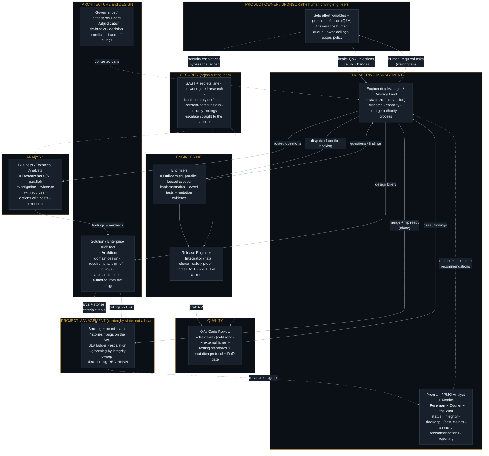

# ORG_MAPPING.md

The kit expressed as an engineering organization. This is not "just a wall
kit": the wall is the visible surface of an autonomous **engineering,
security, quality, metrics, domain-driven design and architecture process**.
This document maps every classic organizational function onto the kit role
that carries it, so someone arriving with org-chart vocabulary can find each
function, and so a missing function is visible as a missing box rather than a
vague unease. AGENT_TOPOLOGY.md is the same system seen as sessions, hooks
and state; this is the same system seen as a team.

---

## 1. The organization, as nodes and edges

Rendered vector: [`assets/org-mapping.svg`](assets/org-mapping.svg).

Dotted edges are observation and cross-cutting lanes; solid edges are work
handoffs. The sequential spine (design -> backlog -> build -> release -> QA
-> merge) and the parallel pools (engineers, analysts) are the same lanes
AGENT_TOPOLOGY.md section 2 pins.

## 2. Function-by-function mapping

| Org function | Carried by | Where it is written |
|---|---|---|
| **Product ownership** | The driving engineer: effort variables + product Q&A, the human queue, all ceilings | PRODUCT_INTAKE.md, SESSION_LIFECYCLE.md section 4 |
| **Engineering management / delivery** | Maestro (the session): dispatch, capacity within caps, merge authority, process sign-off | MAESTRO.md, WORKFLOW.md sections 2/7 |
| **Project management** | Deliberately **state, not a head**: the wall's arcs/stories/bugs (epics/stories/defects), SLA ladder, escalation flags, decision log. Nobody "runs the board"; the courier verifies it and the Maestro acts on it | WALL_STANDARDS.md section 4, ITEM_AUTHORING.md, WORKFLOW.md section 4 |
| **PMO / metrics & reporting analyst** | Foreman (judgment) + Courier and the wall (mechanical): throughput, cost, utilization, integrity; capacity **recommendations with numbers attached** | CAPACITY_REBALANCING.md, foreman.md |
| **Solution / enterprise architecture** | Architect: domain design in docs/architecture/, arcs + stories authored from it, requirements sign-off, rulings; doc changes broadcast blast radius | architect.md, ITEM_AUTHORING.md sections 2-4 |
| **Governance / standards board** | Adjudicator: decision conflicts, contested trade-offs, oscillation; evidence-ranked, never confidence-ranked | adjudicator.md, WORKFLOW.md section 7 |
| **Business / technical analysis** | Researchers: one question each, findings with cited sources, options with costs, speculation labelled | researcher.md, handoffs/finding-route.md |
| **Engineering** | Builders in parallel leased scopes; tests owed by change class; mutation evidence per guard | builder.md, TESTING_STANDARDS.md |
| **Release engineering** | Integrator: rebase, mechanical conflict resolution, the safety proof, gates LAST, one PR slot | integrator.md, WORKFLOW.md section 9 |
| **Quality assurance** | Reviewer (cold read, the only role that reads code for correctness) + external reviewer lanes + the DoD gate + the reject list | reviewer.md, TESTING_STANDARDS.md, skills/reviewer-integration |
| **Security** | A cross-cutting lane, not a box: SAST + secrets in the DoD, network-gated analysts, localhost-only serving, consent-gated installs, and a straight-to-sponsor escalation class | TESTING_STANDARDS.md (SAST lane), SESSION_LIFECYCLE.md section 4, INSTALL.md |
| **Metrics** | Every number measured, never self-reported: harness token actuals, CI wall-clock, ledger-derived utilization, shard timings; budgets advisory, trends reported | EVENT_SCHEMA.md section 5, CAPACITY_REBALANCING.md section 2 |

## 3. Domain-driven design alignment

The kit carries DDD's load-bearing ideas under its own names, and one piece
is deliberately thin — named here so it reads as a decision, not a hole:

- **Ubiquitous language**: the product brief (PRODUCT_INTAKE.md section 3) is
  the shared vocabulary's home — every arc, story and decision cites it, so
  the same word means the same thing from intake to test name. A brief
  section per domain doubles as the glossary of that domain.
- **Bounded contexts**: an arc's **boundary** (ITEM_AUTHORING.md section 3)
  plus a story's **declared path scope** are the enforcement mechanism — a
  lease is a bounded context made mechanical, and a cross-boundary edit is
  refused at dispatch rather than discovered at review.
- **Context maps**: the dependency edges between arcs/stories ("ST-105 needs
  ST-104's interface") plus docs/architecture/ contracts.
- **Aggregates / invariants**: stated as falsifiable architecture invariants
  with an "enforced by" gate (BEST_PRACTICES template section 2).
- **Thin by design**: the kit does not prescribe tactical DDD patterns
  (entities, repositories, domain events *in the product*) — those are the
  host architecture's choice, made through the intake's architecture domain
  and the Architect's design docs, not the kit's to impose.

## 4. Reading order for an org-minded reader

1. This file — who does what, in org terms.
2. `docs/diagrams/AGENT_TOPOLOGY.md` — the same system as sessions/hooks/state,
   parallel vs sequential, concern-to-mechanism map.
3. `docs/PRODUCT_INTAKE.md` -> `docs/ITEM_AUTHORING.md` -> `docs/WORKFLOW.md`
   — the value stream from product question to merged deliverable.
4. `docs/CAPACITY_REBALANCING.md` — how the org resizes itself on measurements.
